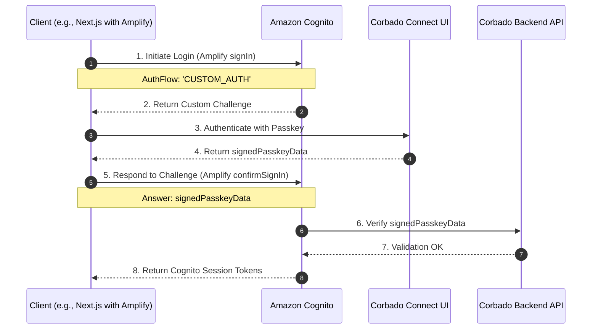

## Introduction

**Corbado Connect** allows you to seamlessly integrate passkey-first authentication into your existing Amazon Cognito user pools. This enables you to offer your users a secure and convenient login experience without passwords, while still leveraging the power of Cognito for user management.

This guide will walk you through the process of integrating **Corbado Connect** with Amazon Cognito, using a sample Next.js application to demonstrate the key concepts.

Amazon Cognito is a service that provides authentication, authorization, and user management for your web and mobile apps. You can learn more about it on the [official Amazon Cognito website](https://aws.amazon.com/cognito/).

## How it Works

The integration between **Corbado Connect** and Amazon Cognito leverages a powerful feature known as a **Custom Authentication Flow**. This feature allows developers to create their own challenge-and-response models using AWS Lambda functions, which is ideal for integrating external authentication mechanisms like Corbado's passkey-first solution.

Instead of a traditional username and password, we will define a custom flow that uses a passkey signature as the challenge.

To implement this, we need to configure the Cognito User Pool to use three specific AWS Lambda triggers:

- **`DefineAuthChallenge`**: This Lambda acts as the orchestrator of our custom flow. It determines which challenge to present to the user at each step of the authentication process.
- **`CreateAuthChallenge`**: This Lambda is responsible for creating the challenge itself. In our case, it won't be creating a secret, but rather preparing for the verification that happens in the next step.
- **`VerifyAuthChallengeResponse`**: This is where the core verification logic resides. This Lambda takes the signed passkey data from the frontend (provided by **Corbado Connect**), and verifies it against Corbado's Backend API to confirm the user's identity. If verification is successful, it informs Cognito to issue the session tokens.

Later in this guide, we will dive deep into the source code and configuration of each of these functions.

## Example Application

To best illustrate the integration, we will refer to a complete example application. This application is built with the following technologies:

- **Next.js**: A popular React framework for building server-rendered applications.
- **AWS Amplify**: A library that simplifies interacting with AWS services like Cognito from a frontend application.

We will walk through the implementation of two key user journeys, showing how **Corbado Connect** is integrated at each stage:
- **[User Sign-up](/corbado-connect-new/flows/user-sign-up)**
- **[User Login](/corbado-connect-new/flows/user-login)**

## User Sign-up

In our example application, the initial user sign-up is handled through a conventional method (e.g., email and password) managed by Amazon Cognito. Once the user has an account and is logged in, we offer them the option to add a passkey to their account for future passwordless logins. This process is often called "passkey append".

### Implementation Overview

After a successful sign-up and initial login, the user is navigated to a page where the `CorbadoConnectAppend` UI component is displayed. This component handles the entire passkey creation and association process.

The implementation relies on a client component that fetches a special token and then renders the `CorbadoConnectAppend` component.

### Obtaining the ConnectToken

Before rendering the component, we need a short-lived `connectToken` (see [here](/corbado-connect-new/ui-components/overview#3-connecttokens-ctk)) from Corbado's Backend API. This token authorizes the creation of a passkey for a specific, authenticated user.

To get this token, the frontend first needs to get the `idToken` for the currently logged-in user from AWS Amplify. This JWT is proof of the user's session with Cognito.

```typescript
// In your frontend component:
import { fetchAuthSession } from 'aws-amplify/auth';
import { getCorbadoConnectTokenAppend } from './actions'; // Server Action

// ...
const session = await fetchAuthSession();
const idToken = session.tokens?.idToken?.toString();
const connectToken = await getCorbadoConnectTokenAppend(idToken);
// ...
```

The `idToken` is then sent to a Next.js Server Action, which securely handles the communication with Corbado's API. The server action first verifies the `idToken` to ensure it's valid and extracts the user's identity, then requests the `connectToken`.

```typescript /application/cognito/app/(auth-required)/post-login/actions.ts
'use server';

import {getCorbadoConnectToken, verifyAmplifyToken} from "@/lib/utils";

export async function getCorbadoConnectTokenAppend(idToken?: string) {
    if (!idToken) {
        throw new Error('idToken is required');
    }

    const {displayName, identifier} = await verifyAmplifyToken(idToken);

    return getCorbadoConnectToken('passkey-append', displayName, identifier);
}
```

### UI Component Integration

With the `appendTokenProvider` logic in place, we can now integrate the `CorbadoConnectAppend` component from the `@corbado/connect-react` library. The component takes care of the entire UI and logic for creating and storing the passkey.

Here's how it's used in our example application's `post-login` page:

```tsx /application/cognito/app/(auth-required)/post-login/page.tsx
'use client';

import {CorbadoConnectAppend} from "@corbado/connect-react";
import {useRouter} from "next/navigation";
import {getCorbadoConnectTokenAppend, postPasskeyAppend} from "@/app/(auth-required)/post-login/actions";
import {fetchAuthSession} from "aws-amplify/auth";
import {AppendStatus} from "@corbado/types";

export default function Page() {
    const router = useRouter();

    return (
        <div className="flex h-screen w-screen items-center justify-center bg-gray-50">
            <div className="z-10 w-full max-w-sm overflow-hidden rounded-2xl border border-gray-100 shadow-xl">
                <div className="flex flex-col space-y-4 bg-gray-50 px-4 py-8 sm:px-8">
                    <CorbadoConnectAppend
                        onSkip={async () => router.push('/profile')}
                        appendTokenProvider={async () => {
                            const session = await fetchAuthSession();
                            const idToken = session.tokens?.idToken?.toString();

                            return await getCorbadoConnectTokenAppend(idToken);
                        }}
                        onComplete={async (appendStatus: AppendStatus, clientState: string) => {
                            await postPasskeyAppend(appendStatus, clientState);
                            router.push('/profile');
                        }}
                    />
                </div>
            </div>
        </div>
    );
}
```

Key props:
- **`appendTokenProvider`**: A function that provides the ConnectToken we discussed earlier. It's called automatically by the component.
- **`onComplete`**: A callback that runs after the passkey has been successfully created. Here you can perform actions like updating your own backend or redirecting the user.
- **`onSkip`**: Allows the user to opt-out of creating a passkey at this time.

## User Login

Now that users can associate passkeys with their accounts, we can enable a truly passwordless login experience. This is where the custom authentication flow we outlined in the "How it Works" section becomes essential.

The goal is to authenticate a user with their passkey using **Corbado Connect** and, upon success, establish an authenticated session with Amazon Cognito. To achieve this, we will use our three custom AWS Lambda functions to bridge the gap between the two systems and ultimately receive valid session tokens from Cognito.

### Implementation Overview

The user login flow involves a sequence of interactions between the client application (using AWS Amplify), Amazon Cognito, and Corbado's backend services. To best visualize this, we can use a sequence chart.

This chart illustrates the flow that begins **after** the user has successfully authenticated with their passkey using a **Corbado Connect** UI component. The focus here is on how the successful passkey authentication is used to establish a session with Cognito.

TODO Use/adapt chart from Kostas



<Info>
The `signedPasskeyData` is a short-lived, single-use JSON Web Token (JWT) that proves a successful passkey authentication with Corbado. It is the key artifact that connects the two systems.
</Info>

### Storing Secrets

Our custom Lambda functions need to communicate securely with Corbado's Backend API. To do this, they require access to sensitive credentials, namely your **Project ID** and **API Secret**.

It is critical to never hard-code secrets directly into your Lambda function's source code. Instead, you should use a dedicated service for managing secrets. For our example application, and as a recommended best practice, we use **AWS Systems Manager (SSM) Parameter Store**.

By storing credentials as `SecureString` parameters in the SSM Parameter Store, you ensure that they are encrypted at rest. You can then grant the Lambda function's IAM role the necessary permissions to read these specific parameters at runtime. This approach provides a secure and scalable way to manage your secrets, separating them from your application code.

### Lambda functions in detail

Here we will examine the code for each of the three Lambda functions required for the custom authentication flow.

<Tabs>
<Tab title="define_auth_challenge">
This is the first and last Lambda to be called in the flow. It acts as the orchestrator or state machine.

```javascript
// This is the 1st lambda function in the Cognito custom auth flow
export const handler = async(event) => {
  console.log('Received event:', event);

  if (!event.request.session.length) {
    // The auth flow just started, send a custom challenge
    return customChallenge(event);
  }

  const lastResponse = event.request.session.slice(-1)[0];
  if (lastResponse.challengeResult === true) {
    return allow(event);
  } else if (countAttempts(event, false) === 0) {
    return customChallenge(event);
  }

  return customChallenge(event)
};

function allow(event) {
  console.log("Authentication allowed!");

  event.response.issueTokens = true;
  event.response.failAuthentication = false;

  return event;
}

function customChallenge(event) {
  event.response.issueTokens = false;
  event.response.failAuthentication = false;
  event.response.challengeName = "CUSTOM_CHALLENGE";

  return event;
}

function countAttempts(event, excludeProvideAuthParameters = true) {
  if (!excludeProvideAuthParameters) {
    return event.request.session.length;
  }

  return event.request.session.filter(
    (entry) => entry.challengeMetadata !== "PROVIDE_AUTH_PARAMETERS"
  ).length;
}
```

</Tab>
<Tab title="create_auth_challenge">
This Lambda is responsible for creating the actual challenge. In a typical custom auth flow (like sending an OTP), this function would generate a secret and send it to the user.

In our passkey flow, however, the "secret" is created and signed on the client side during the WebAuthn ceremony handled by **Corbado Connect**. Therefore, the only job of this Lambda is to pass the user's `cognitoID` securely to the next step via `privateChallengeParameters`. This ID is essential for the verification step.

```javascript
// This is the 2nd lambda in the Cognito custom auth flow
export const handler = async(event) => {
    console.log('Received event:', event);

    event.response = {
        challengeMetadata: 'CORBADO_CHALLENGE_COGNITO_CLAIM',
        // At least one public challenge parameter is required
        publicChallengeParameters: {
            "dummy": "dummy"
        },
        privateChallengeParameters: {
            "cognitoID": event.userName,
        }
    };

    console.log(event.response);

    return event;
};
```

</Tab>
<Tab title="verify_auth_challenge_response">
This is the final and most critical Lambda in the chain. It's responsible for verifying the user's response to the challenge.

Its key responsibilities are:
1.  **Get Secret**: It securely fetches the secret from AWS Systems Manager Parameter Store.
2.  **Call Corbado Backend API**: It takes the `signedPasskeyData` (which is the user's `challengeAnswer`) and the `cognitoID` and sends them to Corbado's `/v2/passkey/verifySignedData` endpoint.
3.  **Return Result**: Based on the response from Corbado's API, it sets `event.response.answerCorrect` to `true` or `false`, telling Cognito whether the user's passkey authentication was successful.

```javascript
// This is the 3rd lambda in the Cognito custom auth flow
import { SSMClient, GetParameterCommand } from '@aws-sdk/client-ssm';

// Full URL of Backend API (e.g. https://backendapi.cloud.corbado.io)
const corbadoBackendApiUrl = process.env.BAPI_URL;

// Name/path of Backend API secret in AWS Systems Manager Parameter Store
const corbadoBackendApiSecretPath = process.env.BAPI_SECRET_PATH;

// Backend API secret (base64-encoded projectID:API Secret for usage in Basic Auth header)
let corbadoBackendApiSecret = null;

// Fetch Backend API secret from AWS Systems Manager Parameter Store
const getCorbadoBackendApiSecret = async () => {
    if (corbadoBackendApiSecret) {
        return corbadoBackendApiSecret;
    }

    try {
        const ssm = new SSMClient();
        const command = new GetParameterCommand({
            Name: corbadoBackendApiSecretPath,
            WithDecryption: true
        });

        const response = await ssm.send(command);
        corbadoBackendApiSecret = response.Parameter.Value;

        return corbadoBackendApiSecret;
    } catch (error) {
        throw new Error(`Failed to fetch ${corbadoBackendApiSecretPath} from AWS Systems Manager Parameter Store: ${error.message}`);
    }
};

// Main handler function
export const handler = async (event) => {
    console.log('Received event:', event);

    // Check if all required fields are present
    if (!event.request.challengeAnswer || !event.request.privateChallengeParameters || !event.request.privateChallengeParameters.cognitoID) {
        console.log('Important event fields are missing');
        event.response.answerCorrect = false;

        return event;
    }

    const cognitoID = event.request.privateChallengeParameters.cognitoID;
    const signedPasskeyData = event.request.challengeAnswer;

    try {
        // Execute call to Backend API
        const basicAuth = await getCorbadoBackendApiSecret();
        const verifySignedDataRes = await fetch(`${corbadoBackendApiUrl}/v2/passkey/verifySignedData`, {
            method: 'POST',
            headers: {
                'Content-Type': 'application/json',
                Authorization: `Basic ${basicAuth}`,
                'Connection': 'close'
            },
            body: JSON.stringify({
                signedPasskeyData: signedPasskeyData,
                username: cognitoID
            })
        });

        // Check if call to Backend API was successful
        if (!verifySignedDataRes.ok) {
            console.log(`Call to ${corbadoBackendApiUrl}/v2/passkey/verifySignedData failed with status ${verifySignedDataRes.status} (Cognito ID: ${cognitoID})`);
            event.response.answerCorrect = false;

            return event;
        }

        // Check verification result
        const verifySignedDataResData = await verifySignedDataRes.json();
        if (verifySignedDataResData.verificationResult === "success") {
            console.log(`Verification successful (Cognito ID: ${cognitoID})`);
            event.response.answerCorrect = true;
        } else {
            console.log(`Verification failed (Cognito ID: ${cognitoID})`);
            event.response.answerCorrect = false;
        }

        return event;
    } catch (error) {
        console.error('Caught exception:', error);
        event.response.answerCorrect = false;

        return event;
    }
}
```
</Tab>
</Tabs>

<Info>
You need to configure these three Lambdas in your Cognito User Pool's settings under **User pool properties** > **Lambda triggers**.
</Info>

### Hosting Lambda functions

- Explain that those lambdas can be "hosted" in Corbado AWS Account or "your" AWS Account (depending on chosen setup/deployment options, link to deployment)

### Implementation

- Explain Implementation of user login
- Explain CorbadoConnectLogin UI Component integration