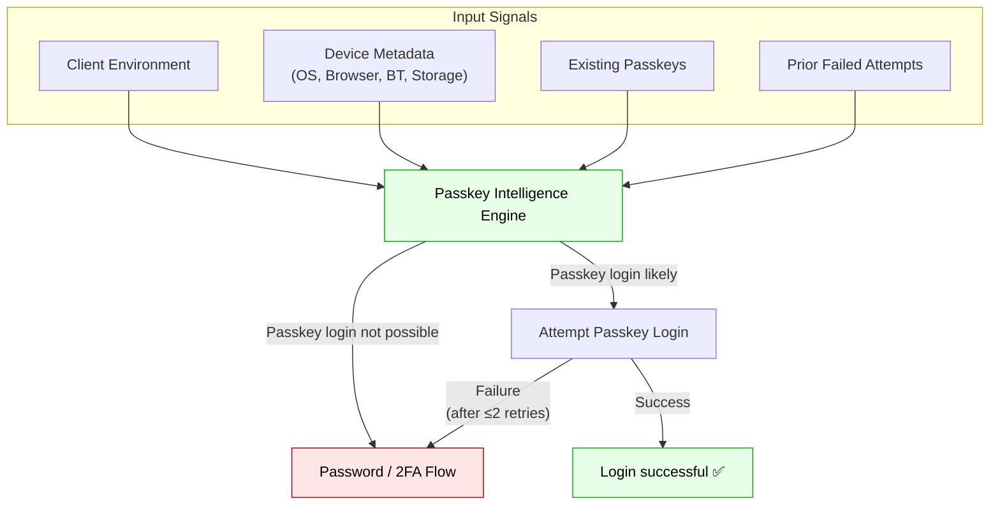

## The Critical Need for Passkey Intelligence

Passkey Intelligence is designed to maximize the benefits of passkey adoption across all industries by driving the Passkey Flywheel: higher creation, more usage, and fewer errors.

| Metric / Goal | Without Corbado | With Corbado | Business Outcome |
| :--- | :--- | :--- | :--- |
| **Passkey Creation Rate** | 15% | **50-70% (+4x)** | More users enroll passkeys, reducing friction and increasing return visits. |
| **Passkey Usage Rate** | 5% | **40-50% (+10x)** | Fewer drop-offs at login, higher engagement, and improved user satisfaction. |
| **Passkey Error Rate** | 20% Login Errors | **&lt;5% Login Errors** *(95% of dead-ends avoided)* | Fewer "I can't log in" cases, lower support costs, and less user frustration. |

<Check>
This flywheel effect (Higher Creation → More Usage → Fewer Errors) leads to higher user retention, more successful logins, and reduced operational support costs regardless of your product category.
</Check>

Delaying the implementation of an intelligence layer may seem tempting, but real-world data shows that users in any type of application quickly encounter confusing dead-ends without it:

- **Device turnover is high:** ~15% of users attempt to sign in from a *different* device than the one that holds their passkey within the first **3 months** of account creation — rising to **35%** within 6 months. 
- **Operating-system dialogs often fail:** On the Web, the front-end cannot know whether a passkey is actually accessible on the current device. Native prompts might open, only to realize no credential is available, leaving users stuck. 
- **QR-code loops confuse users:** Most modern browsers assume “your passkey is on a phone” if none is found locally, automatically showing a QR code for cross-device login. Without guidance, users abandon the flow. 
- **Third-party password managers add complexity:** Between **5–10%** of passkeys are stored in non-platform managers (1Password, Dashlane, Bitwarden, etc.). These providers are not available on every OS × browser combination, so a passkey that worked on one device or browser may be inaccessible on another. 
- **Missing managers on new devices:** Roughly **50%** of users who initially used a password manager do **not** have that manager installed on their next device, breaking cross-device journeys. 
- **Raw failure rate without intelligence:** We observe **5–10%** of all WebAuthn operations fail or time out when attempted blindly, often ending with an unexplained QR code or security-key prompt.

Passkey Intelligence helps avoid these pitfalls by detecting risky contexts ahead of time and guiding users toward the path most likely to succeed, no matter what type of application or service you provide.

## How Passkey Intelligence Works

Passkey Intelligence is a smart authentication logic layer provided by **Corbado Connect** that optimizes when and how passkeys are used in your application. It ensures a smooth user experience by only initiating passkey login or creation ceremonies when success is likely, and by gracefully falling back when not. 

By leveraging a wealth of signals from the user's device, behavior, and environment, Passkey Intelligence dynamically adapts the authentication flow to each situation, boosting both security and user convenience. In short, Passkey Intelligence is the engine that makes high passkey adoption possible – providing one-tap logins, seamless cross-device sign-ins, and context-aware prompts that significantly improve the user experience.

<Frame>
    
</Frame>

At its core, Passkey Intelligence acts as a prediction and decision engine determining the optimal authentication path for each login or signup attempt. It continuously aggregates multiple data points to assess whether a passkey can or should be used on the current device. Key factors include:

-   **Device & Browser Capabilities:** The engine checks the operating system, browser version, and WebAuthn support of the client device. Hardware features like biometric sensors or Bluetooth availability are considered to know if passkeys (including cross-device options) are supported.
-   **User's Passkey History:** It analyzes if the user has previously created or used a passkey, and on which devices. Past successful passkey logins, as well as instances where the user fell back to passwords/OTP, are tracked to inform future decisions. For example, if a user has a registered multi-device ("hybrid") passkey synced to cloud or a password manager, that's noted for cross-device availability.
-   **Contextual Behavior:** The system monitors how users interact with passkey prompts (e.g. do they cancel them? how often do errors occur?). It also keeps an eye on how frequently users skip passkey offers or choose alternative methods, which helps tailor when to prompt them.
-   **Security & Risk Signals:** To safeguard against edge cases, Passkey Intelligence evaluates risk indicators like unusual login patterns, IP or location changes, and device integrity signals. If something looks suspicious or if the environment is not passkey-friendly, the engine may avoid a passkey prompt and opt for a safer fallback automatically.
-   **Local Device Storage Flags:** To make quicker decisions, a small flag is stored in the user's browser (e.g. via `localStorage`) after a successful passkey login. This tells the front-end that "this user *does* have a passkey on this device" for subsequent visits, allowing the UI to directly offer a one-tap passkey login without additional server checks.

Using this data, the intelligence engine dynamically chooses one of several paths for the user's session: it might automatically initiate a platform passkey authentication, present a **One-Tap Passkey** login button (prefilled with the user's identifier), fall back to a password/OTP flow, or even trigger a **cross-device login** via QR code if no local credentials are available. The goal is to always select the least friction path that still ensures a successful, secure login.

## Key Benefits of Passkey Intelligence

Implementing Passkey Intelligence yields significant benefits in both user experience and security outcomes:

<Info>
The following diagram illustrates how **Passkey Intelligence** decides whether to start a passkey ceremony or immediately fall back to a classic authentication flow. Its two guiding principles remain the same: **maximize successful passkey logins** (green path) and **minimize failed or confusing experiences** (red path).
</Info>

<Check>
When the green path is chosen, users experience a friction-free, biometric login. If the red fallback path is triggered, they are guided through the familiar password / 2-factor flow, ensuring they never reach a dead-end.
</Check>

-   **Seamless UX & Higher Success Rates:** Because the system only offers a passkey prompt when it's confident the user can complete it, users encounter far fewer errors and failed login attempts. By avoiding dead-end scenarios (like prompting passkeys on unsupported devices), you reduce user frustration and build trust in the new login method.
-   **Maximized Passkey Adoption:** Passkey Intelligence directly drives up the **passkey login rate**, which is the share of total logins done with passkeys instead of passwords or OTPs. High passkey usage correlates with fewer password resets and lower MFA costs (SMS/OTP), delivering both security and ROI benefits.
-   **Smooth Fallbacks & No Dead-Ends:** In scenarios where a passkey isn't available or likely to work (e.g. user on a work PC without their personal passkey), the system will seamlessly revert to the next-best method *before* the user even realizes a passkey attempt was possible. This means no confusing error messages or unnecessary QR code screens that could scare users off.
-   **Cross-Device Convenience:** Passkey Intelligence improves cross-device login flows by proactively leveraging **cloud-synced passkeys** and multi-device credentials. If a passkey must be used from another device (via a QR code scan), intelligence ensures the user is guided clearly and even helps them **attach a new local passkey** to that device afterward for the future. For example, if a user attempts to log in on their laptop but their only passkey is on their phone, the system can present a QR code. After authenticating on their phone, they are logged in on the laptop and immediately prompted to create a new, local passkey on the laptop, eliminating the need for a QR code on subsequent visits.
-   **Adaptive to User Behavior:** The intelligence engine isn't static; it learns from your user base. By analyzing patterns (e.g. many users aborting at a certain step or opting for "Skip" on passkey prompts), you can adjust your flows – or let Corbado adjust them automatically.
-   **Enterprise-Grade Security Controls:** Every login attempt is evaluated with security in mind. Suspicious signals (multiple rapid failures, new device in a far location, etc.) can trigger the engine to be more conservative – perhaps not auto-launching a passkey and requiring an extra verification step. This balances user-friendliness with risk mitigation.
-   **`clientState` Management:** After a successful passkey operation, Corbado returns a `clientState` string containing encrypted, environment-related information. This state is stored in the browser's `localStorage` to remember the user's context, such as device capabilities and passkey availability. By passing this `clientState` back into UI components in future sessions, you enable faster load times and more seamless flows, like One-Tap login, without repeating environment checks. Learn more about [how to manage `clientState`](/corbado-connect/concepts/client-state).

## One-Tap Login

One of the flagship features enabled by Passkey Intelligence is **One-Tap Login**. It's a mechanism that allows returning users to authenticate with a single tap (plus a biometric check) without needing to re-enter their identifier like an email address.

This is achieved via a dynamic **One-Tap Passkey Button** that is intelligently displayed to users who have used a passkey before on their device. This transforms the login experience into a simple, fast, and secure action. Because it's so easy, it's a powerful tool for boosting passkey adoption.

To learn more about how it works and its benefits, see our dedicated page on [One-Tap Login](/corbado-connect/features/one-tap-login).

## Integration in Login and Signup Flows

Integrating Passkey Intelligence into your authentication flows can be done in a couple of patterns, depending on your UI/UX approach. Corbado supports both **Identifier-First (Automatic)** flows and **Explicit Passkey Button** flows.

### Identifier-First Login Flows
In this approach, the user first enters an identifier (like email or username) and then the system decides whether to trigger a passkey prompt automatically. Once the user submits their identifier, Corbado's engine evaluates if a passkey login should be initiated right away. If yes, the passkey WebAuthn ceremony is auto-launched. If no, the flow silently falls back to the next step (e.g., asking for a password or sending an OTP). This conditional logic means you "auto-login" with passkey when possible, but never at the cost of user confusion.

### Separate Passkey Button Flows
Many applications opt to show a "Login with Passkey" button as an alternative to the traditional login form. Passkey Intelligence augments this approach with the **One-Tap Passkey Button** component. Initially, you might display a normal "Use passkey" button. But once a user becomes eligible for a passkey, the component automatically switches to the One-Tap mode on subsequent visits. This means the next time that user comes back, they'll see a personalized passkey login prompt (e.g. "Login with passkey for **alice@example.com**") right up front.

### Signup / Registration Flows
Passkey Intelligence also enhances the account creation process to boost passkey enrollment. When a new user signs up or when an existing user logs in with a password, Corbado can intelligently prompt them to create a passkey. 

You can configure how this happens. For example, some services choose to automatically initiate passkey creation immediately after a standard login on a supported device. However, you might prefer to first show an explanation screen before creating the passkey. Corbado's components offer customizable passkey enrollment screens that you can enable or skip. You can even tailor these based on device type.

## Passkey Creation and Autofill

When using Passkey Intelligence, the flow of creating a passkey and subsequently using it is optimized end-to-end.

### Passkey Creation
If a user is on a passkey-capable device and authenticates via a non-passkey method (like a password), the intelligence engine can immediately guide them into creating a passkey. One option is **Automatic Passkey Creation**, where the passkey ceremony starts without the user explicitly clicking anything, often right after they log in for the first time.

If you prefer a more explicit opt-in, you can disable automatic creation and use **Passkey Explainer screens**. Corbado's UI components include an **Append Passkey Prompt** – a modal or page shown after sign-up/login that explains passkey benefits and asks the user to continue to set one up. Either way, once the user agrees, the WebAuthn `create()` call is executed and the new passkey is stored by the user's device (in their platform authenticator or manager).

### Autofill and One-Tap Behavior
After a passkey is created, using it in subsequent logins should be effortless. Modern browsers implement what's known as **Conditional UI**, which is essentially a built-in *autofill* for passkeys. If a site is set up correctly, the browser might show a "Use your passkey for *example.com*" prompt or account chooser automatically when the login form is displayed.

Passkey Intelligence works hand-in-hand with such browser features. However, where Conditional UI is not supported or ignored by the user, Corbado's **One-Tap Passkey Button** ensures a one-tap option is always visible in the UI itself for returning users. The intelligence engine effectively pre-fills the user's identifier into this button using data stored from their last passkey login. It's akin to the "Remember me" function but for passkeys – the user doesn't even have to type their email; the button itself shows the account that will sign in with a biometric check.

## Additional Resources

-   [**Passkey Intelligence, Login Identifiers & Verification**](https://www.corbado.com/blog/passkey-intelligence-login-identifiers-verification-flows): An in-depth article introducing the concept of Passkey Intelligence and related features like login identifiers and custom flows.
-   [**How to Get High Passkey Adoption in Login Flows**](https://www.corbado.com/blog/passkey-login-best-practices): A comprehensive guide with data and case studies on boosting passkey login rates, covering One-Tap Passkey Buttons and intelligence-driven strategies.