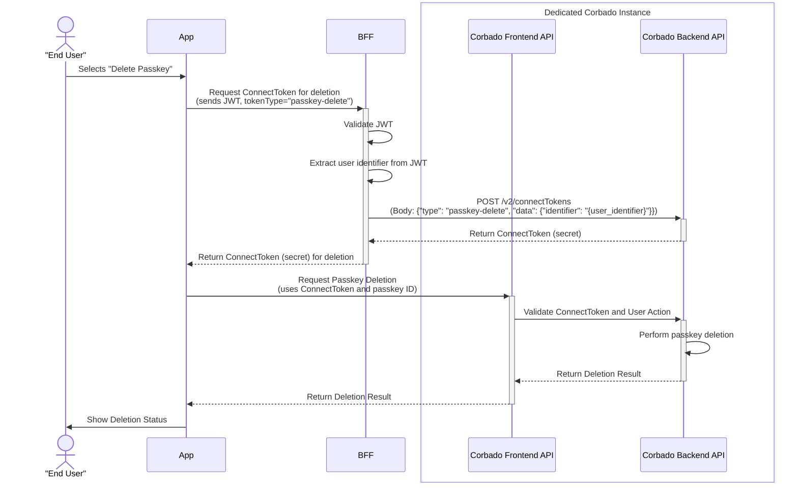

This section describes the flow for users to manage their passkeys. After logging in, users can access a dedicated settings area where they can see all their registered passkeys, add new ones, and remove those they no longer need. This gives users full control over their credentials, enhancing security and usability.

**Corbado Connect** provides the underlying logic for these management features and allows you to introduce them safely and at your own pace.

- [Gradual Rollout](/corbado-connect/features/gradual-rollout) allows you to control which users have access to passkey management features. For example, the ability to add new passkeys from the settings page can be enabled for a small percentage of users initially and then progressively rolled out to your entire user base.

## Technical Flow

The following sequence diagram illustrates the technical flow for a passkey management operation, using deletion as an example. The process for adding or listing passkeys follows a similar pattern, where the mobile app securely obtains a one-time token from your backend to perform the action directly with Corbado's APIs. This ensures that no sensitive operations occur without proper user authentication.

<Frame caption="Sequence diagram for a passkey management operation (e.g., deletion)">

</Frame> 