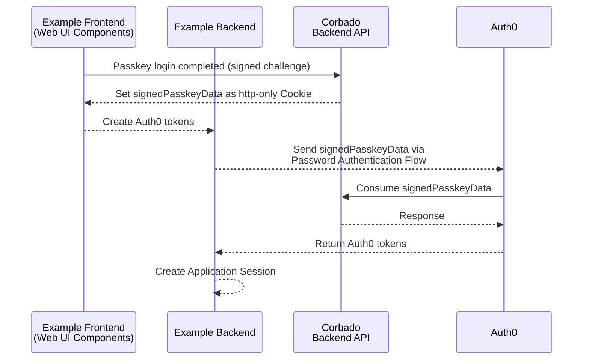

import Auth0Demo from "/snippets/corbado-connect/auth0-demo.mdx"

<Auth0Demo />

## 1. Introduction

**Corbado Connect** allows you to seamlessly integrate passkey-first authentication into your existing **Auth0** system. This enables you to offer your users a secure and convenient login experience without passwords, while still leveraging the power of **Auth0** for user management.

This guide will walk you through the process of integrating **Corbado Connect** with **Auth0**, using a sample Next.js application to demonstrate the key concepts.

**Auth0** is a service that provides authentication, authorization, and user management for your web and mobile apps. You can learn more about it on the [official Auth0 website](https://www.auth0.com).

## 2. How it Works

The integration between **Corbado Connect** and **Auth0** leverages several **Auth0** features:

- The **Password Authentication Flow**
- A **Custom Database** with a **Custom Database Login Action Script**
- An **Action Trigger**

The password authentication flow is not used for classical password authentication but to pass the passkey authentication state from **Corbado Connect** to **Auth0**.

The usage and wiring of these system components will be explained in more detail in the next sections.

## 3. Example Application

To best illustrate the integration, we will refer to a complete example application. This application is built with the following technologies:

- **Next.js**: A popular React framework for building server-rendered applications.

<Card title="Example Application" href="https://auth0.cloud.corbado-demo.com">
See the example application using Corbado Connect and Auth0 in action.
</Card>

[Contact us](https://www.corbado.com/contact) to request access to the source code for the example application.

## 4. Data Storage

When it comes to storage, the integration between **Corbado Connect** and **Auth0** is straightforward and requires **no changes** to your existing database infrastructure.

### 4.1 Architecture

**All passkey data is stored within Corbado Connect**, including:

- **Passkeys and WebAuthn credentials**: Securely stored with enterprise-grade encryption
- **User metadata**: Minimal identifiers needed to link Auth0 users with their passkeys
- **Authentication logs**: Audit trails for passkey operations and user activities

This approach tremendously simplifies integration and cuts down implementation time since no database schema changes are required on your end.

### 4.2 Portability

**Corbado Connect** ensures you maintain full control over your data:

- **Export capabilities**: Passkeys can be exported at any time, fully automated to any external system including yours
- **Standard compliance**: All data follows WebAuthn and FIDO2 standards for maximum portability
- **Migration support**: Complete data migration assistance available when needed

<Note>
See our documentation on [Passkey Export](/corbado-connect/security-compliance/passkey-export) for more details including field descriptions and an example import implementation for the JavaScript/TypeScript [SimpleWebAuthn](https://simplewebauthn.dev/) library.
</Note>

### 4.3 Security & Compliance

All storage meets the highest security standards:

- **ISO 27001 certified**: Information security management system compliance
- **SOC 2 Type II**: Rigorous security, availability, and confidentiality controls
- **Enterprise encryption**: Data encrypted at rest and in transit
- **Regular audits**: Continuous security assessments and penetration testing

### 4.4 System Integration

**Corbado Connect** stores the **Auth0** user ID to seamlessly connect both systems during:

- **Passkey Enrollment**: Links new passkeys to existing **Auth0** user accounts
- **Passkey Login**: Validates passkey ownership against the correct **Auth0** user
- **Passkey Management**: Ensures passkey operations are performed by authorized users

This minimal data synchronization maintains the integrity of both systems while preserving user privacy.

## 5. Passkey Enrollment

In our example application, the initial user sign-up is handled through a conventional method (e.g., email and password) managed by **Auth0**. Once the user has an account and is logged in, we offer them the option to add a passkey to their account for future passwordless logins. This process is often called "passkey append".

The complete flow is illustrated in detail [here](/corbado-connect/flows/user-sign-up).

### 5.1 Implementation Overview

The user sign-up process consists of a series of interactions between the example application, **Auth0**, and Corbado APIs. These interactions are best illustrated using a sequence diagram:


In the following sections, we will explain each step in detail.

### 5.2 Web UI Component Integration

To enable passkey creation we use the [CorbadoConnectAppend](/corbado-connect/web-ui-components/corbadoconnectappend) component from the `@corbado/connect-react` library. The component takes care of the entire UI and logic for creating and storing the passkey.

Here's how it's used in our example application's `post-login` page:

```tsx /application/auth0/app/post-login/page.tsx
"use client";

import {CorbadoConnectAppend} from "@corbado/connect-react";
import {useRouter} from "next/navigation";
import {getConnectToken, postPasskeyAppend} from "@/app/actions";
import {AppendStatus} from "@corbado/types";

export default function AppendPage() {
    const router = useRouter();

    return (
        <div className="flex h-screen flex-1 items-center justify-center bg-gray-50">
            <div className="z-10 w-full max-w-sm overflow-hidden rounded-2xl border border-gray-100 shadow-xl">
                <div className="flex flex-col space-y-4 bg-white px-4 py-8 sm:px-8">
                    <CorbadoConnectAppend
                        onSkip={async () => router.push("/")}
                        appendTokenProvider={async () => {
                            return await getConnectToken('passkey-append');
                        }}
                        onComplete={async (
                            appendStatus: AppendStatus,
                            clientState: string
                        ) => {
                            await postPasskeyAppend(appendStatus, clientState);
                            router.push("/");
                        }}
                    />
                </div>
            </div>
        </div>
    );
}
```

<Info>
For a detailed explanation of all available props for this component, please see the [CorbadoConnectAppend](/corbado-connect/web-ui-components/corbadoconnectappend) component documentation.
</Info>

### 5.3 Obtaining the Connect Token

When the component is initialized, it executes the function given in `appendTokenProvider` to request a [connect token](/corbado-connect/concepts/connect-token) from Corbado's Backend API (this token authorizes the creation of a passkey for a specific and authenticated user).

It uses a Next.js Server Action that first verifies the session and then calls the utility function `getCorbadoConnectToken()`:

```typescript /application/auth0/app/actions.tsx
'use server';

import {getCorbadoConnectToken} from "@/lib/corbado";
import { getSession } from "@/lib/session";
import { AppendStatus } from "@corbado/types";

export const getConnectToken = async (connectTokenType: string) => {
    // get current session (email and userId)
    const session = await getSession();
    if (!session.user) {
        throw new Error('Session is required');
    }

    const displayName = session.user.email;
    const sub = session.user.sub;
    const splits = sub.split('|');
    const identifier = splits[1];

    return getCorbadoConnectToken(connectTokenType, displayName, identifier);
}
```

The utility function subsequently manages the request to the Corbado Backend API:

```typescript
export const getCorbadoConnectToken = async (connectTokenType: string, displayName: string, identifier: string): Promise<string> => {
  const payload = {
    type: connectTokenType,
    data: {
      displayName: displayName,
      identifier: identifier,
    },
  };

  const body = JSON.stringify(payload);

  const url = `${process.env.CORBADO_BACKEND_API_URL}/v2/connectTokens`;
  const response = await fetch(url, {
    method: 'POST',
    headers: {
      Authorization: `Basic ${process.env.CORBADO_BACKEND_API_BASIC_AUTH}`,
      'Content-Type': 'application/json',
    },
    cache: 'no-cache',
    body: body,
  });

  const out = await response.json();

  return out.secret;
}
```

## 6. Passkey Login

Now that users can associate passkeys with their accounts, we can enable a truly passwordless login experience. This is where the **Auth0** password authentication flow we outlined in the "How it Works" section becomes essential.

The goal is to authenticate a user with their passkey using **Corbado Connect** and, upon success, establish an authenticated session with **Auth0**.

The complete flow is illustrated in detail [here](/corbado-connect/flows/user-login).

### 6.1 Implementation Overview

The user login process consists of a series of interactions between the example application, **Auth0**, and Corbado APIs. These interactions are best illustrated using a sequence diagram:



<Info>
The [signedPasskeyData](/corbado-connect/concepts/signed-passkey-data) proves a successful passkey authentication with Corbado. It is the key artifact that connects the two systems.
</Info>

In the following sections, we will explain each step in detail.

### 6.2 Web UI Component Integration

Again, we start by integrating the [CorbadoConnectLogin](/corbado-connect/web-ui-components/corbadoconnectlogin) component from the `@corbado/connect-react` library. The component takes care of the entire UI and logic for handling the passkey login and passing the result to our application logic to complete the login with **Amazon Cognito**.

The core logic resides in a client component that wraps the [CorbadoConnectLogin](/corbado-connect/web-ui-components/corbadoconnectlogin) component:

```tsx /application/auth0/app/(auth)/login/_components/PasskeyLogin.tsx
"use client";

import {CorbadoConnectLogin} from "@corbado/connect-react";
import {MutableRefObject, useEffect, useRef} from "react";

const setUpCustomizations = (containerRef: MutableRefObject<HTMLDivElement|null>) => {
    useEffect(() => {
        if (!containerRef.current) return;

        const replaceTextContent = () => {
            const elements = containerRef.current?.querySelectorAll('div.cb-login-error-soft-fallback');
            elements?.forEach((element) => {
                element.textContent = 'Receive email instead';
            });
        };

        replaceTextContent();

        const observer = new MutationObserver((mutations) => {
            let shouldReplace = false;

            mutations.forEach((mutation) => {
                if (mutation.type === 'childList' && mutation.addedNodes.length > 0) {
                    shouldReplace = true;
                } else if (mutation.type === 'characterData') {
                    shouldReplace = true;
                }
            });

            if (shouldReplace) {
                setTimeout(replaceTextContent, 10);
            }
        });

        observer.observe(containerRef.current, {
            childList: true,
            subtree: true,
            characterData: true
        });

        return () => {
            observer.disconnect();
        };
    }, []);
}

export const PasskeyLogin = ({onFallback, onUnknownUser, onComplete}: {
    onFallback: (identifier: string, message: string) => void
    onUnknownUser: (identifier: string) => void
    onComplete: (signedPasskeyData: string, _: string, webauthnId: string) => Promise<void>
}) => {
    const containerRef = useRef<HTMLDivElement>(null);
    setUpCustomizations(containerRef);

    return (
        <div ref={containerRef}>
            <CorbadoConnectLogin
                onComplete={onComplete}
                onFallback={onFallback}
                onUnknownUser={onUnknownUser}
            />
        </div>
    );
};

export default PasskeyLogin;
```

<Info>
For a detailed explanation of all available props for this component, please see the [CorbadoConnectLogin component documentation](/corbado-connect/web-ui-components/corbadoconnectlogin).
</Info>

## 7. Passkey Management

After users have created their initial passkeys during sign-up and used them for login, they need a way to manage their existing passkeys. Passkey management encompasses three main operations:

1. Viewing existing passkeys
2. Creating additional passkeys
3. Deleting unused passkeys

All these operations follow a similar pattern: they require obtaining a [connect token](/corbado-connect/concepts/connect-token) for the [Corbado Web UI Component](/corbado-connect/web-ui-components/overview), which then handles the user interface and underlying functionality. In the following sections, we'll focus on the **passkey deletion process as an example**, since the other operations follow a similar pattern.

The complete flow is illustrated in detail [here](/corbado-connect/flows/passkey-management).

### 7.1 Implementation Overview

The passkey deletion process consists of a series of interactions between the example application (utilizing AWS Amplify), **Amazon Cognito**, and Corbado APIs. These interactions are best illustrated using a sequence diagram:


### 7.2 Web UI Component Integration

We integrate the [CorbadoConnectPasskeyList](/corbado-connect/web-ui-components/corbadoconnectpasskeylist) component from the `@corbado/connect-react` library. This component provides a complete user interface for managing passkeys, including viewing, adding, and deleting them.

Here's how it's used in our example application's profile page:

```tsx /application/auth0/app/(auth-required)/profile/PasskeySection.tsx
import { getConnectToken } from "../actions";
import { CorbadoConnectPasskeyList } from "@corbado/connect-react";

type Props = {
  integratePasskeys: boolean;
};

export const PasskeySection = ({ integratePasskeys }: Props) => {
  if (!integratePasskeys) {
    return (
      <div className="mb-2 w-full">
        <div>Passkeys are disabled.</div>
      </div>
    );
  }

  return (
    <div className="mb-2 w-full">
      <CorbadoConnectPasskeyList
        connectTokenProvider={async (connectTokenType: string) => {
          return await getConnectToken(connectTokenType);
        }}
      />
    </div>
  );
};

export default PasskeySection;
```

<Info>
For a detailed explanation of all available props for this component, please see the [CorbadoConnectPasskeyList](/corbado-connect/web-ui-components/corbadoconnectpasskeylist) component documentation.
</Info>

### 7.3 Obtaining the Connect Token

When the component needs to perform an operation (like deleting a passkey), it executes the function given in `connectTokenProvider` to request a [connect token](/corbado-connect/concepts/connect-token) from Corbado's Backend API. This token authorizes the specific operation for the authenticated user.

It uses a Next.js Server Action that first verifies the session and then calls the utility function `getCorbadoConnectToken()`:

```typescript /application/auth0/app/(auth-required)/profile/actions.tsx
'use server';

import {getCorbadoConnectToken} from "@/lib/corbado";
import {auth} from "@/auth";
import {deleteAuth0User} from "@/lib/Auth0"

export const getConnectToken = async (connectTokenType: string) => {
    const session = await auth();
    if (!session) {
        throw new Error('Session is required');
    }

    const displayName = session.user.email;
    const identifier = session.user.userId;

    return getCorbadoConnectToken(connectTokenType, displayName, identifier);
}
```

The utility function then manages the request to the Corbado Backend API, using the provided `connectTokenType` to specify which operation the token should authorize (in this case, it could be 'passkey-list', 'passkey-add', or 'passkey-delete').