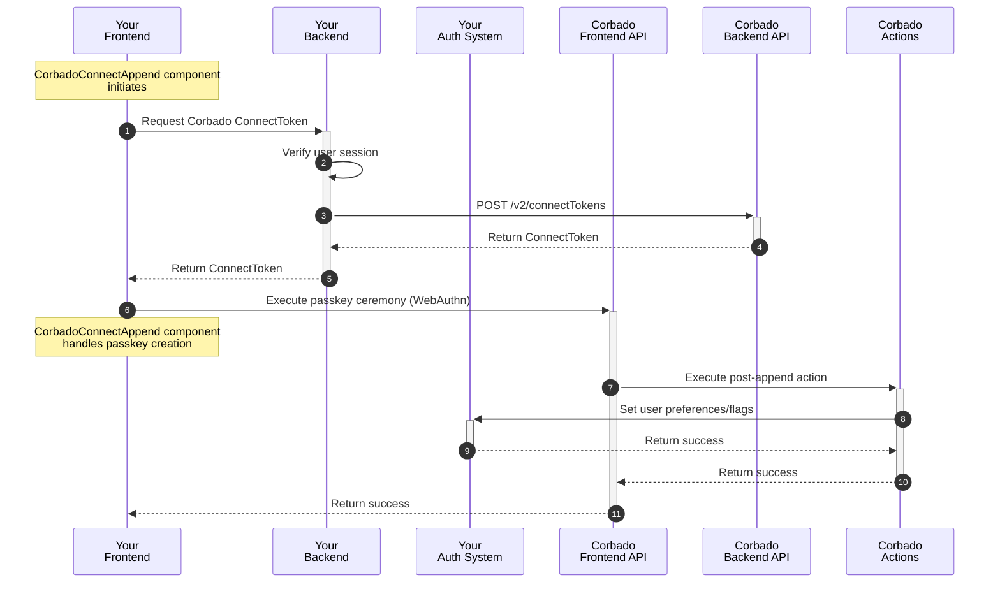

{/*
TODOS:
- extend flows with links to this generic guide
- mark option 3 somehow? "(planned)"? "(beta)"?
*/}

## Introduction

**Corbado Connect** allows you to seamlessly integrate passkey-first authentication into your existing Identity Provider (IdP) or authentication system. This enables you to offer your users a secure and convenient login experience without passwords, while still leveraging your existing user management infrastructure.

This guide provides a generic approach to integrating **Corbado Connect** with any authentication system, whether it's:

- A custom-built authentication solution
- A third-party Identity Provider (IdP)
- An authentication framework or library

The integration patterns described here can be adapted to work with virtually any authentication system that allows for custom authentication flows or external identity verification.

While we provide specific integration guides for popular authentication providers like [Amazon Cognito](/corbado-connect/integration/cognito), this guide serves as a foundation for integrating with any other authentication system.

## User Sign-up

In a typical integration scenario, the initial user sign-up is handled through your existing authentication system's standard registration process. This could be through:

- Email and password registration
- Social login providers
- Enterprise SSO

Once a user has successfully created an account and is logged in, **Corbado Connect** provides the ability to add a passkey to their account for future passwordless logins. This process is often called "passkey append" and represents the bridge between your existing user management system and Corbado's passkey infrastructure.

This approach offers several advantages:

- Maintains compatibility with your existing user registration flow
- Allows for gradual adoption of passkeys
- Preserves existing user data and relationships
- Enables a smooth transition for your users

The complete user sign-up and passkey append flow is illustrated in detail in our [User Sign-up Flow documentation](/corbado-connect/flows/user-sign-up). In the following sections, we'll break down each component of the implementation and explore different integration patterns to suit your specific needs.

### Implementation Overview

The user sign-up and passkey append process consists of a series of coordinated interactions between your application's frontend and backend, your authentication system, and Corbado's APIs. Here's a high-level overview of the flow:



In the following sections, we will explain each step in detail.

### UI Component Integration

The integration starts with the `CorbadoConnectAppend` component, which is designed to be used immediately after a user has been authenticated through your existing system. The component guides users through creating (or "appending") a passkey to their account, but only if they and their device meet the eligibility requirements.

Here's an example integration:

```js
<head>
  <script src="https://cdn.cloud.corbado.io/connect/dist/web-js-latest.min.js"></script>
  <link rel="stylesheet" href="https://cdn.cloud.corbado.io/connect/dist/web-js-latest.min.css" />
  <script type="module">
    const passkeyAppendElement = document.getElementById('passkey-append');
    Corbado.mountCorbadoConnectAppend(passkeyAppendElement, {
      projectId: "pro-XXXX", // Your Corbado Project ID
      frontendApiUrlSuffix: "frontendapi.cloud.corbado.io",

      // Called when the user decides not to create a passkey or passkey creation
      // is skipped. Add custom logic like logging and analytics.
      onSkip: (status) => { 
        console.log('Append skipped with status:', status);
      },

      appendTokenProvider: async () => {
        // Get Corbado ConnectToken from your backend, see next section
      },

      // Called when passkey creation is completed successfully. Use to
      // refresh page or show success UI for example.
      onComplete: (status, clientState) => { 
        console.log('Append complete with status:', status);
      },
    });
  </script>
</head>

<body>
  <!-- The passkey append UI will render into this div -->
  <div id="passkey-append"></div>
</body>
```

<Info>
For comprehensive information on configuration options, detailed styling choices, and customization using CSS variables and classes, please refer to the [CorbadoConnectAppend component documentation](/corbado-connect/ui-components/corbadoconnectappend).
</Info>

### Obtaining the ConnectToken

- transfer same section of cognito documentation @/corbado-connect/integrations/cognito.mdx to this generic case

## User Login

- transfer same section of cognito documentation @/corbado-connect/integrations/cognito.mdx to this generic case

### Implementation Overview

- explain signedPasskeyData (JWT) that everything "concentrates" around this jwt when we need to hand-over authentication state between Corbado Connect and the external system
- there are multiple options which will be explained next

#### Option 1: IdP extension

- this option is implemented by extending the existing IdP (with configuration or writing a plugin for example)
- refer to cognito custom auth flow/lambda functions
- signedPasskeyData will be passed to the external IdP and will be handled there
- first signedPasskeyData must get verified by doing a call to Corbado Backend API /v2/passkeys/verifySignedPasskeyData
- if successfully a session is created and returned (or own tokens JWT, access token etc.)
- transfer mermaid chart from "User Login > Implementation Overview" @/corbado-connect/integrations/cognito.mdx to this generic case (use a "External IdP" participant)

#### Option 2: Own endpoint

- this option is implemented by implementing your own endpoint
- send signedPasskeyData to own endpoint
- verify signedPasskeyData by doing a call to Corbado Backend API /v2/passkeys/verifySignedPasskeyData
- if successfully a session is created and returned (or own tokens JWT, access token etc.)
- transfer mermaid chart from "User Login > Implementation Overview" @/corbado-connect/integrations/cognito.mdx to this generic case (use a "ExampleBackend" participant)

#### Option 3: Corbado Action

- this option is implemented by implementing the post-login Corbado Action
- here you can create your own session and return a session id and/or token to the finish call

### UI Component Integration

- explain UI component integration/source-code from @/corbado-connect/ui-components/corbadoconnectlogin.mdx
- leave out the oncomplete callback and explain that is it option-depended and will be explained next

#### Option 1: IdP extension

- just redirect to profile page

#### Option 2: Own endpoint

- make call to own endpoint (ExampleBackend)
- explain that this new endpoint makes a call to Corbado Backend API /v2/passkeys/verifySignedPasskeyData (see sequence-chart)
- if successfully a session is created (response contains session cookie for example)
- explain session cookie case and jwt in response that you then can set as cookie or local storage or keep in memory

#### Option 3: Corbado Action

- just redirect to profile page

## Passkey Management

TODO

### Implementation Overview

TODO

### UI Component Integration

TODO

### Obtaining the ConnectToken

TODO