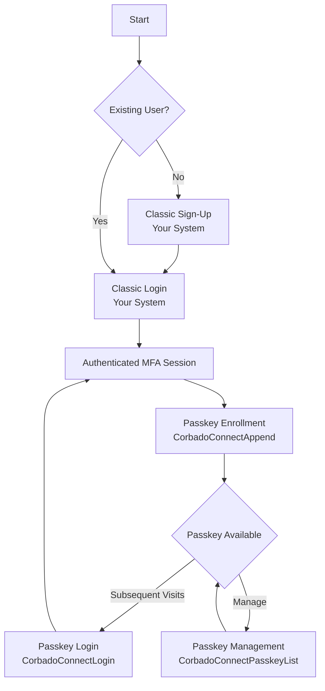
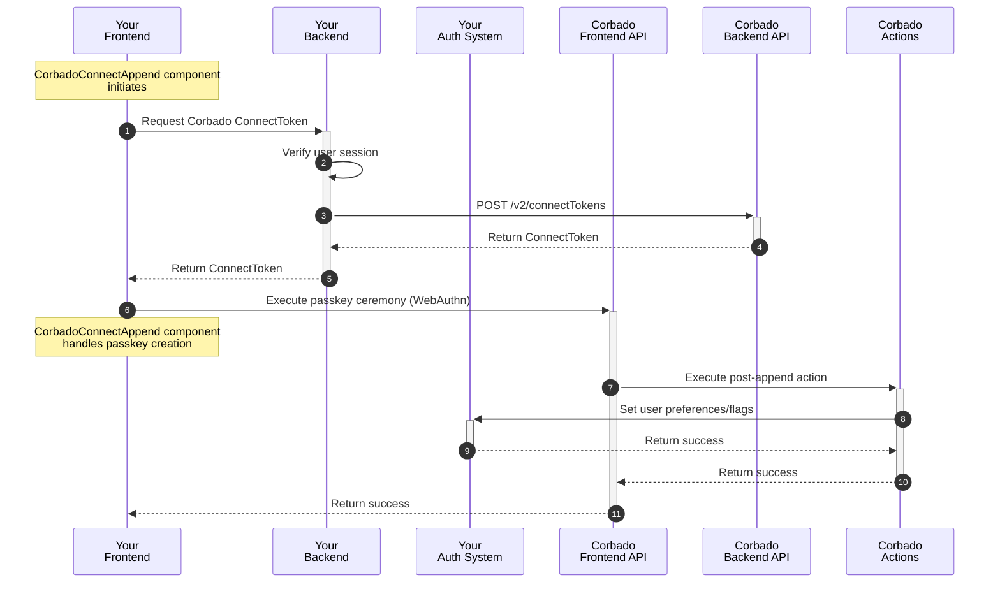
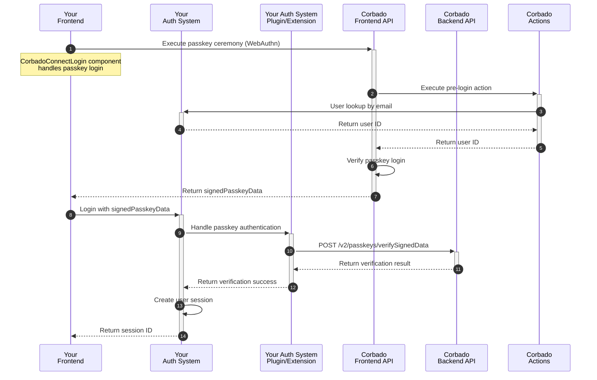
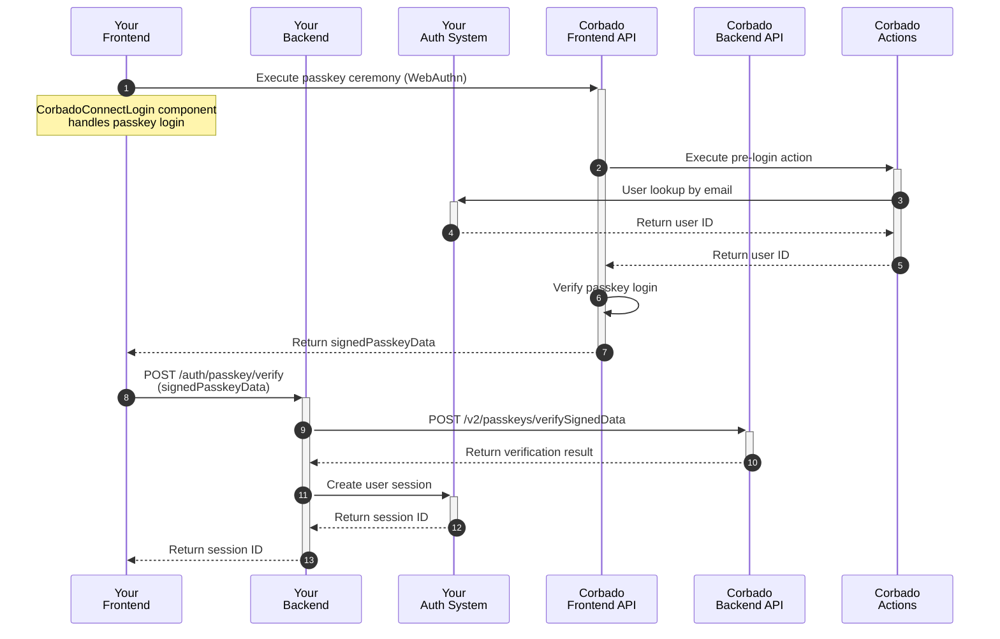
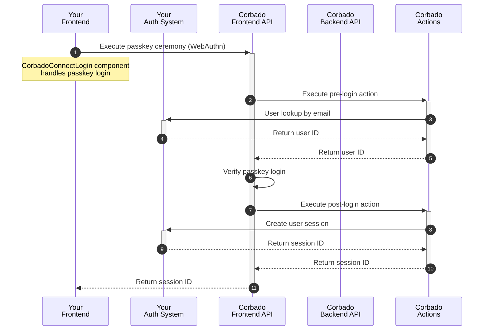

## Introduction

**Corbado Connect** is designed to seamlessly integrate passkey-first authentication into your existing Identity Provider (IdP) or custom authentication system. This approach allows you to offer your users a secure, convenient, and passwordless login experience while leveraging your current user management infrastructure. You can enhance your security and user experience without performing a complex migration or replacing your established authentication stack.

This guide provides a generic, step-by-step approach to integrating **Corbado Connect** that can be adapted to virtually any authentication system, including:

-   Custom-built authentication solutions
-   Third-party Identity Providers (IdPs)
-   Authentication frameworks and libraries

While we offer specific guides for providers like [Amazon Cognito](/corbado-connect/integration/cognito), this document serves as the foundational blueprint for all other integrations.

## The Recommended User Journey

Integrating **Corbado Connect** means layering passkey functionality on top of your existing system. Most enterprise clients already have a robust, often multi-step, sign-up process. Therefore, we recommend leaving your classic sign-up and login flows untouched and introducing passkeys *after* the user has successfully authenticated.

This post-login enrollment strategy ensures that a stable user identity (UUID) exists and an authenticated session is active—both are prerequisites for securely generating the tokens required for passkey operations. It also provides a natural path for your existing users to adopt passkeys.

Here is a visual overview of the recommended lifecycle:



This guide will walk you through implementing steps 3, 4, and 5.

## Step 1: Passkey Enrollment

The first step is to allow authenticated users to add a passkey to their account. This process, often called "passkey append", typically occurs on a dashboard or profile page immediately after a user logs in with their existing credentials.

The `CorbadoConnectAppend` component handles this flow, guiding users to create a passkey, but only if they and their device meet the necessary requirements determined by our [Gradual Rollout](/corbado-connect/features/gradual-rollout) and [Passkey Intelligence](/corbado-connect/features/passkey-intelligence) engines.

### Implementation Overview

The passkey enrollment process involves a coordinated effort between your frontend, your backend, and Corbado's APIs.



In the following sections, we will explain each step in detail.

### UI Component Integration

To begin, integrate the `CorbadoConnectAppend` component into a page that is accessible only to authenticated users.

Here's an example integration:

```js
<head>
  <script src="https://cdn.cloud.corbado.io/connect/dist/web-js-latest.min.js"></script>
  <link rel="stylesheet" href="https://cdn.cloud.corbado.io/connect/dist/web-js-latest.min.css" />
  <script type="module">
    const passkeyAppendElement = document.getElementById('passkey-append');
    Corbado.mountCorbadoConnectAppend(passkeyAppendElement, {
      projectId: "pro-XXX", // Your Corbado Project ID
      frontendApiUrlSuffix: "frontendapi.cloud.corbado.io",

      // Called when the user decides not to create a passkey or passkey creation
      // is skipped. Add custom logic like logging and analytics.
      onSkip: (status) => { 
        console.log('Append skipped with status:', status);
      },

      appendTokenProvider: async () => {
        // Get current user's session ID
        const sessionId = await getCurrentSessionId();

        // Get Corbado ConnectToken from your backend (see next section)
        const response = await fetch('/auth/corbadoConnectToken', {
            method: 'POST',
            headers: {
                'Content-Type': 'application/json',
                'Authorization': `Bearer ${sessionId}`
            },
            body: JSON.stringify({ type: 'passkey-append' })
        });

        if (!response.ok) {
            throw new Error('Failed to get ConnectToken');
        }

        const data = await response.json();

        return data.connectToken;
      },

      // Called when passkey creation is completed successfully. Use to
      // refresh page or show success UI for example.
      onComplete: (status, clientState) => { 
        console.log('Append complete with status:', status);
      },
    });
  </script>
</head>

<body>
  <!-- The passkey append UI will render into this div -->
  <div id="passkey-append"></div>
</body>
```

<Info>
For comprehensive information on configuration options, detailed styling choices, and customization using CSS variables and classes, please refer to the [CorbadoConnectAppend component documentation](/corbado-connect/ui-components/corbadoconnectappend).
</Info>

### Obtaining the ConnectToken

When the `CorbadoConnectAppend` component initializes, it calls the `appendTokenProvider` function to request a short-lived `ConnectToken`. This token authorizes the creation of a passkey for the currently authenticated user. Generating this token must be done on your backend to ensure security.

Here's an example of a backend endpoint for this purpose:

```javascript
// Example using Express.js
app.post('/auth/corbadoConnectToken', async (req, res) => {
    try {
        // 1. Verify the current user's session
        const sessionId = req.headers.authorization?.split(' ')[1];
        if (!sessionId) {
            return res.status(401).json({ error: 'No session ID provided' });
        }

        const user = await yourAuthSystem.verifySession(sessionId);
        if (!user) {
            return res.status(401).json({ error: 'Invalid session' });
        }

        // 2. Request ConnectToken from Corbado Backend API
        const response = await fetch('https://backendapi.cloud.corbado.io/v2/connectTokens', {
            method: 'POST',
            headers: {
                'Authorization': `Basic ${CORBADO_API_SECRET}`,
                'Content-Type': 'application/json',
            },
            body: JSON.stringify({
                type: req.body.type, // e.g., 'passkey-append'
                data: {
                    displayName: user.displayName,
                    identifier: user.email,
                }
            })
        });

        if (!response.ok) {
            console.error('Failed to get ConnectToken:', await response.text());
            return res.status(500).json({ error: 'Failed to get ConnectToken' });
        }

        const data = await response.json();
        
        // 3. Return the ConnectToken to the frontend
        res.json({
            connectToken: data.secret
        });
    } catch (error) {
        console.error('Error getting ConnectToken:', error);
        res.status(500).json({ error: 'Internal server error' });
    }
});
```

The endpoint performs several important steps:

1.  **Session Verification**: Ensures the request comes from an authenticated user.
2.  **User Information**: Retrieves user details needed for the `ConnectToken`.
3.  **Token Generation**: Requests a `ConnectToken` from Corbado's Backend API.
4.  **Error Handling**: Properly handles and reports any issues.

<Warning>
The `ConnectToken` is short-lived and single-use. Always generate a new token for each passkey operation. Never expose your API secret on the frontend.
</Warning>

### Updating MFA Settings

After a passkey is successfully created, you may need to update settings in your authentication system. This could include marking the user as having MFA enabled, setting passkey as their preferred authentication method, or simply recording the creation timestamp.

This can be achieved using Corbado [Actions](/corbado-connect/architecture/actions), which trigger custom logic at specific points in the flow. The `post-append` action is perfect for this.

Here's an example of a `post-append` action:

```javascript
// Main handler function for the 'post-append' action
export const handler = async (event) => {
    console.log('Received event:', event);

    try {
        const username = event.username;
        
        // 1. Check if MFA settings are already configured
        const user = await yourAuthSystem.getUser(username);
        if (user.hasMfaEnabled) {
            console.log('User already has MFA settings configured');
            return { statusCode: 200, body: {} };
        }

        // 2. Update MFA settings in your authentication system
        await yourAuthSystem.updateUser(username, {
            mfaEnabled: true,
            preferredMfaMethod: 'passkey',
            lastMfaUpdate: new Date().toISOString()
        });

        // 3. Return success
        return { statusCode: 200, body: {} };
    } catch (error) {
        console.error('Caught exception:', error);
        return {
            statusCode: 500,
            body: {
                message: 'Failed to update MFA settings',
                error: error.message,
            },
        };
    }
};
```

The implementation will depend on your system's API, but the pattern is consistent: receive the event, connect to your system, update user data, and return a response.

<Info>
For more information about Corbado actions and how to implement them, see the [Actions documentation](/corbado-connect/architecture/actions).
</Info>

## Step 2: Passkey Login

Once users have enrolled passkeys, you can offer them a truly passwordless login experience. The goal is to authenticate a user with their passkey via **Corbado Connect** and then establish an authenticated session in your own system.

The `CorbadoConnectLogin` component manages the entire UI and logic for this, including handling cases where a passkey isn't available on the current device.

### Implementation Overview

The key to the login flow is the `signedPasskeyData`, a short-lived, single-use JSON Web Token (JWT) that **Corbado Connect** provides upon successful passkey authentication. This JWT is the cryptographic proof that you can trust to establish a session for the user in your system.

There are three primary patterns for integrating the passkey login flow:

1.  **System Extension**: Extend your authentication system with a plugin or custom authentication method that can process the `signedPasskeyData`. This is a clean approach if your IdP supports it. (Our [Amazon Cognito](/corbado-connect/integration/cognito) guide uses this pattern).
2.  **Custom Endpoint**: Create a new backend endpoint dedicated to verifying the `signedPasskeyData` and creating a session. This offers maximum flexibility.
3.  **Corbado Action**: Use a `post-login` action to handle session creation directly within the Corbado ecosystem, minimizing changes to your backend.

For simplicity, we will elaborate on options 2 and 3, as they are the most universally applicable. In all cases, the final step is creating a session in your authentication system and returning a session identifier (e.g., a session token or cookie) to the client.

#### Option 1: System Extension

This advanced option involves building a plugin or extension for your existing authentication system. This keeps all authentication logic centralized within your IdP.

Here's how the flow typically works:



This approach is ideal when your authentication system has a well-documented plugin architecture and you want to maintain tight integration with its native session management.

#### Option 2: Custom Endpoint

This is a highly flexible approach where you implement a dedicated backend endpoint to verify the `signedPasskeyData` and create a session.

Here's how the flow works:



The backend endpoint implementation looks like this:

```typescript
// Example using Express.js
app.post('/auth/passkey/verify', async (req, res) => {
    try {
        const { signedPasskeyData } = req.body;

        // 1. Verify signedPasskeyData with Corbado Backend API
        const verifyResult = await fetch('https://backendapi.cloud.corbado.io/v2/passkeys/verifySignedData', {
            method: 'POST',
            headers: {
                'Authorization': `Basic ${CORBADO_API_SECRET}`,
                'Content-Type': 'application/json',
            },
            body: JSON.stringify({ signedPasskeyData })
        });

        const data = await verifyResult.json();
        if (data.verificationResult !== "success") {
            return res.status(401).json({ error: 'Invalid signedPasskeyData' });
        }

        // 2. Extract user information from the now-trusted data
        const userInfo = extractUserInfo(signedPasskeyData); // You'll need a JWT parsing library for this

        // 3. Create user session in your auth system
        const session = await yourAuthSystem.createSession({
            userId: userInfo.sub,
        });

        // 4. Return session ID to the client
        res.json({
            sessionId: session.id,
        });
    } catch (error) {
        console.error('Verification failed:', error);
        res.status(500).json({ error: 'Verification failed' });
    }
});
```

This approach is excellent when you need full control over the authentication flow or when your IdP doesn't support custom extensions.

#### Option 3: Corbado Action

This is the most lightweight approach, leveraging Corbado's `post-login` action to handle session creation. After a successful passkey login, the action is triggered, and your code is responsible for creating a session in your system and returning the session ID.

Here's how the flow works:



The implementation involves creating a `post-login` action in your Corbado project:

```javascript
export const handler = async (event) => {
    console.log('Received event:', event);

    try {
        const userId = event.userId;

        // 1. Create user session in your auth system
        const session = await yourAuthSystem.createSession({
            userId: userId,
        });

        // 2. Return session ID directly to the frontend
        return {
            statusCode: 200,
            body: {
                sessionId: session.id
            }
        };
    } catch (error) {
        console.error('Session creation failed:', error);
        return {
            statusCode: 500,
            body: {
                message: 'Failed to create session',
                error: error.message,
            },
        };
    }
};
```

This pattern is ideal for rapid integration with minimal changes to your existing backend services.

### UI Component Integration

Regardless of the backend pattern you choose, the frontend integration starts with the `CorbadoConnectLogin` component. You can embed this on a dedicated login page or inside a modal.

```html
<head>
  <script src="https://cdn.cloud.corbado.io/connect/dist/web-js-latest.min.js"></script>
  <link rel="stylesheet" href="https://cdn.cloud.corbado.io/connect/dist/web-js-latest.min.css" />

  <script type="module">
    const passkeyLoginElement = document.getElementById('authorize-with-passkey');
    Corbado.mountCorbadoConnectLogin(passkeyLoginElement, {
      projectId: "pro-XXX", // Your Corbado Project ID
      frontendApiUrlSuffix: "frontendapi.cloud.corbado.io", // Points to your chosen Corbado Frontend API environment

      // Called when passkey login is completed successfully
      onComplete: (result, clientState) => {
        // This callback's implementation varies depending on the option chosen
        // See the following sections for details
      },

      // Called when passkey login is not possible or fails. Use this to
      // show your fallback UI (e.g., a password field). The identifier might be
      // pre-filled if the user provided one.
      onFallback: (identifier, errorMessage) => {
        console.log(`Fallback triggered for '${identifier}' with message: ${errorMessage}`);
        // e.g., show a password field
      },
    });
  </script>
</head>

<body>
  <div id="authorize-with-passkey"></div>
  <div id="authorize-with-fallback" style="display: none;">
    <!-- Your existing fallback authentication (e.g. password) comes here -->
  </div>
</body>
```

<Info>
For comprehensive information on configuration options and customization, refer to the [CorbadoConnectLogin component documentation](/corbado-connect/ui-components/corbadoconnectlogin).
</Info>

The implementation of the `onComplete` callback depends on the backend option you selected.

#### onComplete for Option 2 (Custom Endpoint)

The `onComplete` callback receives the `signedPasskeyData`, which you must send to your verification endpoint.

```javascript
onComplete: async (result, clientState) => {
    try {
        const signedPasskeyData = result.signedPasskeyData;
        
        // 1. Send signedPasskeyData to your verification endpoint
        const response = await fetch('/auth/passkey/verify', {
            method: 'POST',
            headers: { 'Content-Type': 'application/json' },
            body: JSON.stringify({ signedPasskeyData })
        });

        if (!response.ok) {
            throw new Error('Verification failed');
        }

        const sessionData = await response.json();

        // 2. Handle the session (e.g., store token, redirect)
        // This part depends on how your backend sends the session
        // (e.g., via HttpOnly cookie or in the response body)
        localStorage.setItem('sessionId', sessionData.sessionId);

        // 3. Redirect to authenticated area
        window.location.href = '/profile';
    } catch (error) {
        console.error('Authentication failed:', error);
        // Handle error (show error message, trigger fallback, etc.)
    }
}
```

#### onComplete for Option 3 (Corbado Action)

When using a Corbado Action, the session ID is returned directly in the `result` object, simplifying the frontend logic.

```javascript
onComplete: (result, clientState) => {
    const sessionId = result.sessionId;

    // 1. Handle the session
    if (sessionId) {
        localStorage.setItem('sessionId', sessionId);
        
        // 2. Redirect to authenticated area
        window.location.href = '/profile';
    } else {
        console.error('Authentication failed: No session ID returned.');
        // Handle error
    }
}
```

## Step 3: Passkey Management

Providing users with a way to manage their passkeys is a critical part of the experience. The `CorbadoConnectPasskeyList` component offers a complete, pre-built UI for users to view, add, and delete passkeys associated with their account.

This component should be placed in a secure, authenticated area of your application, such as a user profile or account settings page.

### Implementation Overview

The `CorbadoConnectPasskeyList` component requires `ConnectToken`s to perform its actions (listing, appending, and deleting passkeys). Much like the enrollment flow, these tokens must be securely fetched from your backend to authorize each specific operation for the logged-in user.

### UI Component Integration

Integrate the component on a profile or settings page. The component will handle all the logic for displaying passkeys and managing user interactions.

```html
<head>
  <script src="https://cdn.cloud.corbado.io/connect/dist/web-js-latest.min.js"></script>
  <link rel="stylesheet" href="https://cdn.cloud.corbado.io/connect/dist/web-js-latest.min.css" />

  <script type="module">
    const passkeyListElement = document.getElementById('passkey-list');

    // This function provides ConnectTokens for all actions (list, append, delete)
    const connectTokenProvider = async (type) => {
      // 'type' will be 'passkey-list', 'passkey-append', or 'passkey-delete'
      const sessionId = await getCurrentSessionId();

      const response = await fetch('/auth/corbadoConnectToken', {
        method: 'POST',
        headers: { 
            'Content-Type': 'application/json',
            'Authorization': `Bearer ${sessionId}`
        },
        body: JSON.stringify({ type }), 
      });

      if (!response.ok) {
        throw new Error(`Failed to get ConnectToken for type: ${type}`);
      }

      const { connectToken } = await response.json();
      return connectToken;
    };

    Corbado.mountCorbadoConnectPasskeyList(passkeyListElement, {
      projectId: "pro-XXX", // Your Corbado Project ID
      frontendApiUrlSuffix: "frontendapi.cloud.corbado.io",
      connectTokenProvider: connectTokenProvider
    });
  </script>
</head>

<body>
  <!-- The passkey list UI will render into this div -->
  <div id="passkey-list"></div>
</body>
```

<Info>
For a detailed explanation of all available props and customization options, please see the [CorbadoConnectPasskeyList component documentation](/corbado-connect/ui-components/corbadoconnectpasskeylist).
</Info>

### Obtaining the ConnectToken

The `connectTokenProvider` function is the bridge to your backend. It's responsible for fetching a `ConnectToken` for the specific action (`passkey-list`, `passkey-append`, or `passkey-delete`) the user wants to perform. You can use the same backend endpoint created for the enrollment step, as it's already set up to handle different token types.

When a user opens the page, the component will call `connectTokenProvider('passkey-list')` to get a token to display the existing passkeys. If they try to delete a passkey, it will call `connectTokenProvider('passkey-delete')`, and so on. This ensures every action is explicitly authorized by your backend for the currently authenticated user.