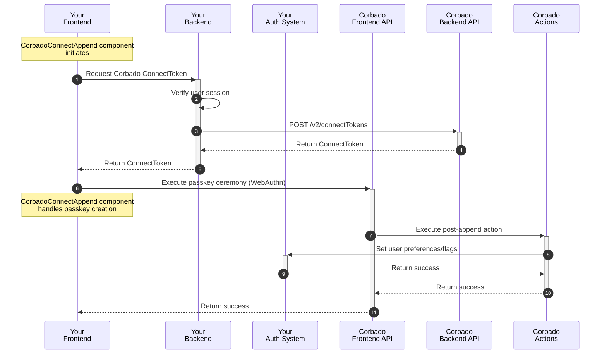
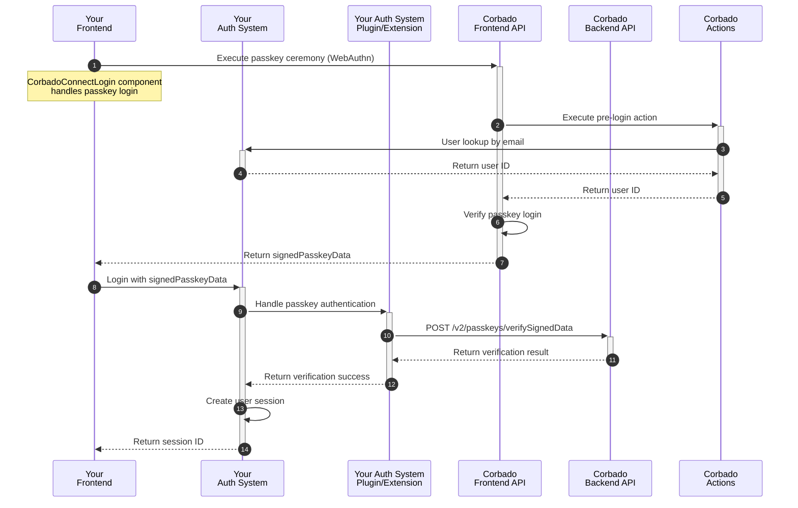
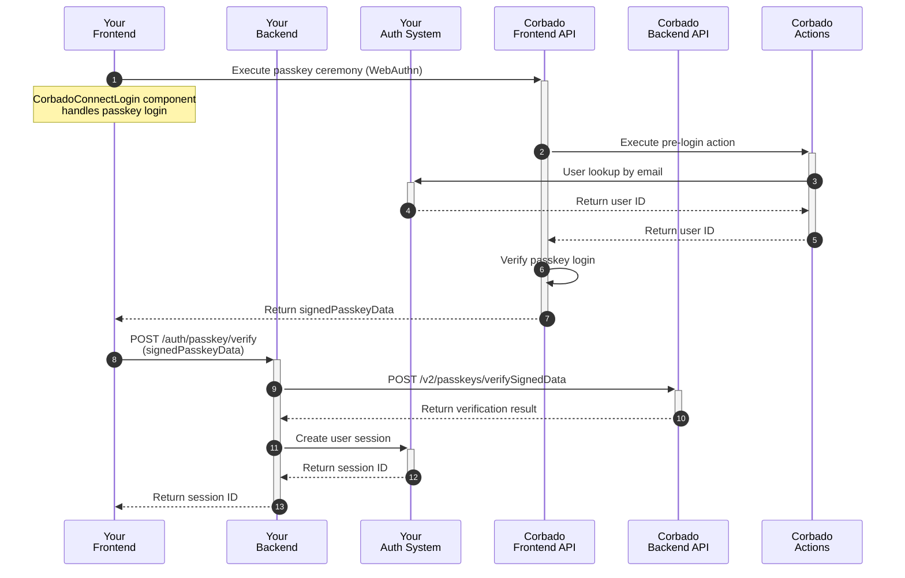
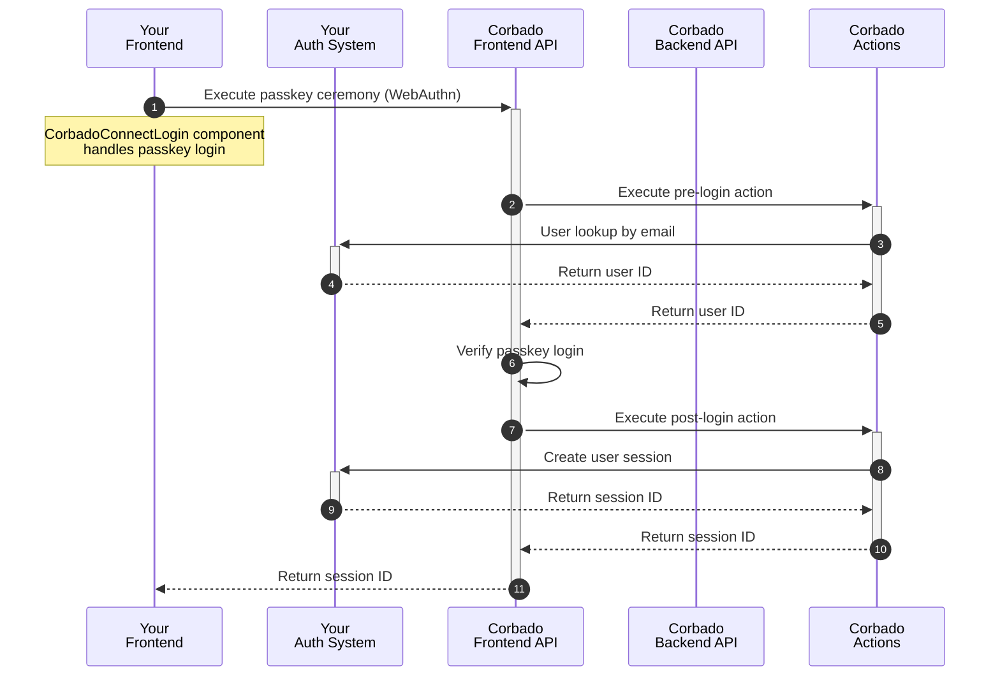

{/*
TODOS:
- extend flows with links to this generic guide
- mark option 3 somehow? "(planned)"? "(beta)"?
- Replace "Corbado" with "Corbado Connect"
*/}

## Introduction

**Corbado Connect** allows you to seamlessly integrate passkey-first authentication into your existing Identity Provider (IdP) or authentication system. This enables you to offer your users a secure and convenient login experience without passwords, while still leveraging your existing user management infrastructure.

This guide provides a generic approach to integrating **Corbado Connect** with any authentication system, whether it's:

- A custom-built authentication solution
- A third-party Identity Provider (IdP)
- An authentication framework or library

The integration patterns described here can be adapted to work with virtually any authentication system that allows for custom authentication flows or external identity verification.

While we provide specific integration guides for popular authentication providers like [Amazon Cognito](/corbado-connect/integration/cognito), this guide serves as a foundation for integrating with any other authentication system.

## User Sign-up

In a typical integration scenario, the initial user sign-up is handled through your existing authentication system's standard registration process. This could be through:

- Email and password registration
- Social login providers
- Enterprise SSO

Once a user has successfully created an account and is logged in, **Corbado Connect** provides the ability to add a passkey to their account for future passwordless logins. This process is often called "passkey append" and represents the bridge between your existing user management system and Corbado's passkey infrastructure.

This approach offers several advantages:

- Maintains compatibility with your existing user registration flow
- Allows for gradual adoption of passkeys
- Preserves existing user data and relationships
- Enables a smooth transition for your users

The complete user sign-up and passkey append flow is illustrated in detail in our [User Sign-up Flow documentation](/corbado-connect/flows/user-sign-up). In the following sections, we'll break down each component of the implementation and explore different integration patterns to suit your specific needs.

### Implementation Overview

The user sign-up and passkey append process consists of a series of coordinated interactions between your application's frontend and backend, your authentication system, and Corbado's APIs. Here's a high-level overview of the flow:



In the following sections, we will explain each step in detail.

### UI Component Integration

The integration starts with the `CorbadoConnectAppend` component, which is designed to be used immediately after a user has been authenticated through your existing system. The component guides users through creating (or "appending") a passkey to their account, but only if they and their device meet the eligibility requirements.

Here's an example integration:

```js
<head>
  <script src="https://cdn.cloud.corbado.io/connect/dist/web-js-latest.min.js"></script>
  <link rel="stylesheet" href="https://cdn.cloud.corbado.io/connect/dist/web-js-latest.min.css" />
  <script type="module">
    const passkeyAppendElement = document.getElementById('passkey-append');
    Corbado.mountCorbadoConnectAppend(passkeyAppendElement, {
      projectId: "pro-XXXX", // Your Corbado Project ID
      frontendApiUrlSuffix: "frontendapi.cloud.corbado.io",

      // Called when the user decides not to create a passkey or passkey creation
      // is skipped. Add custom logic like logging and analytics.
      onSkip: (status) => { 
        console.log('Append skipped with status:', status);
      },

      appendTokenProvider: async () => {
        // Get Corbado ConnectToken from your backend, see next section
      },

      // Called when passkey creation is completed successfully. Use to
      // refresh page or show success UI for example.
      onComplete: (status, clientState) => { 
        console.log('Append complete with status:', status);
      },
    });
  </script>
</head>

<body>
  <!-- The passkey append UI will render into this div -->
  <div id="passkey-append"></div>
</body>
```

<Info>
For comprehensive information on configuration options, detailed styling choices, and customization using CSS variables and classes, please refer to the [CorbadoConnectAppend component documentation](/corbado-connect/ui-components/corbadoconnectappend).
</Info>

### Obtaining the ConnectToken

When the component is initialized, it executes the function given in `appendTokenProvider` to request a short-lived `ConnectToken` from Corbado's Backend API (this token authorizes the creation of a passkey for a specific and authenticated user, see the [ConnectToken documentation](/corbado-connect/ui-components/overview#3-connecttokens-ctk) for more details).

To achieve this, you must implement a new endpoint in your system. This endpoint must first verify the user's session and then make the final request to the Corbado Backend API to obtain the `ConnectToken`.

### Updating MFA Settings

After a passkey is created, you may need to update settings in your authentication system to reflect this change. This could include:

- Marking the user as having MFA enabled
- Setting passkey as the preferred authentication method
- Updating user preferences or flags
- Recording the passkey creation timestamp

This can be achieved using Corbado [actions](/corbado-connect/architecture/actions), which enable you to extensively customize **Corbado Connect** to suit your specific requirements.

The `post-append` action is triggered after successful passkey creation. Here's an example of how you might implement this action:

```javascript
// Main handler function
export const handler = async (event) => {
    console.log('Received event:', event);

    try {
        // Get user information from the event
        const username = event.username;
        
        // Your authentication system's client/SDK
        const authClient = await getAuthClient();

        // First check if MFA settings are already configured
        const user = await authClient.getUser(username);
        if (user.hasMfaEnabled) {
            console.log('User already has MFA settings configured');
            
            return {
                statusCode: 200,
                body: {},
            };
        }

        // Update MFA settings in your authentication system
        await authClient.updateUser(username, {
            mfaEnabled: true,
            preferredMfaMethod: 'passkey',
            lastMfaUpdate: new Date().toISOString()
        });

        return {
            statusCode: 200,
            body: {}
        };
    } catch (error) {
        console.error('Caught exception:', error);

        return {
            statusCode: 500,
            body: {
                message: 'Failed to update MFA settings',
                error: error.message,
            },
        };
    }
};
```

The exact implementation will depend on your authentication system's API or SDK, but the general flow remains the same:

1. Receive the event with user information from Corbado
2. Connect to your authentication system
3. Check current MFA settings (optional)
4. Update the settings as needed
5. Return success or error response

<Info>
For more information about Corbado actions and how to implement them, see the [Actions documentation](/corbado-connect/architecture/actions).
</Info>

## User Login

Now that users can associate passkeys with their accounts, we can enable a truly passwordless login experience. The goal is to authenticate a user with their passkey using **Corbado Connect** and, upon successful verification, establish an authenticated session in your system.

The complete flow is illustrated in detail in our [User Login Flow documentation](/corbado-connect/flows/user-login).

### Implementation Overview

The cornerstone of user login integration is `signedPasskeyData` — a short-lived, single-use JSON Web Token (JWT) that confirms successful passkey authentication with **Corbado Connect**. This token acts as the link between **Corbado Connect's** passkey authentication and your authentication system, which ultimately needs to establish a session.

There are several ways to integrate the passkey login flow with your authentication system:

1. **System Extension**: If your authentication system supports plugins or custom authentication methods, you can extend it to manage `signedPasskeyData` verification and session creation (refer to our dedicated [Amazon Cognito](/corbado-connect/integration/cognito) integration guide, which follows this approach).
2. **Custom Endpoint**: Develop a new endpoint in your backend that verifies `signedPasskeyData` and establishes a session.
3. **Corbado Action**: Utilize Corbado's action system to directly manage the authentication flow and establish a session.

In each option, it is necessary to create a session within your authentication system at the conclusion of the process. For simplicity, we demonstrate creating a session in the database and returning a session ID. However, you have complete flexibility to implement sessions in any manner you prefer, such as using tokens implemented with a JWT. The specifics of session storage, whether as a cookie, in local storage, or in memory, are beyond the scope of this documentation.

We will now elaborate on each option in the following sections.

#### Option 1: System Extension

This option involves extending your existing authentication system through its plugin architecture or custom authentication method support. Many modern authentication systems provide ways to add new authentication methods or customize the authentication flow.

Here's how the flow typically works:



This approach is ideal when:

- Your authentication system has a plugin architecture
- You want to maintain all authentication logic within your existing system
- You need tight integration with your system's session management
- You want to leverage your system's existing user management features

<Info>
The exact implementation details will depend on your authentication system's extension capabilities. Some systems might require implementing specific interfaces or following certain patterns.
</Info>

#### Option 2: Custom Endpoint

This option involves implementing a dedicated endpoint in your backend that handles passkey verification and session creation. This approach gives you full control over the authentication flow and is suitable when your authentication system doesn't support extensions or when you need custom session handling.

Here's how the flow typically works:



The implementation typically involves creating a new endpoint in your backend:

```typescript
// Example using Express.js
app.post('/auth/passkey/verify', async (req, res) => {
    try {
        const { signedPasskeyData } = req.body;

        // 1. Verify signedPasskeyData with Corbado Backend API
        const verifyResult = await fetch('https://backendapi.cloud.corbado.io/v2/passkeys/verifySignedData', {
            method: 'POST',
            headers: {
                'Authorization': `Basic ${CORBADO_API_SECRET}`,
                'Content-Type': 'application/json',
            },
            body: JSON.stringify({ signedPasskeyData })
        });

        const data = await verifyResult.json();
        if (data.verificationResult !== "success") {
            return res.status(401).json({ error: 'Invalid signedPasskeyData' });
        }

        // 2. Extract user information
        const userInfo = extractUserInfo(signedPasskeyData);

        // 3. Create user session in your auth system
        const session = await yourAuthSystem.createSession({
            userId: userInfo.sub,
        });

        // 4. Return session ID to the client
        res.json({
            sessionId: session.Id,
        });
    } catch (error) {
        console.error('Verification failed:', error);
        res.status(500).json({ error: 'Authentication failed' });
    }
});
```

This approach is ideal when:

- Your authentication system doesn't support plugins/extensions
- You need complete control over the authentication flow
- You want to implement custom session management
- You're building a new authentication system from scratch

<Info>
Remember to implement proper error handling and security measures in your endpoint, such as rate limiting and logging.
</Info>

#### Option 3: Corbado Action

This option leverages Corbado's action system to handle the authentication flow. Instead of implementing verification logic in your system, you can use a `post-login` action to create and return a session. This approach minimizes the integration effort while maintaining security.

Here's how the flow typically works:



The implementation involves creating a `post-login` action:

```javascript
export const handler = async (event) => {
    console.log('Received event:', event);

    try {
        const userId = event.userId;

        // 1. Create user session in your auth system
        const session = await yourAuthSystem.createSession({
            userId: userId,
        });

        // 2. Return session ID to the client
        return {
            statusCode: 200,
            body: {
                sessionId: session.Id
            }
        };
    } catch (error) {
        console.error('Session creation failed:', error);

        return {
            statusCode: 500,
            body: {
                message: 'Failed to create session',
                error: error.message,
            },
        };
    }
};
```

This approach is ideal when:

- You want minimal changes to your existing system
- You prefer to handle authentication logic in **Corbado Connect's** environment
- You need a quick integration path
- Your authentication system has a simple session creation API

<Info>
The action environment provides secure access to your authentication system's API. Make sure to configure the necessary credentials and permissions in your **Corbado Connect** project settings.
</Info>

### UI Component Integration

- explain UI component integration/source-code from @/corbado-connect/ui-components/corbadoconnectlogin.mdx
- leave out the oncomplete callback and explain that is it option-depended and will be explained next

#### Option 1: IdP extension

- just redirect to profile page

#### Option 2: Own endpoint

- make call to own endpoint (ExampleBackend)
- explain that this new endpoint makes a call to Corbado Backend API /v2/passkeys/verifySignedPasskeyData (see sequence-chart)
- if successfully a session is created (response contains session cookie for example)
- explain session cookie case and jwt in response that you then can set as cookie or local storage or keep in memory

#### Option 3: Corbado Action

- just redirect to profile page

## Passkey Management

TODO

### Implementation Overview

TODO

### UI Component Integration

TODO

### Obtaining the ConnectToken

TODO