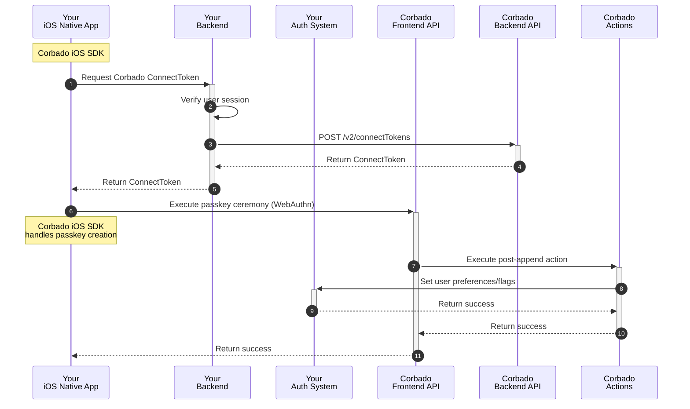

## Introduction

**Corbado Connect** provides a native iOS SDK that simplifies the integration of passkey authentication into your iOS native apps. By using our SDK, you can offer a seamless and secure user experience with passkeys, without needing to replace your existing Identity Provider (IdP). The SDK handles the complexities of the WebAuthn standard and our backend APIs, allowing you to focus on your app's core functionality.

This guide provides a step-by-step approach to integrating the **Corbado iOS SDK**. You'll learn how to implement passkey enrollment, login, and management within your app.

For a complete, working example, please refer to our example app available on GitHub. It's a great resource to see the SDK in action and to use as a reference during your own implementation.

<Card title="Example App" href="https://github.com/corbado/corbado-ios/tree/main/ConnectExample">
  See the Corbado iOS SDK in action.
</Card>

## SDK Installation

For the most up-to-date instructions on requirements, installation, and initialization, please refer to the official `README` in our GitHub repository. The `README` provides a comprehensive guide to getting the SDK set up in your project.

<Card title="Corbado iOS SDK" href="https://github.com/corbado/corbado-ios">
  Learn how to install the Corbado iOS SDK.
</Card>

## Backend Integration

The backend logic required to support **Corbado Connect** is consistent across all client platforms, whether it's a web application, an iOS app, or an Android app. The primary responsibility of your backend is to securely generate a `connectToken` for an authenticated user, a process that remains the same regardless of the client.

To maintain a single source of truth and avoid duplicating instructions, we've consolidated all backend-related steps into a dedicated guide. Please refer to it for a complete walkthrough of the required API endpoints in your backend.

<Card title="Backend Setup" href="/corbado-connect/integration/generic/backend">
  Learn how to implement the necessary backend endpoints in your backend to support passkey operations.
</Card>

To call your endpoint for `connectToken` generation, we create a small helper class that will be utilized in the upcoming integrations:

```swift AppBackend.swift
class AppBackend {
    static func getConnectToken(connectTokenType: ConnectTokenType, sessionId: String) async throws -> String {
        // 1. Set up request
        let urlString = "https://backend.example.com/connectToken"
        guard let url = URL(string: urlString) else {
            throw URLError(.badURL)
        }

        var request = URLRequest(url: url)
        request.httpMethod = "POST"
        request.setValue("application/json", forHTTPHeaderField: "Content-Type")

        let requestPayload = ConnectTokenRequest(
            connectTokenType: connectTokenType.rawValue,
            sessionId: sessionId
        )
        
        do {
            let jsonData = try JSONEncoder().encode(requestPayload)
            request.httpBody = jsonData
        } catch {
            throw error
        }

        // 2. Perform request
        let (data, response) = try await URLSession.shared.data(for: request)

        // 3. Check response
        guard let httpResponse = response as? HTTPURLResponse, (200...299).contains(httpResponse.statusCode) else {
            let statusCode = (response as? HTTPURLResponse)?.statusCode ?? -1
            print("Error: HTTP Status Code \(statusCode)")
            
            // You might want to try decoding error details from 'data' here if your API
            // provides them or a custom error
            throw URLError(.badServerResponse)
        }

        // 4. Decode the JSON response
        do {
            let decodedResponse = try JSONDecoder().decode(ConnectTokenResponse.self, from: data)
            return decodedResponse.token
        } catch {
            print("Error decoding JSON response: \(error)")
            
            if let responseString = String(data: data, encoding: .utf8) {
                print("Raw response string: \(responseString)")
            }
            
            throw error
        }
    }
}
```

You must provide the `sessionId` of the user's session to enable the backend to verify the user's authentication status.

<Info>We use a `sessionId` for demonstration purposes only. Any other method, such as a JWT, would also be suitable.</Info>

## Step 1: Passkey Enrollment

In a typical integration scenario, the initial user sign-up is handled through your existing authentication system's standard registration process. This could be through:

- Email and password registration
- Social login providers
- Enterprise SSO

Once a user has successfully created an account and is logged in, **Corbado Connect** provides the ability to add a passkey to their account for future passwordless logins. This process is often called "passkey append" and represents the bridge between your existing user management system and Corbado's passkey infrastructure.

This approach offers several advantages:

- Maintains compatibility with your existing user registration flow
- Allows for gradual adoption of passkeys
- Preserves existing user data and relationships
- Enables a smooth transition for your users

The complete user sign-up and passkey append flow is illustrated in detail in our [User Sign-up Flow documentation](/corbado-connect/flows/user-sign-up). In the following sections, we'll break down each component of the implementation.

### Implementation Overview

The user sign-up and passkey append process consists of a series of coordinated interactions between your iOS native app and backend, your authentication system, and Corbado's APIs. Here's a high-level overview of the flow:



In the following sections, we will explain each step in detail.

### App Integration

To integratate passkey creation into the app, we need to create a new screen advertising passkeys and a button to create a new passkey. As mentioned in the beginning, the user must have logged in first.


This screens interacts with **Corbado Connect** using the **Corbado iOS SDK** at two different situations which we will explain next.

#### Before Rendering

Before you render the screen above, you need to call `isAppendAllowed()` from the **Corbado iOS SDK**. This method checks [Gradual Rollout](/corbado-connect/features/gradual-rollout) and [Passkey Intelligence](/corbado-connect/features/passkey-intelligence) to determine if the user is allowed to append a passkey.

We will use the utility function explained above to provide a `connectToken` to the method. We need to provide the `sessionId` of the user's session to enable the backend to verify the user's authentication status. This of course depends on your authentication and session management system (e.g., you might use a JWT instead of a `sessionId`).

```swift
let nextStep = await corbado.isAppendAllowed { _ in
    return try await AppBackend.getConnectToken(connectTokenType: .append, sessionId: "...")
}

switch nextStep {
case .askUserForAppend(let autoAppend, _):
    if autoAppend {
        // Start passkey creation ceremony
    } else {
        // Render the screen above
    }
case .skip:
    // Skip passkey creation, route to next screen
}
```

#### On Button Click

If the user wants to create a passkey, he clicks on the create button. Then you need to call `completeAppend()` from the **Corbado iOS SDK**. This method will start the passkey creation ceremony that interacts with the iPhone and **Corbado Connect** (standard WebAuthn ceremony).

```swift
let rsp = await corbado.completeAppend()
switch rsp {
case .completed:
    // Passkey creation completed
case .cancelled:
    // Passkey creation cancelled
case .excludeCredentialsMatch:
    // Passkey creation failed
case .error:
    // Passkey creation failed
}
```

You need to decide what to do in the different cases, for example just routing to the next screen or showing a message.

## Step 2: Passkey Login

TODO

## Step 3: Passkey Management

TODO