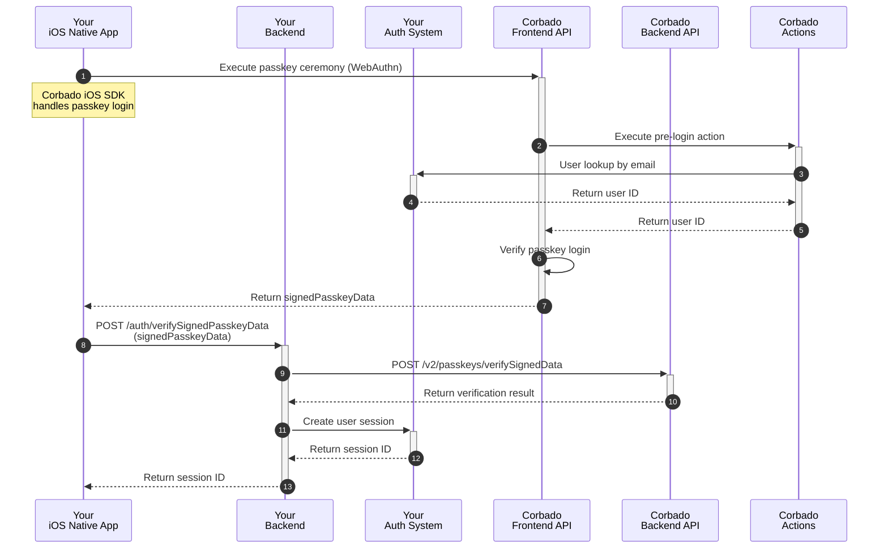

## Introduction

**Corbado Connect** provides a native iOS SDK that simplifies the integration of passkey authentication into your iOS native apps. By using our SDK, you can offer a seamless and secure user experience with passkeys, without needing to replace your existing Identity Provider (IdP). The SDK handles the complexities of the WebAuthn standard and our backend APIs, allowing you to focus on your app's core functionality.

This guide provides a step-by-step approach to integrating the **Corbado iOS SDK**. You'll learn how to implement passkey enrollment, login, and management within your app.

For a complete, working example, please refer to our example app available on GitHub. It's a great resource to see the SDK in action and to use as a reference during your own implementation.

<Card title="Example App" href="https://github.com/corbado/corbado-ios/tree/main/ConnectExample">
  See the Corbado iOS SDK in action.
</Card>

## SDK Installation

For the most up-to-date instructions on requirements, installation, and initialization, please refer to the official `README` in our GitHub repository. The `README` provides a comprehensive guide to getting the SDK set up in your project.

<Card title="Corbado iOS SDK" href="https://github.com/corbado/corbado-ios">
  Learn how to install the Corbado iOS SDK.
</Card>

## Backend Integration

The backend logic required to support **Corbado Connect** is consistent across all client platforms, whether it's a web application, an iOS native app, or an Android native app.

To maintain a single source of truth and avoid duplicating instructions, we've consolidated all backend-related steps into a dedicated guide. Please refer to it for a complete walkthrough of the required API endpoints in your backend:

<Card title="Backend Setup" href="/corbado-connect/integration/generic/backend">
  Learn how to implement the necessary backend endpoints in your backend to support passkey operations.
</Card>

To call your endpoints for `connectToken` generation and `signedPasskeyData` verification, we create a small helper class that will be utilized in the upcoming integrations:

```swift AppBackend.swift
class AppBackend {
    /// Get connectToken from backend (which gets it from Corbado Backend API)
    static func getConnectToken(connectTokenType: ConnectTokenType, sessionId: String) async throws -> String {
        // 1. Set up request
        let urlString = "https://<your-backend-url>/auth/createConnectToken"
        guard let url = URL(string: urlString) else {
            throw URLError(.badURL)
        }

        var request = URLRequest(url: url)
        request.httpMethod = "POST"
        request.setValue("application/json", forHTTPHeaderField: "Content-Type")

        let requestPayload = GetConnectTokenRequest(
            connectTokenType: connectTokenType.rawValue,
            sessionId: sessionId
        )
        
        do {
            let jsonData = try JSONEncoder().encode(requestPayload)
            request.httpBody = jsonData
        } catch {
            throw error
        }

        // 2. Perform request
        let (data, response) = try await URLSession.shared.data(for: request)

        // 3. Check response
        guard let httpResponse = response as? HTTPURLResponse, (200...299).contains(httpResponse.statusCode) else {
            let statusCode = (response as? HTTPURLResponse)?.statusCode ?? -1
            print("Error: HTTP Status Code \(statusCode)")
            
            // You might want to try decoding error details from 'data' here if your API
            // provides them or a custom error
            throw URLError(.badServerResponse)
        }

        // 4. Decode the JSON response
        do {
            let decodedResponse = try JSONDecoder().decode(GetConnectTokenResponse.self, from: data)
            return decodedResponse.token
        } catch {
            print("Error decoding JSON response: \(error)")
            
            if let responseString = String(data: data, encoding: .utf8) {
                print("Raw response string: \(responseString)")
            }
            
            throw error
        }
    }

    /// Verify signedPasskeyData with backend (which verifies with Corbado Backend API)
    static func verifySignedPasskeyData(signedPasskeyData: String) async throws -> (Bool, String) {
        // 1. Set up request
        let urlString = "https://<your-backend>/auth/verifySignedPasskeyData"
        guard let url = URL(string: urlString) else {
            throw URLError(.badURL)
        }

        var request = URLRequest(url: url)
        request.httpMethod = "POST"
        request.setValue("application/json", forHTTPHeaderField: "Content-Type")

        let requestPayload = VerifySignedPasskeyDataRequest(
            signedPasskeyData: signedPasskeyData
        )
        
        do {
            let jsonData = try JSONEncoder().encode(requestPayload)
            request.httpBody = jsonData
        } catch {
            throw error
        }

        // 2. Perform request
        let (data, response) = try await URLSession.shared.data(for: request)

        // 3. Check response
        guard let httpResponse = response as? HTTPURLResponse, (200...299).contains(httpResponse.statusCode) else {
            let statusCode = (response as? HTTPURLResponse)?.statusCode ?? -1
            print("Error: HTTP Status Code \(statusCode)")
            
            // You might want to try decoding error details from 'data' here if your API
            // provides them or a custom error
            throw URLError(.badServerResponse)
        }

        // 4. Decode the JSON response
        do {
            let decodedResponse = try JSONDecoder().decode(VerifySignedPasskeyDataResponse.self, from: data)
            return (decodedResponse.success, decodedResponse.sessionId)
        } catch {
            print("Error decoding JSON response: \(error)")
            
            if let responseString = String(data: data, encoding: .utf8) {
                print("Raw response string: \(responseString)")
            }
            
            throw error
        }
    }
}

struct GetConnectTokenRequest: Codable {
    let connectTokenType: String
    let idToken: String
}

struct GetConnectTokenResponse: Codable {
    let token: String
}

struct VerifySignedPasskeyDataRequest: Codable {
    let signedPasskeyData: String
}

struct VerifySignedPasskeyDataResponse: Codable {
    let success: Bool
    let sessionId: String
}
```

For `getConnectToken()`, you must provide the `sessionId` of the user's session to enable the backend to verify the user's authentication status.

<Info>We use a `sessionId` for demonstration purposes only. Any other method, such as a JWT, would also be suitable.</Info>

## Step 1: Passkey Enrollment

In a typical integration scenario, the initial user sign-up is handled through your existing authentication system's standard registration process. This could be through:

- Email and password registration
- Social login providers
- Enterprise SSO

Once a user has successfully created an account and is logged in, **Corbado Connect** provides the ability to add a passkey to their account for future passwordless logins. This process is often called "passkey append" and represents the bridge between your existing user management system and Corbado's passkey infrastructure.

This approach offers several advantages:

- Maintains compatibility with your existing user registration flow
- Allows for gradual adoption of passkeys
- Preserves existing user data and relationships
- Enables a smooth transition for your users

The complete user sign-up and passkey append flow is illustrated in detail in our [User Sign-up Flow documentation](/corbado-connect/flows/user-sign-up). In the following sections, we'll break down each component of the implementation.

### Implementation Overview

The user sign-up and passkey append process consists of a series of coordinated interactions between your iOS native app and backend, your authentication system, and Corbado's APIs. Here's a high-level overview of the flow:


In the following sections, we will explain each step in detail.

### App Integration

Integrating passkey enrollment into your app involves presenting a new screen that encourages authenticated users to create a passkey for future passwordless logins.


The interaction with the **Corbado iOS SDK** on this screen occurs at two key moments: before the screen is rendered and when the user taps the creation button.

#### Before Rendering

Before rendering the passkey enrollment screen, you should call the `isAppendAllowed()` method from the **Corbado iOS SDK**. This function is crucial for determining if the current user is eligible to add a passkey, based on your configurations for [Gradual Rollout](/corbado-connect/features/gradual-rollout) and [Passkey Intelligence](/corbado-connect/features/passkey-intelligence).

The method requires a `connectTokenProvider`, a closure that fetches a short-lived `connectToken` from your backend. We'll use the `AppBackend` helper class defined previously. You need to provide the user's current session identifier (e.g., a session ID or JWT) so your backend can verify their authenticated state before generating the token.

```swift
// In your ViewModel or screen logic
let nextStep = await corbado.isAppendAllowed { _ in
    // Provide the session ID of the currently logged-in user.
    return try await AppBackend.getConnectToken(connectTokenType: .append, sessionId: "your-user-session-id")
}

switch nextStep {
case .askUserForAppend(let autoAppend, _):
    if autoAppend {
        // Passkey Intelligence determined the user is highly likely to convert.
        // You can immediately trigger the passkey creation ceremony or adjust the UI
        // to encourage immediate action. For now, we'll simply show the screen.
    }
    
    // Render the screen as shown above, allowing the user to initiate.
case .skip:
    // The user is not eligible for passkey append at this time.
    // You should skip this screen and navigate them to the main part of your app.
}
```

#### On Button Click

When the user taps the button to create a passkey, you must call the `completeAppend()` method from the **Corbado iOS SDK**. This function initiates the native iOS passkey creation ceremony, which securely interacts with the device's hardware and Corbado's backend.

The method returns a status indicating the outcome of the ceremony, which you should handle accordingly.

```swift
// In your button's action handler
let response = await corbado.completeAppend()

switch response {
case .completed:
    // Success! The passkey was created and associated with the user's account.
    // Navigate to a success screen or the next part of your app.
    print("Passkey creation successful!")
case .cancelled:
    // The user manually cancelled the native iOS prompt.
    // No action is typically needed; the user remains on the current screen.
    print("Passkey creation was cancelled by the user.")
case .excludeCredentialsMatch:
    // A passkey from this device already exists for the user.
    // This is not an error. Inform the user gracefully.
    print("A passkey already exists on this device.")
case .error:
    // An unexpected error occurred during the process.
    // Display an error message to the user.
    print("An error occurred during passkey creation.")
}
```

## Step 2: Passkey Login

Now that users can associate passkeys with their accounts, we can enable a truly passwordless login experience. The goal is to authenticate a user with their passkey using **Corbado Connect** and, upon successful verification, establish an authenticated session in your system.

The complete flow is illustrated in detail in our [User Login Flow documentation](/corbado-connect/flows/user-login).

### Implementation Overview

The user login process consists of a series of coordinated interactions between your iOS native app and backend, your authentication system, and Corbado's APIs. Here's a high-level overview of the flow:



In the following sections, we will explain each step in detail.

### App Integration

Integrating passkey login into your app is a little bit more complex than passkey enrollment because we have to directly integrate with your existing login screen and there are more cases to handle including multiple screens.

#### Before Rendering

Before rendering the login screen, you should call the `isLoginAllowed()` method from the **Corbado iOS SDK**. This function is crucial for determining if the current user is eligible to use a passkey, based on your configurations for [Gradual Rollout](/corbado-connect/features/gradual-rollout) and [Passkey Intelligence](/corbado-connect/features/passkey-intelligence).

```swift
let nextStep = await corbado.isLoginAllowed()
switch nextStep {
case .initTextField(let cuiChallenge, _):
    // If cuiChallenge is not nil, handle "Conditional UI Login",
    // otherwise handle "Textfield Login" (see below)
    
case .initOneTap(let email):
    // Handle "OneTap Login" (see below)
case .initFallback(_, _):
    // Handle "Fallback Login" (see below)
}
```

#### Conditional UI Login

- Explain CUI
- Link to glossary
- Show screen
- Show code/methods

#### Textfield Login

- Explain textfield
- Show screen
- Show code/methods

#### OneTap Login

- Explain OneTap
- Link to OneTap feature
- Show screen
- Show code/methods

#### Fallback Login

- Explain Fallback
- Show screen
- Explain that own code runs

## Step 3: Passkey Management

TODO