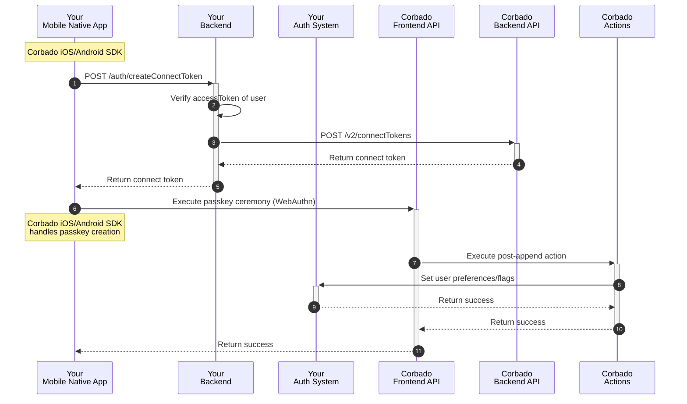
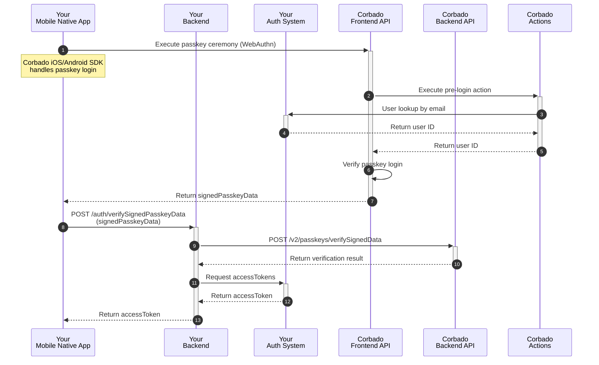
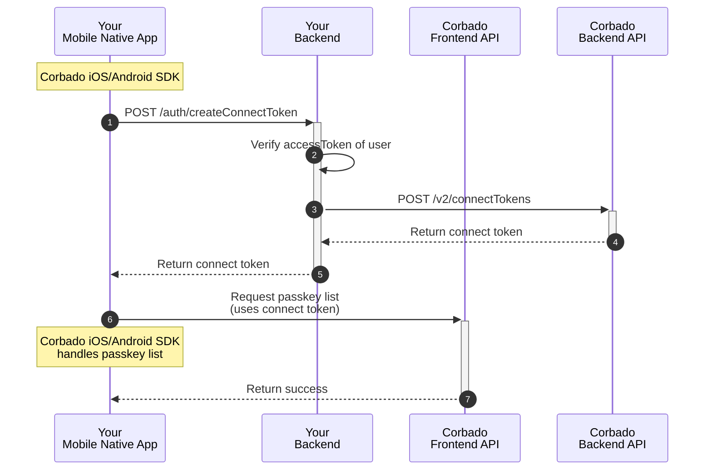

import Demo from "/snippets/corbado-connect/demo.mdx"

<Demo />

## 1. Introduction

**Corbado Connect** provides native SDKs for both **iOS** and **Android** that simplify the integration of passkey authentication into your native apps. By using our SDKs, you can offer a seamless and secure user experience with passkeys, without needing to replace your existing Identity Provider (IdP). The SDKs handle the complexities of the WebAuthn standard and our backend APIs, allowing you to focus on your app's core functionality.

This guide provides a step-by-step approach to integrating the **Corbado iOS SDK** and **Corbado Android SDK**. You'll learn how to implement passkey enrollment, login, and management within your app.

For a comprehensive, working example, please refer to our example apps available on GitHub. They are an excellent resource to observe the SDKs in action and to use as a reference during your own implementation. Please note that the example apps use Cognito as an Identity Provider, but the implementation is similar for any other IdP.

<CardGroup>
    <Card title="iOS example App" href="https://github.com/corbado/corbado-ios/tree/main/ConnectExample">
    See the Corbado iOS SDK in action.
    </Card>
    <Card title="Android example App" href="https://github.com/corbado/corbado-android/tree/main/example">
    See the Corbado Android SDK in action.
    </Card>
</CardGroup>

## 2. SDK Installation

For the most up-to-date instructions on requirements, installation, and initialization, please refer to the official `README` in our GitHub repositories. The `README` provides a comprehensive guide to getting the SDK set up in your project.

<CardGroup>
    <Card title="Corbado iOS SDK" href="https://github.com/corbado/corbado-ios">
    Learn how to install the Corbado iOS SDK.
    </Card>
    <Card title="Corbado Android SDK" href="https://github.com/corbado/corbado-android">
    Learn how to install the Corbado Android SDK.
    </Card>
</CardGroup>

## 3. Backend Integration

The backend logic required to support **Corbado Connect** is consistent across all client platforms, whether it's a web application or an native/mobile application.

To maintain a single source of truth and avoid duplicating instructions, we've consolidated all backend-related steps into a dedicated guide. Please refer to it for a complete walkthrough of the required session management and API endpoints in your backend:

<Card title="Backend Setup" href="/corbado-connect/integration/generic/backend">
  Learn how to implement the necessary session management and API endpoints in your backend.
</Card>

To call your endpoints for [connect token](/corbado-connect/concepts/connect-token) generation and [signedPasskeyData](/corbado-connect/concepts/signed-passkey-data) verification (both endpoints are described in the **Backend Setup** guide), we create a small helper class that will be utilized in the upcoming integrations:

<CodeGroup>
```swift AppBackend.swift
import CorbadoConnect
import Foundation

class AppBackend {
    /// Get connect token from backend (which gets it from Corbado Backend API)
    static func getConnectToken(connectTokenType: ConnectTokenType, accessToken: String) async throws -> String {
        // 1. Set up request
        let urlString = "https://<your-backend>/auth/createConnectToken"
        guard let url = URL(string: urlString) else {
            throw URLError(.badURL)
        }

        var request = URLRequest(url: url)
        request.httpMethod = "POST"
        request.setValue("application/json", forHTTPHeaderField: "Content-Type")
        request.setValue("Bearer \(accessToken)", forHTTPHeaderField: "Authorization")

        let requestPayload = GetConnectTokenRequest(
            connectTokenType: connectTokenType.rawValue
        )
        
        do {
            let jsonData = try JSONEncoder().encode(requestPayload)
            request.httpBody = jsonData
        } catch {
            throw error
        }

        // 2. Perform request
        let (data, response) = try await URLSession.shared.data(for: request)

        // 3. Check response
        guard let httpResponse = response as? HTTPURLResponse, (200...299).contains(httpResponse.statusCode) else {
            let statusCode = (response as? HTTPURLResponse)?.statusCode ?? -1
            print("Error: HTTP Status Code \(statusCode)")
            
            // You might want to try decoding error details from 'data' here if your API
            // provides them or a custom error
            throw URLError(.badServerResponse)
        }

        // 4. Decode the JSON response
        do {
            let decodedResponse = try JSONDecoder().decode(GetConnectTokenResponse.self, from: data)
            return decodedResponse.connectToken
        } catch {
            print("Error decoding JSON response: \(error)")
            
            if let responseString = String(data: data, encoding: .utf8) {
                print("Raw response string: \(responseString)")
            }
            
            throw error
        }
    }

    /// Verify signedPasskeyData with backend (which verifies with Corbado Backend API)
    /// If you are using an external Identity Provider (IdP) such as Amazon Cognito or Firebase, 
    /// you can delegate the verification process to those systems by making a call to them.
    static func verifySignedPasskeyData(signedPasskeyData: String) async throws -> (Bool, String) {
        // 1. Set up request
        let urlString = "https://<your-backend>/auth/verifySignedPasskeyData"
        guard let url = URL(string: urlString) else {
            throw URLError(.badURL)
        }

        var request = URLRequest(url: url)
        request.httpMethod = "POST"
        request.setValue("application/json", forHTTPHeaderField: "Content-Type")

        let requestPayload = VerifySignedPasskeyDataRequest(
            signedPasskeyData: signedPasskeyData
        )
        
        do {
            let jsonData = try JSONEncoder().encode(requestPayload)
            request.httpBody = jsonData
        } catch {
            throw error
        }

        // 2. Perform request
        let (data, response) = try await URLSession.shared.data(for: request)

        // 3. Check response
        guard let httpResponse = response as? HTTPURLResponse, (200...299).contains(httpResponse.statusCode) else {
            let statusCode = (response as? HTTPURLResponse)?.statusCode ?? -1
            print("Error: HTTP Status Code \(statusCode)")
            
            // You might want to try decoding error details from 'data' here if your API
            // provides them or a custom error
            throw URLError(.badServerResponse)
        }

        // 4. Decode the JSON response
        do {
            let decodedResponse = try JSONDecoder().decode(VerifySignedPasskeyDataResponse.self, from: data)
            return (decodedResponse.success, decodedResponse.accessToken)
        } catch {
            print("Error decoding JSON response: \(error)")
            
            if let responseString = String(data: data, encoding: .utf8) {
                print("Raw response string: \(responseString)")
            }
            
            throw error
        }
    }
}

struct GetConnectTokenRequest: Codable {
    let connectTokenType: String
}

struct GetConnectTokenResponse: Codable {
    let token: String
}

struct VerifySignedPasskeyDataRequest: Codable {
    let signedPasskeyData: String
}

struct VerifySignedPasskeyDataResponse: Codable {
    let success: Bool
    let accessToken: String
}
```
```kotlin AppBackend.kt
import com.corbado.connect.core.ConnectTokenType
import kotlinx.serialization.Serializable
import kotlinx.serialization.json.Json
import java.io.BufferedReader
import java.io.InputStreamReader
import java.io.OutputStreamWriter
import java.net.HttpURLConnection
import java.net.URL

object AppBackend {
    // Get connect token from backend (which gets it from Corbado Backend API)
    suspend fun getConnectToken(
        connectTokenType: ConnectTokenType,
        accessToken: String
    ): Result<String> {
        return try {
            // 1. Set up request
            val request = GetConnectTokenRequest(connectTokenType)
            val jsonRequest = Json.encodeToString(GetConnectTokenRequest.serializer(), request)

            // 2. Perform request
            val urlString = "https://<your-backend>/auth/createConnectToken"
            val url = URL(urlString)
            val connection = url.openConnection() as HttpURLConnection
            connection.requestMethod = "POST"
            connection.setRequestProperty("Content-Type", "application/json")
            connection.setRequestProperty("Authorization", "Bearer $accessToken")
            connection.doOutput = true

            val writer = OutputStreamWriter(connection.outputStream)
            writer.write(jsonRequest)
            writer.flush()

            // 3. Check response
            val reader = BufferedReader(InputStreamReader(connection.inputStream))
            val response = reader.readText()

            // 4. Decode the JSON response
            val jsonResponse = Json.decodeFromString(GetConnectTokenResponse.serializer(), response)

            Result.success(jsonResponse.connectToken)
        } catch (e: Exception) {
            Result.failure(e)
        }
    }

    // Verify signedPasskeyData with backend (which verifies with Corbado Backend API)
    // If you are using an external Identity Provider (IdP) such as Amazon Cognito or Firebase,
    // you can delegate the verification process to those systems by making a call to them.
    suspend fun verifySignedPasskeyData(signedPasskeyData: String): Result<Pair<Boolean, String>> {
        return try {
            // 1. Set up request
            val request = VerifySignedPasskeyDataRequest(signedPasskeyData)
            val jsonRequest = Json.encodeToString(VerifySignedPasskeyDataRequest.serializer(), request)

            // 2. Perform request
            val urlString = "https://<your-backend>/auth/verifySignedPasskeyData"
            val url = URL(urlString)
            val connection = url.openConnection() as HttpURLConnection
            connection.requestMethod = "POST"
            connection.setRequestProperty("Content-Type", "application/json")
            connection.doOutput = true

            val writer = OutputStreamWriter(connection.outputStream)
            writer.write(jsonRequest)
            writer.flush()

            // 3. Check response
            val reader = BufferedReader(InputStreamReader(connection.inputStream))
            val response = reader.readText()

            // 4. Decode the JSON response
            val jsonResponse = Json.decodeFromString(VerifySignedPasskeyDataResponse.serializer(), response)

            Result.success(Pair(jsonResponse.success, jsonResponse.accessToken))
        } catch (e: Exception) {
            Result.failure(e)
        }
    }
}

@Serializable
data class GetConnectTokenRequest(
    val connectTokenType: ConnectTokenType,
)

@Serializable
data class GetConnectTokenResponse(
    val token: String
)

@Serializable
data class VerifySignedPasskeyDataRequest(
    val signedPasskeyData: String
)

@Serializable
data class VerifySignedPasskeyDataResponse(
    val success: Boolean,
    val accessToken: String
)
```
</CodeGroup>

For `getConnectToken()`, you must provide the user's `accessToken` to enable the backend to verify their authenticated state.

<Info>For more details on `accessTokens`, please refer to the session management section in the [Backend Setup](/corbado-connect/integration/generic/backend#2-session-management) guide.</Info>

## 4. Passkey Enrollment

In a typical integration scenario, the initial user sign-up is handled through your existing authentication system's standard registration process. This could be through:

- Email and password registration
- Social login providers
- Enterprise SSO

Once a user has successfully created an account and is logged in, **Corbado Connect** provides the ability to add a passkey to their account for future passwordless logins. This process is often called "passkey append" and represents the bridge between your existing user management system and Corbado's passkey infrastructure.

This approach offers several advantages:

- Maintains compatibility with your existing user registration flow
- Allows for gradual adoption of passkeys
- Preserves existing user data and relationships
- Enables a smooth transition for your users

The complete user sign-up and passkey append flow is illustrated in detail in our [User Sign-up Flow documentation](/corbado-connect/flows/user-sign-up). In the following sections, we'll break down each component of the implementation.

### 4.1 Implementation Overview

The user sign-up and passkey append process consists of a series of coordinated interactions between your mobile native app and backend, your authentication system, and Corbado's APIs. Here's a high-level overview of the flow:



In the following sections, we will explain each step in detail.

### 4.2 App Integration

Integrating passkey enrollment into your app involves presenting a new screen that encourages authenticated users to create a passkey for future passwordless logins.


The interaction with the **Corbado iOS/Android SDK** on this screen occurs at two key moments: before the screen is rendered and when the user taps the creation button.

#### 4.2.1 Before Rendering

Before rendering the passkey enrollment screen, you should call the `isAppendAllowed()` method from the **Corbado iOS/Android SDK**. This function is crucial for determining if the current user is eligible to add a passkey, based on your configurations for [Gradual Rollout](/corbado-connect/features/gradual-rollout) and [Passkey Intelligence](/corbado-connect/features/passkey-intelligence).

The method requires a `connectTokenProvider`, a closure that fetches a [connect token](/corbado-connect/concepts/connect-token) from your backend. We'll use the `AppBackend` helper class defined previously. You need to provide the user's current `accessToken` so your backend can verify their authenticated state before generating the token.

<CodeGroup>
```swift iOS example (Swift)
// In your ViewModel or screen logic
let nextStep = await corbado.isAppendAllowed { _ in
    // Provide the accessToken of the currently logged-in user.
    return try await AppBackend.getConnectToken(connectTokenType: .PasskeyAppend, accessToken: "access-token-of-user")
}

switch nextStep {
case .askUserForAppend(let autoAppend, _):
    if autoAppend {
        // Passkey Intelligence determined the user is highly likely to convert.
        // You can immediately trigger the passkey creation ceremony or adjust the UI
        // to encourage immediate action. For now, we'll simply show the screen.
    }
    
    // Render the screen as shown above, allowing the user to initiate.
case .skip:
    // The user is not eligible for passkey append at this time.
    // You should skip this screen and navigate them to the main part of your app.
}
```
```kotlin Android example (Kotlin)
// In your ViewModel or screen logic
val nextStep = corbado.isAppendAllowed { _ ->
    val result = AppBackend.getConnectToken(ConnectTokenType.PasskeyAppend, "access-token-of-user")
    if (result.isFailure) {
        throw ConnectTokenError("Could not get connect token")
    }

    result.getOrThrow()
}

when (nextStep) {
    is ConnectAppendStep.AskUserForAppend -> {
        if (nextStep.autoAppend) {
            // Passkey Intelligence determined the user is highly likely to convert.
            // You can immediately trigger the passkey creation ceremony or adjust the UI
            // to encourage immediate action. For now, we'll simply show the screen.
        }
        
        // Render the screen as shown above, allowing the user to initiate.
    }

    is ConnectAppendStep.Skip -> {
        // The user is not eligible for passkey append at this time.
        // You should skip this screen and navigate them to the main part of your app.
    }
}
```
</CodeGroup>

#### 4.2.2 On Button Click

When the user taps the button to create a passkey, you must call the `completeAppend()` method from the **Corbado iOS/Android SDK**. This function initiates the native passkey creation ceremony, which securely interacts with the device's hardware and Corbado's backend.

The method returns a status indicating the outcome of the ceremony, which you should handle accordingly.

<CodeGroup>
```swift iOS example (Swift)
// In your button's action handler
let response = await corbado.completeAppend()

switch response {
case .completed:
    // Success! The passkey was created and associated with the user's account.
    // Navigate to a success screen or the next part of your app.

case .cancelled:
    // The user manually cancelled the native iOS prompt.
    // No action is typically needed; the user remains on the current screen.

case .excludeCredentialsMatch:
    // A passkey from this device already exists for the user.
    // This is not an error. Inform the user gracefully.

case .error:
    // An unexpected error occurred during the process.
    // You can either display an error message to the user or
    // choose to silently skip/ignore the error.
}
```
```kotlin Android example (Kotlin)
// In your button's action handler
when(val result = corbado.completeAppend(activityContext)) {
    is ConnectAppendStatus.Completed -> {
        // Success! The passkey was created and associated with the user's account.
        // Navigate to a success screen or the next part of your app.
    }
    ConnectAppendStatus.Cancelled -> {
        // The user manually cancelled the native prompt.
        // No action is typically needed; the user remains on the current screen.
    }
    else -> {
        // An unexpected error occurred during the process.
        // You can either display an error message to the user or
        // choose to silently skip/ignore the error.
    }
}
```
</CodeGroup>

## 5. Passkey Login

Now that users can append passkeys to their accounts, we can enable a truly passwordless login experience. The goal is to authenticate a user with their passkey using **Corbado Connect** and, upon successful verification, obtain a new `accessToken` from your system.

The complete flow is illustrated in detail in our [User Login Flow documentation](/corbado-connect/flows/user-login).

### 5.1 Implementation Overview

The user login process consists of a series of coordinated interactions between your mobile native app and backend, your authentication system, and Corbado's APIs. Here's a high-level overview of the flow:



In the following sections, we will explain each step in detail.

### 5.2 App Integration

Integrating passkey login into your app is slightly more complex than passkey enrollment because it requires direct integration with your existing login screen and involves handling several different cases and potential UI states across multiple screens.

#### 5.2.1 Before Rendering

Before rendering the login screen, you should call the `isLoginAllowed()` method from the **Corbado iOS/Android SDK**. This function is crucial for determining if the current user is eligible to use a passkey, based on your configurations for [Gradual Rollout](/corbado-connect/features/gradual-rollout) and [Passkey Intelligence](/corbado-connect/features/passkey-intelligence).

<CodeGroup>
```swift iOS example (Swift)
let nextStep = await corbado.isLoginAllowed()
switch nextStep {
case .initTextField(let cuiChallenge, _):
    // If cuiChallenge is not nil, handle "Overlay Login",
    // otherwise handle "Textfield Login" (see below)
    
case .initOneTap(let email):
    // Handle "One-Tap Login" (see below)

case .initFallback(_, _):
    // Handle "Fallback Login" (see below)
}
```
```kotlin Android example (Kotlin)
when (val nextStep = corbado.isLoginAllowed()) {
    is ConnectLoginStep.InitTextField -> {
        // If challenge is not null, handle "Overlay Login",
        // otherwise handle "Textfield Login" (see below)
    }

    is ConnectLoginStep.InitOneTap -> {
        // Handle "One-Tap Login" (see below)
    }

    is ConnectLoginStep.InitFallback -> {
        // Handle "Fallback Login" (see below)
    }
}
```
</CodeGroup>

#### 5.2.2 Overlay Login


With **Overlay Login**, a user can log in with an existing passkey without providing their login identifier (e.g., email). The passkey prompt appears automatically. To handle this case, you need to call the `loginWithoutIdentifier()` method from the **Corbado iOS/Android SDK**.

If the login has been successful (`.done` / `.Done`), you must verify the returned [signedPasskeyData](/corbado-connect/concepts/signed-passkey-data) with your backend using the helper method `verifySignedPasskeyData()` implemented earlier.

<CodeGroup>
```swift iOS example (Swift)
// Take cuiChallenge from .initTextField(), see above
let nextStep = await corbado.loginWithoutIdentifier(cuiChallenge: cuiChallenge, conditionalUI: false) {
    // This closure is called when the Corbado iOS SDK is waiting for a user interaction.
    // You can use it to show a loading indicator.
}

switch nextStep {
case .done(let signedPasskeyData, let username):
    // The passkey ceremony was successful.
    do {
        let (success, accessToken) = try await AppBackend.verifySignedPasskeyData(signedPasskeyData: signedPasskeyData)
        if success {
            // Backend verification successful. You now have a valid accessToken.
            // Store the token and navigate the user to the logged-in area of your app.
        } else {
            // Backend verification failed. Show an appropriate error message.
        }
    } catch (let error) {
        // Handle error
    }
    
case .ignore(_):
    // Passkey login was ignored. This is not an error.
    
case .initSilentFallback(let email, _):
    // Passkey login failed silently, and a fallback is configured. The user
    // should now proceed with a different authentication method on your
    // fallback login screen.
    
case .error(let error, let triggerFallback, _, let username):
    if triggerFallback {
        // A fallback has been triggered due to an error.
        // Redirect to your fallback login screen.
    }
        
    switch error {
    case .PasskeyDeletedOnServer(let message):
        // This passkey still exists on the device but was deleted 
        // from the server. Inform the user about this situation.
    default:
        // A generic error occurred. Show a generic error message.
    }
}
```
```kotlin Android example (Kotlin)
// Take challenge from .InitTextField, see above
val result = corbado.loginWithoutIdentifier(activityContext, challenge)
when (result) {
    is ConnectLoginWithoutIdentifierStatus.Done -> {
        // The passkey ceremony was successful.
        val (success, accessToken) = AppBackend.verifySignedPasskeyData(result.session).getOrThrow()
        if (success) {
            // Backend verification successful. You now have a valid accessToken.
            // Store the token and navigate the user to the logged-in area of your app.
        } else {
            // Backend verification failed. Show an appropriate error message.
        }
    }

    is ConnectLoginWithoutIdentifierStatus.InitSilentFallback -> {
        // Passkey login failed silently, and a fallback is configured. The user
        // should now proceed with a different authentication method on your
        // fallback login screen.
    }

    is ConnectLoginWithoutIdentifierStatus.Error -> {
        if (result.triggerFallback) {
            // A fallback has been triggered due to an error.
            // Redirect to your fallback login screen.
        }

        // A generic error occurred. Show a generic error message.
    }

    is ConnectLoginWithoutIdentifierStatus.Ignore -> {
        // Passkey login was ignored. This is not an error.
    }
}
```
</CodeGroup>

#### 5.2.3 Textfield Login


This is the standard identifier-first login flow. The user provides their login identifier (e.g., email), and your app uses it to initiate the passkey ceremony. To handle this case, you call the `loginWithIdentifier()` method from the **Corbado iOS/Android SDK**.

Just like with other flows, a successful login returns `.done` / `.Done` with [signedPasskeyData](/corbado-connect/concepts/signed-passkey-data), which you must verify with your backend.

<CodeGroup>
```swift iOS example (Swift)
// Take email from textfield input
let nextStep = await corbado.loginWithIdentifier(identifier: email)

switch nextStep {
case .done(let signedPasskeyData, let username):
    // The passkey ceremony was successful.
    do {
        let (success, accessToken) = try await AppBackend.verifySignedPasskeyData(signedPasskeyData: signedPasskeyData)
        if success {
            // Backend verification successful. You now have a valid accessToken.
            // Store the token and navigate the user to the logged-in area of your app.
        } else {
            // Backend verification failed. Show an error message.
        }
    } catch (let error) {
        // Handle error
    }
case .initSilentFallback(let email, _):
    // A fallback is configured. Route to your fallback login screen.
    
case .error(let error, let triggerFallback, _, let username):
    if triggerFallback {
        // A fallback has been triggered. Route to your fallback login screen.
    }
    
    switch error {
    case .UserNotFound:
        // No user account matches the provided identifier.
        // Show an error message like "There is no account registered to that email address."
    default:
        // A generic error occurred.
    }
    
case .initRetry:
    // The operation can be retried. You might want to show a retry button to the user.
}
```
```kotlin Android example (Kotlin)
// Take email from textfield input
val result = corbado.loginWithTextField(activityContext, email)
when (result) {
    is ConnectLoginWithIdentifierStatus.Done -> {
        // The passkey ceremony was successful.
        val (success, accessToken) = AppBackend.verifySignedPasskeyData(result.session).getOrThrow()
        if (success) {
            // Backend verification successful. You now have a valid accessToken.
            // Store the token and navigate the user to the logged-in area of your app.
        } else {
            // Backend verification failed. Show an appropriate error message.
        }
    }
    is ConnectLoginWithIdentifierStatus.InitSilentFallback -> {
        // A fallback is configured. Route to your fallback login screen.
    }
    is ConnectLoginWithIdentifierStatus.Error -> {
        if (result.triggerFallback) {
            // A fallback has been triggered. Route to your fallback login screen.
        }
        
        // A generic error occurred.
    }
    is ConnectLoginWithIdentifierStatus.InitRetry -> {
        // The operation can be retried. You might want to show a retry button to the user.
    }
}
```
</CodeGroup>

#### 5.2.4 One-Tap Login


[One-Tap Login](/corbado-connect/features/one-tap-login) offers the most frictionless experience. When the **Corbado iOS/Android SDK** has a stored identifier for the user, it can initiate the passkey login with a single tap, skipping the need for the user to type anything. You handle this case by calling `loginWithOneTap()`.

The subsequent steps for handling the response are identical to the **Textfield Login** flow: you will need to handle the different cases returned by the method and ultimately verify the [signedPasskeyData](/corbado-connect/concepts/signed-passkey-data) with your backend.

<CodeGroup>
```swift iOS example (Swift)
let nextStep = await corbado.loginWithOneTap()

// Handle the 'nextStep' response just as you would for the 'Textfield Login'
// flow. The possible cases (.done, .error, etc.) are the same.
```
```kotlin Android example (Kotlin)
val result = corbado.loginWithOneTap(activityContext)

// Handle the 'result' response just as you would for the 'Textfield Login'
// flow. The possible cases (.Done, .Error, etc.) are the same.
```
</CodeGroup>

#### 5.2.5 Fallback Login


A fallback login is your safety net. It ensures that if passkey authentication cannot proceed for any reason (e.g., an unexpected error, no passkey available, or a failed ceremony), the user is seamlessly directed to your traditional login screen (e.g., using email and password). This mechanism provides exceptional robustness, guaranteeing that your users always have a path to authenticate.

## 6. Passkey Management

Providing users with a way to manage their passkeys is a critical part of the experience. Your application should offer a secure, authenticated area (like a profile or settings page) where users can list, delete, and add new passkeys.

The **Corbado iOS/Android SDK** provides all the necessary methods to build this functionality into your app. The complete passkey management flow is also illustrated in detail in our [Passkey Management Flow documentation](/corbado-connect/flows/passkey-management).

### 6.1 Implementation Overview

The passkey management process consists of a series of coordinated interactions between your mobile native app, your backend, and Corbado's APIs. Here's a high-level overview of the flow for listing passkeys. The flows for deleting and creating a new passkey are similar.



In the following sections, we will explain each step in detail.

### 6.2 App Integration

All passkey management operations are security-sensitive and must be authorized. For this purpose, the **Corbado iOS/Android SDK** uses a [connect token](/corbado-connect/concepts/connect-token) that you generate on your backend for an authenticated user.

To provide this token to the **Corbado iOS/Android SDK** in a secure and timely manner, all management methods require a `connectTokenProvider`. This is a closure that the SDK calls just before executing an operation to get a fresh [connect token](/corbado-connect/concepts/connect-token). You can reuse the `AppBackend` helper class for this.

#### 6.2.1 List Passkeys


To build a passkey management screen, you need to know two things: what passkeys the user currently has, and whether they are allowed to add a new one. The `isManageAppendAllowed()` method from the **Corbado iOS/Android SDK** conveniently provides both pieces of information in a single call.

This eligibility check is governed by your project's settings for [Gradual Rollout](/corbado-connect/features/gradual-rollout) and [Passkey Intelligence](/corbado-connect/features/passkey-intelligence). The method returns the list of existing passkeys along with a status indicating if the "Add new passkey" button should be displayed.

<CodeGroup>
```swift iOS example (Swift)
// This single method both fetches the list of current passkeys and checks
// if the user is eligible to add a new one.
let nextStep = await corbado.isManageAppendAllowed(connectTokenProvider: {
    // Provide a connect token of type 'PasskeyList' to authorize the list operation.
    return try await AppBackend.getConnectToken(connectTokenType: .PasskeyList, accessToken: "access-token-of-user")
})

switch nextStep {
case .allowed(let passkeys):
    // Success. The user is allowed to add a new passkey.
    // Update your UI state with the `passkeys` array to display them.
    // Your UI should also show an "Add new passkey" button.

case .notAllowed(let passkeys):
    // Success, but with a condition. The user is *not* allowed to add a new passkey.
    // Update your UI state with the `passkeys` array to display them.
    // The "Add new passkey" button should be hidden.

case .error(let error):
    // An error occurred during the process.
    // Handle the error, for example by showing an alert to the user.
}
```
```kotlin Android example (Kotlin)
// This single method both fetches the list of current passkeys and checks
// if the user is eligible to add a new one.
val manageStep = corbado.isManageAppendAllowed { _ ->
    // Provide a connect token of type 'PasskeyList' to authorize the list operation.
    val result = AppBackend.getConnectToken(ConnectTokenType.PasskeyList, "access-token-of-user")
    if (result.isFailure) {
        throw ConnectTokenError("Could not get connect token")
    }

    result.getOrThrow()
}

when (manageStep) {
    is ConnectManageStep.Allowed -> {
        // Success. The user is allowed to add a new passkey.
        // Update your UI state with the `passkeys` array to display them.
        // Your UI should also show an "Add new passkey" button.
    }

    is ConnectManageStep.NotAllowed -> {
        // Success, but with a condition. The user is *not* allowed to add a new passkey.
        // Update your UI state with the `passkeys` array to display them.
        // The "Add new passkey" button should be hidden.
    }

    is ConnectManageStep.Error -> {
        // An error occurred during the process.
        // Handle the error, for example by showing an alert to the user.
    }
}
```
</CodeGroup>

#### 6.2.2 Delete Passkey


To allow a user to delete a passkey, you first need to identify which passkey they wish to remove. Typically, this is done by having the user select one from the list you populated in the previous step. Once you have the passkey's ID, you call the `deletePasskey()` method from the **Corbado iOS/Android SDK**.

This operation also requires authorization, so you must provide the same `connectTokenProvider` as before to generate a fresh [connect token](/corbado-connect/concepts/connect-token) of type `PasskeyDelete`.

<CodeGroup>
```swift iOS example (Swift)
// This assumes 'passkey' is the PasskeyInfo object selected by the user from your UI list.
let status = await corbado.deletePasskey(passkeyId: passkey.id) { _ in
    // Provide a connect token of type 'PasskeyDelete' to authorize the deletion.
    return try await AppBackend.getConnectToken(connectTokenType: .PasskeyDelete, accessToken: "access-token-of-user")
}

switch status {
case .done(let passkeys):
    // Deletion was successful.
    // The SDK conveniently returns the updated list of passkeys.
    // You should refresh your UI with this new list.
    
case .error(let error):
    // An error occurred during the deletion process.
    // You should handle the specific error and show an appropriate message to the user.
    
default:
    // A fallback for any other unhandled cases.
    // You could show a generic error message here.
}
```
```kotlin Android example (Kotlin)
// This assumes 'passkeyId' is the ID of the passkey selected by the user from your UI list.
val deleteStatus = corbado.deletePasskey(connectTokenProvider = { _ ->
    // Provide a connect token of type 'PasskeyDelete' to authorize the deletion.
    val result = AppBackend.getConnectToken(ConnectTokenType.PasskeyDelete, "access-token-of-user")
    if (result.isFailure) {
        throw ConnectTokenError("Could not get connect token")
    }

    result.getOrThrow()
}, passkeyId = passkeyId)

when (deleteStatus) {
    is ConnectManageStatus.Done -> {
        // Deletion was successful.
        // The SDK conveniently returns the updated list of passkeys.
        // You should refresh your UI with this new list.
    }
    else -> {
        // An error occurred during the deletion process.
        // You should handle the specific error and show an appropriate message to the user.
    }
}
```
</CodeGroup>

#### 6.2.3 Create Passkey


If the user is allowed to add a new passkey (as determined by the `isManageAppendAllowed()` method), your UI should present an "Add new passkey" button. When the user taps this button, you call the `completePasskeyListAppend()` method from the **Corbado iOS/Android SDK**.

This function initiates the native passkey creation ceremony. It requires a `connectTokenProvider` to authorize the action, but for this operation, you must request a [connect token](/corbado-connect/concepts/connect-token) of type `PasskeyAppend` from your backend.

<CodeGroup>
```swift iOS example (Swift)
// This would be called when the user taps the "Add new passkey" button in your UI.
let status = await corbado.completePasskeyListAppend { _ in
    // Provide a connect token of type 'PasskeyAppend' to authorize the creation.
    return try await AppBackend.getConnectToken(connectTokenType: .PasskeyAppend, accessToken: "access-token-of-user")
}

switch status {
case .done(let passkeys):
    // Success! The new passkey was created.
    // The SDK returns the updated list of passkeys, including the new one.
    // You should refresh your UI with this new list.
    
case .passkeyOperationCancelled:
    // The user manually cancelled the native iOS prompt.
    // No action is typically needed, but you could show a transient message.
    
case .error(_):
    // An unexpected error occurred during the process.
    // Display a clear error message to the user.
    
case .passkeyOperationExcludeCredentialsMatch:
    // A passkey from this device already exists for the user.
    // This is not an error. Inform the user gracefully.
}
```
```kotlin Android example (Kotlin)
// This would be called when the user taps the "Add new passkey" button in your UI.
val appendStatus = corbado.completePasskeyListAppend(activityContext, { _ ->
    // Provide a connect token of type 'PasskeyAppend' to authorize the creation.
    val result = AppBackend.getConnectToken(ConnectTokenType.PasskeyAppend, "access-token-of-user")
    if (result.isFailure) {
        throw ConnectTokenError("Could not get connect token")
    }

    result.getOrThrow()
})

when (appendStatus) {
    is ConnectManageStatus.Done -> {
        // Success! The new passkey was created.
        // The SDK returns the updated list of passkeys, including the new one.
        // You should refresh your UI with this new list.
    }
    is ConnectManageStatus.PasskeyOperationCancelled -> {
        // The user manually cancelled the native prompt.
        // No action is typically needed, but you could show a transient message.
    }
    is ConnectManageStatus.Error -> {
        // An unexpected error occurred during the process.
        // Display a clear error message to the user.
    }
    is ConnectManageStatus.PasskeyOperationExcludeCredentialsMatch -> {
        // A passkey from this device already exists for the user.
        // This is not an error. Inform the user gracefully.
    }
}
```
</CodeGroup>
