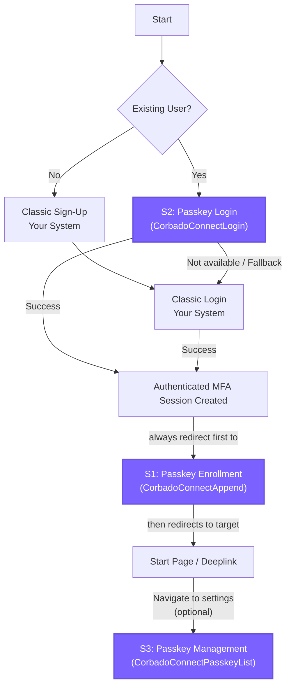

import Demo from "/snippets/corbado-connect/demo.mdx"

<Demo />

## Introduction

**Corbado Connect** allows you to seamlessly integrate passkey-first authentication into your existing Identity Provider (IdP) or authentication system. This approach allows you to offer your users a secure, convenient, and passwordless login experience while leveraging your current user management infrastructure. You can enhance your security and user experience without performing a complex migration or replacing your established authentication stack.

This guide provides a generic approach to integrating **Corbado Connect** with any authentication system, whether it's:

- A custom-built authentication solution
- A third-party Identity Provider (IdP)
- An authentication framework or library

The integration patterns described here can be adapted to work with virtually any authentication system that allows for custom authentication flows or external identity verification.

While we provide specific integration guides for popular authentication providers like [Amazon Cognito](/corbado-connect/integration/cognito), this guide serves as a foundation for integrating with any other authentication system.

## How it Works: Recommended User Journey

Integrating **Corbado Connect** means layering passkey functionality on top of your existing system. Most enterprise clients already have a robust, often multi-step, sign-up process for account creation. Therefore, we recommend leaving your classic sign-up flow untouched and introducing passkeys **after** the user has successfully authenticated.

This post-login enrollment strategy ensures that a stable user identity (e.g. UUID) exists and an authenticated session is active — both are prerequisites for securely generating the tokens required for passkey operations. It also provides a natural path for your existing users to adopt passkeys. Once a user has created a passkey, they can use it to login without passwords.

For a deep dive into the data and best practices behind this recommendation, see our [blog post on passkey creation best practices](https://www.corbado.com/blog/passkey-creation-best-practices).

Here is a visual overview of the recommended user journey, outlining each step where you need to implement **Corbado Connect** using our [Web UI Components](/corbado-connect/web-ui-components):

A key part of this flow is that after any successful login (both for passkey and non-passkey logins), the application should always redirect to a page hosting the `CorbadoConnectAppend` component. This ensures every authenticated user is consistently offered the chance to enroll a passkey.

<Warning>
  **Rule: Always redirect to the append flow after login**

  This strategy is crucial for maximizing passkey adoption. The `CorbadoConnectAppend` component's built-in [Passkey Intelligence](/corbado-connect/features/passkey-intelligence) is designed to handle multiple scenarios. For example, after a cross-device authentication (CDA or "hybrid login"), the user has successfully logged in, but their new device doesn't have a passkey stored locally. Redirecting them to the append flow provides the perfect, low-friction opportunity to create one, improving their future login experience on that device.
</Warning>

This guide will walk you through the implementation of each necessary step.