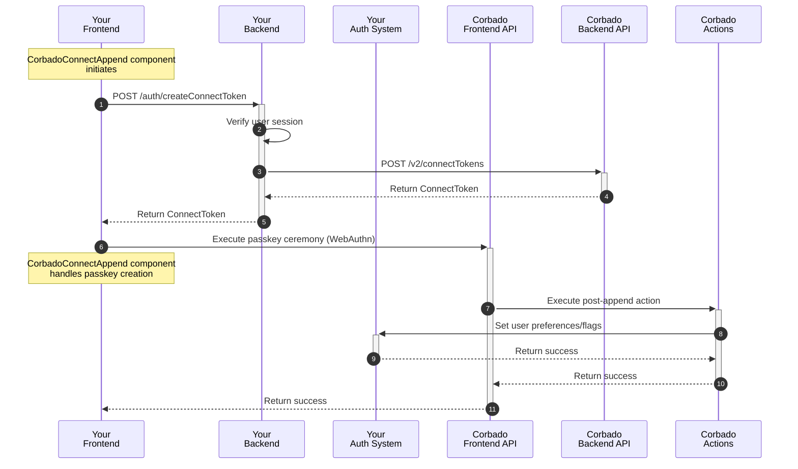
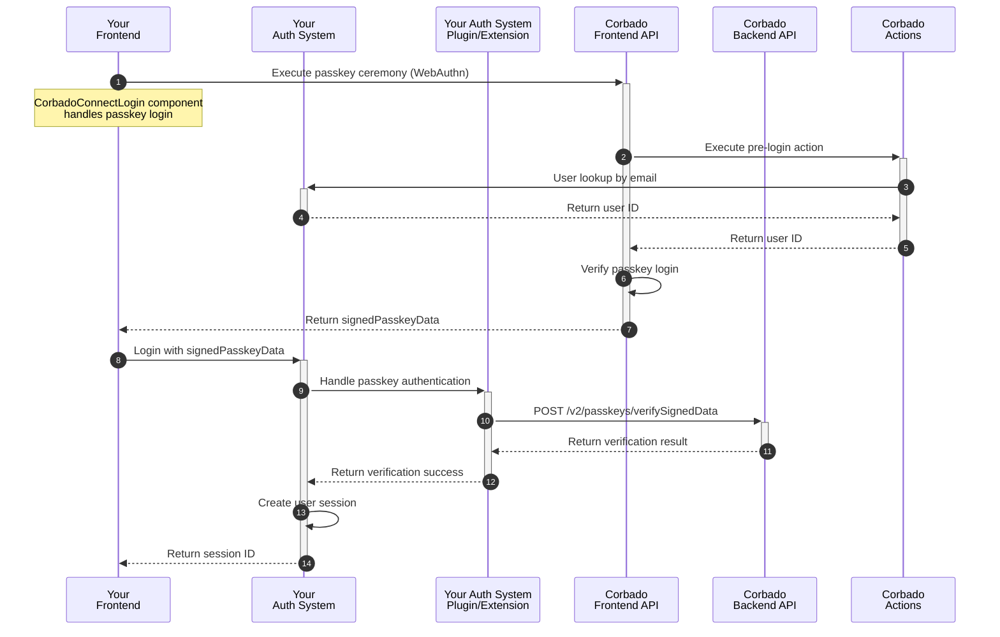
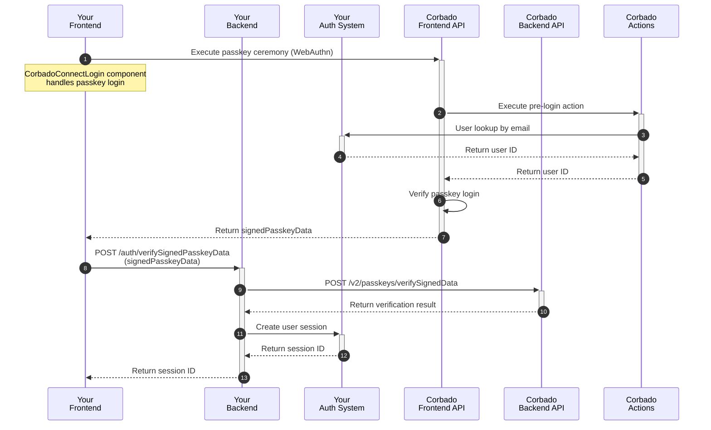
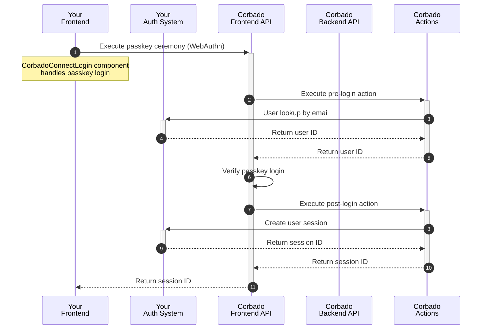

import Demo from "/snippets/corbado-connect/demo.mdx"

<Demo />

## Introduction

- Explain Web approach

## Step 1: Passkey Enrollment

In a typical integration scenario, the initial user sign-up is handled through your existing authentication system's standard registration process. This could be through:

- Email and password registration
- Social login providers
- Enterprise SSO

Once a user has successfully created an account and is logged in, **Corbado Connect** provides the ability to add a passkey to their account for future passwordless logins. This process is often called "passkey append" and represents the bridge between your existing user management system and Corbado's passkey infrastructure.

This approach offers several advantages:

- Maintains compatibility with your existing user registration flow
- Allows for gradual adoption of passkeys
- Preserves existing user data and relationships
- Enables a smooth transition for your users

The complete user sign-up and passkey append flow is illustrated in detail in our [User Sign-up Flow documentation](/corbado-connect/flows/user-sign-up). In the following sections, we'll break down each component of the implementation.

### Implementation Overview

The user sign-up and passkey append process consists of a series of coordinated interactions between your application's frontend and backend, your authentication system, and Corbado's APIs. Here's a high-level overview of the flow:



In the following sections, we will explain each step in detail.

### UI Component Integration

The integration starts with the `CorbadoConnectAppend` component, which is designed to be used immediately after a user has been authenticated through your existing system. The component guides users through creating (or "appending") a passkey to their account, but only if they and their device meet the eligibility requirements.

Here's an example integration:

```html
<head>
  <script src="https://cdn.cloud.corbado.io/connect/dist/web-js-latest.min.js"></script>
  <link rel="stylesheet" href="https://cdn.cloud.corbado.io/connect/dist/web-js-latest.min.css" />
  <script type="module">
    const passkeyAppendElement = document.getElementById('passkey-append');
    Corbado.mountCorbadoConnectAppend(passkeyAppendElement, {
      projectId: "pro-XXX", // Your Corbado Project ID
      frontendApiUrlSuffix: "frontendapi.cloud.corbado.io",

      // Called when the user decides not to create a passkey or passkey creation
      // is skipped. Add custom logic like logging and analytics.
      onSkip: (status) => { 
        console.log('Append skipped with status:', status);
      },

      appendTokenProvider: async () => {
        // Get Corbado ConnectToken from your backend (see next
        // section), session ID is sent as cookie
        const response = await fetch('/auth/createConnectToken', {
            method: 'POST',
            headers: {
                'Content-Type': 'application/json'
            },
            body: JSON.stringify({
                type: 'passkey-append',
            })
        });

        if (!response.ok) {
            throw new Error('Failed to get ConnectToken');
        }

        const data = await response.json();

        return data.connectToken;
      },

      // Called when passkey creation is completed successfully. Use to
      // refresh page or show success UI for example.
      onComplete: (status, clientState) => { 
        console.log('Append complete with status:', status);
      },
    });
  </script>
</head>

<body>
  <!-- The passkey append UI will render into this div -->
  <div id="passkey-append"></div>
</body>
```

<Info>
For comprehensive information on configuration options, detailed styling choices, and customization using CSS variables and classes, please refer to the [CorbadoConnectAppend component documentation](/corbado-connect/web-ui-components/corbadoconnectappend).
</Info>

### Obtaining the ConnectToken

When the component is initialized, it executes the function given in `appendTokenProvider` to request a short-lived `connectToken` from Corbado's Backend API. This token authorizes the creation of a passkey for a specific and authenticated user (see [connectToken documentation](/corbado-connect/concepts/connect-token) for more details).

Here's an example implementation in your backend:

```javascript
// Example using Express.js
app.post('/auth/createConnectToken', async (req, res) => {
    try {
        // 1. Verify the current user's session
        const sessionId = req.cookies.session_id;
        const user = await yourAuthSystem.verifySession(sessionId);
        if (!user) {
            return res.status(401).json({ error: 'Invalid session' });
        }

        // 2. Request ConnectToken from Corbado Backend API
        const response = await fetch('https://backendapi.cloud.corbado.io/v2/connectTokens', {
            method: 'POST',
            headers: {
                'Authorization': `Basic ${CORBADO_API_SECRET}`,
                'Content-Type': 'application/json',
            },
            body: JSON.stringify({
                type: req.body.type, // e.g., 'passkey-append'
                data: {
                    displayName: user.displayName,
                    identifier: user.email,
                }
            })
        });

        if (!response.ok) {
            console.error('Failed to get ConnectToken:', await response.text());

            return res.status(500).json({ error: 'Failed to get ConnectToken' });
        }

        const data = await response.json();
        
        // 3. Return the ConnectToken to the frontend
        res.json({
            connectToken: data.secret
        });
    } catch (error) {
        console.error('Error getting ConnectToken:', error);
        res.status(500).json({ error: 'Internal server error' });
    }
});
```

The endpoint performs several important steps:

1. **Session Verification**: Ensures the request comes from an authenticated user
2. **User Information**: Retrieves user details needed for the ConnectToken
3. **Token Generation**: Requests a ConnectToken from Corbado Backend API
4. **Error Handling**: Properly handles and reports any issues

<Info>
The ConnectToken is short-lived and single-use. Always generate a new token for each passkey operation.
</Info>

### Updating MFA Settings

After a passkey is created, you may need to update settings in your authentication system to reflect this change. This could include:

- Marking the user as having MFA enabled
- Setting passkey as the preferred authentication method
- Updating user preferences or flags
- Recording the passkey creation timestamp

This can be achieved using Corbado [actions](/corbado-connect/architecture/actions), which enable you to extensively customize **Corbado Connect** to suit your specific requirements.

The `post-append` action is triggered after successful passkey creation. Here's an example of how you might implement this action:

```javascript
// Main handler function
export const handler = async (event) => {
    console.log('Received event:', event);

    try {
        const username = event.username;
        
        // 1. Check if MFA settings are already configured
        const user = await yourAuthSystem.getUser(username);
        if (user.hasMfaEnabled) {
            console.log('User already has MFA settings configured');
            
            return {
                statusCode: 200,
                body: {},
            };
        }

        // 2. Update MFA settings in your authentication system
        await yourAuthSystem.updateUser(username, {
            mfaEnabled: true,
            preferredMfaMethod: 'passkey',
            lastMfaUpdate: new Date().toISOString()
        });

        // 3. Return success
        return {
            statusCode: 200,
            body: {}
        };
    } catch (error) {
        console.error('Caught exception:', error);

        return {
            statusCode: 500,
            body: {
                message: 'Failed to update MFA settings',
                error: error.message,
            },
        };
    }
};
```

The exact implementation will depend on your authentication system's API or SDK, but the general flow remains the same:

1. Receive the event with user information from Corbado
2. Connect to your authentication system
3. Check current MFA settings (optional)
4. Update the settings as needed
5. Return success or error response

<Info>
For more information about Corbado actions and how to implement them, see the [Actions documentation](/corbado-connect/architecture/actions).
</Info>

## Step 2: Passkey Login

Now that users can associate passkeys with their accounts, we can enable a truly passwordless login experience. The goal is to authenticate a user with their passkey using **Corbado Connect** and, upon successful verification, establish an authenticated session in your system.

The complete flow is illustrated in detail in our [User Login Flow documentation](/corbado-connect/flows/user-login).

### Implementation Overview

The cornerstone of user login integration is `signedPasskeyData` — a short-lived, single-use JSON Web Token (JWT) that confirms successful passkey authentication with **Corbado Connect** (option 1 & 2). This token acts as the link between **Corbado Connect's** passkey authentication and your authentication system, which ultimately needs to establish a session.

There are several ways to integrate the passkey login flow with your authentication system:

1. **System Extension**: If your authentication system supports plugins or custom authentication methods, you can extend it to manage `signedPasskeyData` verification and session creation (refer to our dedicated [Amazon Cognito](/corbado-connect/integration/cognito) integration guide, which follows this approach).
2. **Custom Endpoint**: Develop a new endpoint in your backend that verifies `signedPasskeyData` and establishes a session.
3. **Corbado Action**: Utilize Corbado's action system to directly manage the authentication flow and establish a session.

In each option, it is necessary to create a session within your authentication system at the conclusion of the process. For simplicity, we demonstrate creating a server-side session and storing its session ID in a cookie. However, you have complete flexibility to implement sessions in any manner you prefer, such as using tokens implemented with a JWT and storing them in local storage.

We will now elaborate on each option in the following sections.

#### Option 1: System Extension

This option involves extending your existing authentication system through its plugin architecture or custom authentication method support. Many modern authentication systems provide ways to add new authentication methods or customize the authentication flow.

Here's how the flow typically works:



This approach is ideal when:

- Your authentication system has a plugin architecture
- You want to maintain all authentication logic within your existing system
- You need tight integration with your system's session management
- You want to leverage your system's existing user management features

<Info>
The exact implementation details will depend on your authentication system's extension capabilities. Some systems might require implementing specific interfaces or following certain patterns.
</Info>

#### Option 2: Custom Endpoint

This option involves implementing a dedicated endpoint in your backend that handles passkey verification and session creation. This approach gives you full control over the authentication flow and is suitable when your authentication system doesn't support extensions or when you need custom session handling.

Here's how the flow typically works:



The implementation typically involves creating a new endpoint in your backend:

```typescript
// Example using Express.js
app.post('/auth/verifySignedPasskeyData', async (req, res) => {
    try {
        const { signedPasskeyData } = req.body;

        // 1. Verify signedPasskeyData with Corbado Backend API
        const verifyResult = await fetch('https://backendapi.cloud.corbado.io/v2/passkeys/verifySignedData', {
            method: 'POST',
            headers: {
                'Authorization': `Basic ${CORBADO_API_SECRET}`,
                'Content-Type': 'application/json',
            },
            body: JSON.stringify({ signedPasskeyData })
        });

        const data = await verifyResult.json();
        if (data.verificationResult !== "success") {
            return res.status(401).json({ error: 'Invalid signedPasskeyData' });
        }

        // 2. Extract user information
        const userInfo = extractUserInfo(signedPasskeyData);

        // 3. Create user session in your auth system
        const session = await yourAuthSystem.createSession({
            userId: userInfo.sub,
        });

        // TODO Adapt this to native app cases where we don't have a cookie, just return
        // in payload? Then we need to adapt web and mention that this is insecure because
        // of missing HTTPOnly cookie.

        // 4. Store session ID in a cookie
        res.cookie('session_id', session.Id, {
            httpOnly: true,             // Prevents JavaScript access
            secure: true,               // Only sent over HTTPS
            sameSite: 'strict',         // CSRF protection
            maxAge: 3 * 60 * 60 * 1000, // 3 hours
            path: '/'                   // Available across the site
        });

        // 5. Send success response
        res.json({
            success: true,
        });
    } catch (error) {
        console.error('Verification failed:', error);
        res.status(500).json({ error: 'Verification failed' });
    }
});
```

This approach is ideal when:

- Your authentication system doesn't support plugins/extensions
- You need complete control over the authentication flow
- You want to implement custom session management
- You're building a new authentication system from scratch

<Info>
Remember to implement proper error handling and security measures in your endpoint, such as rate limiting and logging.
</Info>

#### Option 3: Corbado Action

This option leverages Corbado's action system to handle the authentication flow. Instead of implementing verification logic of `signedPasskeyData` in your system, you can use a `post-login` action to create and return a session. This approach minimizes the integration effort while maintaining security.

Here's how the flow typically works:



The implementation involves creating a `post-login` action:

```javascript
export const handler = async (event) => {
    console.log('Received event:', event);

    try {
        const userId = event.userId;

        // 1. Create user session in your auth system
        const session = await yourAuthSystem.createSession({
            userId: userId,
        });

        // 2. Return session ID to the client
        return {
            statusCode: 200,
            body: {
                sessionId: session.Id
            }
        };
    } catch (error) {
        console.error('Session creation failed:', error);

        return {
            statusCode: 500,
            body: {
                message: 'Failed to create session',
                error: error.message,
            },
        };
    }
};
```

This approach is ideal when:

- You want minimal changes to your existing system
- You prefer to handle authentication logic in **Corbado Connect's** environment
- You need a quick integration path
- Your authentication system has a simple session creation API

<Info>
The action environment provides secure access to your authentication system's API. Make sure to configure the necessary credentials and permissions in your **Corbado Connect** project settings.
</Info>

### UI Component Integration

The integration starts with the `CorbadoConnectLogin` component. The component takes care of the entire UI and logic for handling the passkey login and passing the result to our application logic to complete the login.

Here's an example integration:

```html
<head>
  <script src="https://cdn.cloud.corbado.io/connect/dist/web-js-latest.min.js"></script>
  <link rel="stylesheet" href="https://cdn.cloud.corbado.io/connect/dist/web-js-latest.min.css" />

  <script type="module">
    const passkeyLoginElement = document.getElementById('authorize-with-passkey');
    Corbado.mountCorbadoConnectLogin(passkeyLoginElement, {
      projectId: "pro-XXX", // Your Corbado Project ID
      frontendApiUrlSuffix: "frontendapi.cloud.corbado.io", // Points to your chosen Corbado Frontend API environment

      // Called when passkey login is completed successfully
      onComplete: (signedPasskeyData, clientState) => {
        // This callback varies depending on the option chosen; see the following sections for details
      },

      // Called when passkey login is not possible or fails critically. Show your
      // fallback UI (e.g., a password field). The identifier might be pre-filled if
      // the user provided one.
      onFallback: (identifier, errorMessage) => {
        console.log(`Fallback triggered for '${identifier}' with message: ${errorMessage}`);
      },
    });
  </script>
</head>

<body>
  <div id="authorize-with-passkey"></div>
  <div id="authorize-with-fallback" style="display: none;">
    <!-- Your existing fallback authentication (e.g. password) comes here -->
  </div>
</body>
```

<Info>
For comprehensive information on configuration options, detailed styling choices, and customization using CSS variables and classes, please refer to the [CorbadoConnectLogin component documentation](/corbado-connect/web-ui-components/corbadoconnectlogin).
</Info>

The implementation details for the `onComplete` callback will be provided in the subsequent sections.

#### Option 1: System Extension

As we have integrated with the existing authentication system, session creation and storage are managed by it. Therefore, after a successful passkey login, we need to hand over to the existing authentication system to complete the login:

```javascript
onComplete: (signedPasskeyData, clientState) => {
    handlePasskeyLogin(signedPasskeyData);
}
```

#### Option 2: Custom Endpoint

When using the custom endpoint approach, the `onComplete` callback needs to send the `signedPasskeyData` to your verification endpoint and redirect to the profile page:

```javascript
onComplete: async (signedPasskeyData, clientState) => {
    // 1. Send signedPasskeyData to your verification endpoint
    const response = await fetch('/auth/verifySignedPasskeyData', {
        method: 'POST',
        headers: {
            'Content-Type': 'application/json'
        },
        body: JSON.stringify({ signedPasskeyData })
    });

    if (!response.ok) {
        throw new Error('Verification failed');
    }

    // 2. The session ID has been stored in a cookie (see above)

    // 3. Redirect to profile page
    window.location.href = '/profile';
}
```

#### Option 3: Corbado Action

When using a Corbado Action, the session ID is returned directly in the `result` object, simplifying the frontend logic:

```javascript
onComplete: async (result, clientState) => {
    const sessionId = result.sessionId;

    // 1. Store the session ID in a cookie (note that setting 
    // the cookie from JavaScript makes it vulnerable to XSS 
    // attacks, unlike option 2 which uses an httpOnly cookie)
    document.cookie = `session_id=${sessionId}; path=/; secure; SameSite=Strict`;

    // 2. Redirect to profile page
    window.location.href = '/profile';
}
```

## Step 3: Passkey Management

Providing users with a way to manage their passkeys is a critical part of the experience. The `CorbadoConnectPasskeyList` component offers a complete, pre-built UI for users to list, add, and delete passkeys associated with their account.

This component should be placed in a secure, authenticated area of your application, such as a user profile or account settings page.

### Implementation Overview

The `CorbadoConnectPasskeyList` component requires a distinct `ConnectToken` to perform each of its actions. Much like the enrollment flow, these tokens must be securely fetched from your backend to authorize each specific operation for the logged-in user.

### UI Component Integration

Integrate the `CorbadoConnectPasskeyList` component on a profile or settings page. The component will handle all the logic for displaying passkeys and managing user interactions:

```html
<head>
  <script src="https://cdn.cloud.corbado.io/connect/dist/web-js-latest.min.js"></script>
  <link rel="stylesheet" href="https://cdn.cloud.corbado.io/connect/dist/web-js-latest.min.css" />

  <script type="module">
    const passkeyListElement = document.getElementById('passkey-list');

    // This function provides ConnectTokens for all actions (list, append, delete)
    const connectTokenProvider = async (type) => {
      // 'type' will be 'passkey-list', 'passkey-append', or 'passkey-delete'

      // Session ID is sent as cookie
      const response = await fetch('/auth/createConnectToken', {
        method: 'POST',
        headers: { 
            'Content-Type': 'application/json'
        },
        body: JSON.stringify({ type }), 
      });

      if (!response.ok) {
        throw new Error(`Failed to get ConnectToken for type: ${type}`);
      }

      const { connectToken } = await response.json();

      return connectToken;
    };

    Corbado.mountCorbadoConnectPasskeyList(passkeyListElement, {
      projectId: "pro-XXX", // Your Corbado Project ID
      frontendApiUrlSuffix: "frontendapi.cloud.corbado.io",
      connectTokenProvider: connectTokenProvider
    });
  </script>
</head>

<body>
  <!-- The passkey list UI will render into this div -->
  <div id="passkey-list"></div>
</body>
```

<Info>
For a detailed explanation of all available props and customization options, please see the [CorbadoConnectPasskeyList component documentation](/corbado-connect/web-ui-components/corbadoconnectpasskeylist).
</Info>

### Obtaining the ConnectToken

The `connectTokenProvider` function is the bridge to your backend. It's responsible for fetching a `ConnectToken` for the specific action (`passkey-list`, `passkey-append`, or `passkey-delete`) the user wants to perform. You can use the same backend endpoint created for the enrollment step, as it's already set up to handle different token types.

When a user opens the page, the component will call `connectTokenProvider('passkey-list')` to get a token to display the existing passkeys. If they try to delete a passkey, it will call `connectTokenProvider('passkey-delete')`, and so on. This ensures every action is explicitly authorized by your backend for the currently authenticated user.