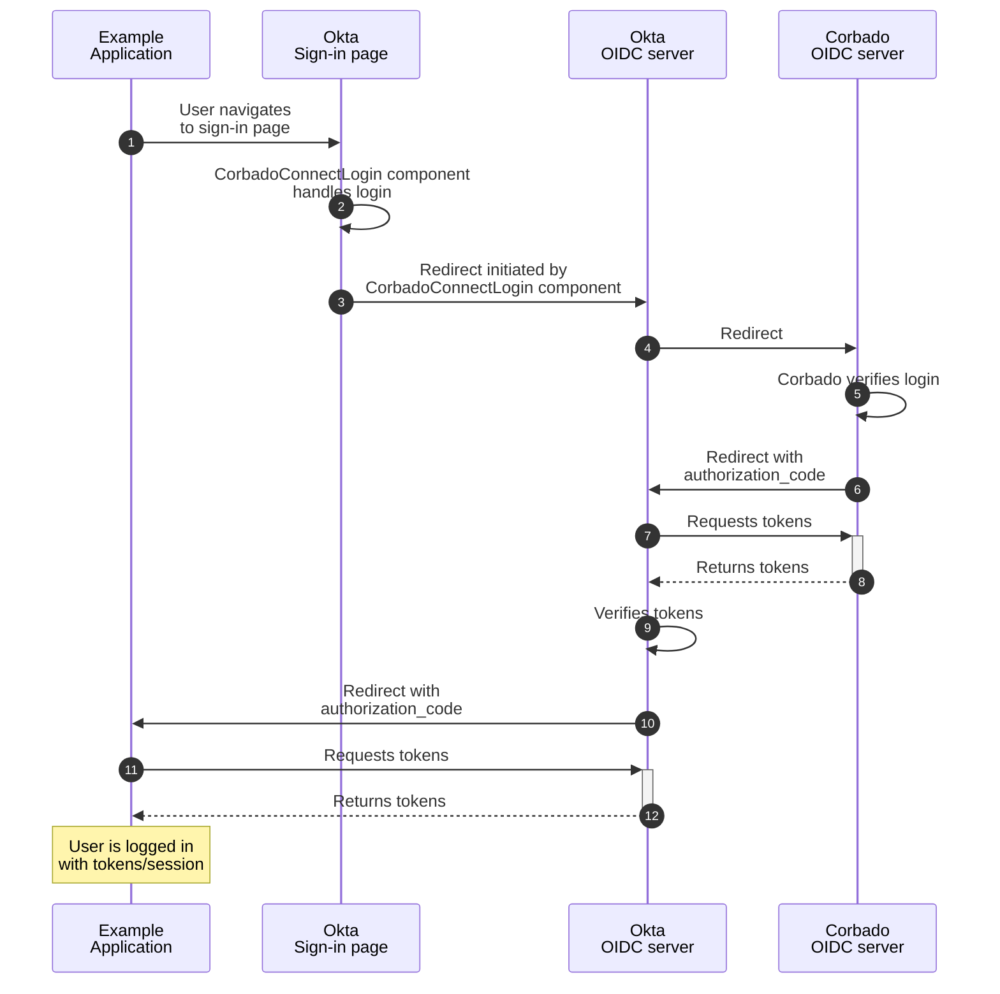

import OktaDemo from "/snippets/corbado-connect/okta-demo.mdx"

<OktaDemo />

## 1. Introduction

**Corbado Connect** allows you to seamlessly integrate passkey-first authentication into your existing **Okta** system. This enables you to offer your users a secure and convenient login experience without passwords, while still leveraging the power of **Okta** for user management.

This guide will walk you through the process of integrating **Corbado Connect** with **Okta**, using a sample Next.js application to demonstrate the key concepts.

**Okta** offers multiple authentication solutions that have evolved over time. **Corbado Connect** supports the following:

- **Okta Identity Engine** (requires custom domain and hosted widget)
- **Okta CIC/Auth0** (Auth0 was acquired by **Okta** and is now part of **Okta CIC**)

**Okta Classic** is currently **not supported**. If you need more information about the different **Okta** solutions, read our [blog article](https://www.corbado.com/blog/okta-passkeys-analysis) or [contact us](https://www.corbado.com/contact).

## 2. How it Works

The integration between **Corbado Connect** and **Okta** leverages the industry-standard **OAuth 2.0 Authorization Framework** and **OpenID Connect (OIDC)** protocol. This approach allows **Corbado Connect** to act as an external **Identity Provider (IdP)** that seamlessly integrates with your existing **Okta** infrastructure.

Instead of users authenticating directly with **Okta** using traditional credentials, they will authenticate with **Corbado Connect** using passkeys, and then be federated back to **Okta** through a secure OIDC flow.

This **OAuth 2.0/OIDC federation** approach ensures that your existing **Okta** policies, user management, and application integrations remain unchanged while adding the security and convenience of passkey-first authentication.

Later in this guide, we will dive deep into this concept.

## 3. Example Application

To best illustrate the integration, we will refer to a complete example application. This application is built with the following technologies:

- **Next.js**: A popular React framework for building server-rendered applications.

<Card title="Example Application" href="https://okta-ek30212.cloud.corbado-demo.com">
See the example application using Corbado Connect and Okta in action.
</Card>

[Contact us](https://www.corbado.com/contact) to request access to the source code for the example application.

## 4. Data Storage

When it comes to storage, the integration between **Corbado Connect** and **Okta** is straightforward and requires **no changes** to your existing database infrastructure.

For comprehensive details on architecture, portability, security, and compliance, please refer to our dedicated [Data Storage](/corbado-connect/integration/generic/data-storage) section.

## 5. Passkey Enrollment

In our example application, the initial user sign-up is handled through a conventional method (e.g., email and password) managed by **Okta**. Once the user has an account and is logged in, we offer them the option to add a passkey to their account for future passwordless logins. This process is often called "passkey append".

The complete flow is illustrated in detail [here](/corbado-connect/flows/user-sign-up).

### 5.1 Web UI Component Integration

To enable passkey creation we use the [CorbadoConnectAppend](/corbado-connect/web-ui-components/corbadoconnectappend) component from the `@corbado/connect-react` library. The component takes care of the entire UI and logic for creating and storing the passkey.

Here's how it's used in our example application's `post-login` page:

```tsx /application/okta/app/(auth-required)/post-login/page.tsx
"use client";

import {CorbadoConnectAppend} from "@corbado/connect-react";
import {useRouter} from "next/navigation";
import {getCorbadoConnectTokenAppend, postPasskeyAppend} from "./actions";
import {AppendStatus} from "@corbado/types";

export default function Page() {
    const router = useRouter();

    return (
        <div className="flex h-screen flex-1 items-center justify-center bg-gray-50">
            <div className="z-10 w-full max-w-sm overflow-hidden rounded-2xl border border-gray-100 shadow-xl">
                <div className="flex flex-col space-y-4 bg-gray-50 px-4 py-8 sm:px-8">
                    <CorbadoConnectAppend
                        onSkip={async () => router.push("/profile")}
                        appendTokenProvider={async () => {
                            return await getCorbadoConnectTokenAppend();
                        }}
                        onComplete={async (
                            appendStatus: AppendStatus,
                            clientState: string
                        ) => {
                            await postPasskeyAppend(appendStatus, clientState);
                            router.push("/profile");
                        }}
                    />
                </div>
            </div>
        </div>
    );
}
```

<Info>
For a detailed explanation of all available props for this component, please see the [CorbadoConnectAppend](/corbado-connect/web-ui-components/corbadoconnectappend) component documentation.
</Info>

### 5.2 Obtaining the Connect Token

When the component is initialized, it executes the function given in `appendTokenProvider` to request a [connect token](/corbado-connect/concepts/connect-token) from Corbado's Backend API (this token authorizes the creation of a passkey for a specific and authenticated user).

It uses a Next.js Server Action that first verifies the session and then calls the utility function `getCorbadoConnectToken()`:

```typescript /application/okta/app/(auth-required)/post-login/actions.ts
'use server';

import {AppendStatus} from "@corbado/types";
import {cookies} from "next/headers";
import {getCorbadoConnectToken} from "@/lib/corbado";
import {auth} from "@/auth";


export async function getCorbadoConnectTokenAppend() {
    const session = await auth();
    if (!session) {
        throw new Error('Session is required');
    }

    const displayName = session.user.email;
    const identifier = session.user.userId;

    return getCorbadoConnectToken('passkey-append', displayName, identifier);
}
```

The utility function subsequently manages the request to the Corbado Backend API:

```typescript
export const getCorbadoConnectToken = async (connectTokenType: string, displayName: string, identifier: string): Promise<string> => {
  const payload = {
    type: connectTokenType,
    data: {
      displayName: displayName,
      identifier: identifier,
    },
  };

  const body = JSON.stringify(payload);

  const url = `${process.env.CORBADO_BACKEND_API_URL}/v2/connectTokens`;
  const response = await fetch(url, {
    method: 'POST',
    headers: {
      Authorization: `Basic ${process.env.CORBADO_BACKEND_API_BASIC_AUTH}`,
      'Content-Type': 'application/json',
    },
    cache: 'no-cache',
    body: body,
  });

  const out = await response.json();

  return out.secret;
}
```

## 6. Passkey Login

Now that users can associate passkeys with their accounts, we can enable a truly passwordless login experience. This is where the **OAuth 2.0/OIDC federation**  we outlined in the "How it Works" section becomes essential.

The goal is to authenticate a user with their passkey using **Corbado Connect** and, upon success, establish an authenticated session with **Okta**.

The complete flow is illustrated in detail [here](/corbado-connect/flows/user-login).

### 6.1 Web UI Component Integration

Unlike passkey enrollment, the login process is more complex because we need to integrate the [CorbadoConnectLogin](/corbado-connect/web-ui-components/corbadoconnectlogin) component directly into **Okta's** hosted sign-in page (hosted widget).

This integration is accomplished through the **Okta** Admin Console under **Customizations > Brands**. We will explain the most important changes next.

First, you need to load the JavaScript and CSS for the [CorbadoConnectLogin](/corbado-connect/web-ui-components/corbadoconnectlogin) component. Extend the `<head>` with the following `<script>` and `<link>` tags:

```html
<script src="https://cdn.cloud.corbado.io/connect/dist/web-js-latest.min.js"></script>
<link rel="stylesheet" href="https://cdn.cloud.corbado.io/connect/dist/web-js-latest.min.css" />
```

Next, you need to wire the component with the sign-in form using the following JavaScript:

```html
<script type="text/javascript">
const oktaFFHandshake = async (signedPasskeyData) => {
    const config = OktaUtil.getSignInWidgetConfig();
    const stateHandle = config.stateToken;
    const url = document.querySelector('.okta-idps-container').children[0].href;
    window.location.href = `/sso/idps/0oatsgxte1zfxW3gI697?login_hint=${signedPasskeyData}&fromURI=` + encodeURIComponent(location.href)
}

const setConventionalLoginError = (errorMessage) => {
    const cboErrorContainerId = 'cbo-error-container';
    const existingContainer = document.querySelector('#' + cboErrorContainerId);
    console.log("existingContainer", existingContainer);
    if (existingContainer) {
        existingContainer.remove();
    }

    if (errorMessage === '') {
        return;
    }

    const newDiv1 = document.createElement('div');
    newDiv1.className = 'o-form-has-errors';
    newDiv1.id = cboErrorContainerId;
    newDiv1.role = 'alert';
    const newDiv2 = document.createElement('div');
    const newDiv3 = document.createElement('div');
    newDiv3.className = 'okta-form-infobox-error infobox infobox-error'
    newDiv3.role = 'alert';
    const newText = document.createElement('p');
    newText.textContent = errorMessage;
    newDiv3.appendChild(newText);
    newDiv2.appendChild(newDiv3);
    newDiv1.appendChild(newDiv2);

    var form = document.querySelector('.o-form-fieldset-container');
    form.parentNode.insertBefore(newDiv1, form);

    const submitButton = form.parentNode.parentNode.querySelector('input[type="submit"]');
    if (submitButton) {
        submitButton.addEventListener('click', function(event) {
            setConventionalLoginError('');
        });
    }
}

const fallbackToConventionalLogin = (passkeyLoginElement, conventionalLoginElement, email) => {
    passkeyLoginElement.style.display = 'none';
    const usernameInput = Array.from(conventionalLoginElement.querySelectorAll('input')).find(el => el.name.trim() === 'identifier');
    usernameInput.value = email;
    usernameInput.dispatchEvent(new Event('input', { bubbles: true }));
    conventionalLoginElement.style.display = 'block';
}

const getOnCompletePasskeyLoginFunction = () => {
    return async (signedPasskeyData, clientState) => {
        oktaFFHandshake(signedPasskeyData);
    };
}

const mountLogin = (passkeyLoginElement, conventionalLoginElement) => {
    Corbado.mountCorbadoConnectLogin(passkeyLoginElement, {
        projectId: 'pro-8464273456666930151',
        frontendApiUrlSuffix: "frontendapi.cloud.corbado.io",
        customDomain: "https://corbado.okta-ek30212.cloud.corbado-demo.com",
        onFallback: (email, errorMessage) => {
            setConventionalLoginError(errorMessage);
            fallbackToConventionalLogin(passkeyLoginElement, conventionalLoginElement, email);
        },
        onFallbackSilent: (email) => {
            fallbackToConventionalLogin(passkeyLoginElement, conventionalLoginElement, email);
        },
        onComplete: getOnCompletePasskeyLoginFunction(),
        onSignupClick: () => console.log(""),
        onConditionalLoginStart: (ac) => {
            console.log("");
        }
    });
}

const handlePrimaryAuth = () => {
    // Section 1: Add passkey container
    const conventionalLoginElement = document.querySelector('.auth-content-inner');
    if (!conventionalLoginElement) {
        return;
    }

    const newDiv = document.createElement('div');
    newDiv.id = 'passkey-login-container';
    const passkeyLoginElement = conventionalLoginElement.insertAdjacentElement('afterend', newDiv);
    conventionalLoginElement.style.display = 'none';

    mountLogin(passkeyLoginElement, conventionalLoginElement);

    // Section 2: Remove OIDC button
    const signInWithOIDCContainer = document.querySelector('.sign-in-with-idp');
    signInWithOIDCContainer.style.display = 'none';
}

const okta = new OktaSignIn(OktaUtil.getSignInWidgetConfig());
okta.on('afterRender', c => {
    console.log('after render', c)
    const controllerName = c.controller;
    switch (controllerName) {
        case 'primary-auth':
            return handlePrimaryAuth();
    }
});

okta.on('afterError', ((c, e) => {
    setConventionalLoginError('');
}));
</script>
```

<Info>
For a detailed explanation of all available props for this component, please see the [CorbadoConnectLogin component documentation](/corbado-connect/web-ui-components/corbadoconnectlogin).
</Info>

### 6.2 OAuth 2.0/OIDC Federation

As explained above, **Corbado Connect** functions as an **OIDC** server and can be used for **OAuth 2.0/OIDC federation**. To enable this integration, you need to create a new **Identity Provider** in the **Okta** Admin Console under **Security > Identity Providers**.

The following simplified sequence diagram illustrates how the different components work together in the federation process:



## 7. Passkey Management

After users have created their initial passkeys during sign-up and used them for login, they need a way to manage their existing passkeys. Passkey management encompasses three main operations:

1. Viewing existing passkeys
2. Creating additional passkeys
3. Deleting unused passkeys

All these operations follow a similar pattern: they require obtaining a [connect token](/corbado-connect/concepts/connect-token) for the [Corbado Web UI Component](/corbado-connect/web-ui-components/overview), which then handles the user interface and underlying functionality. In the following sections, we'll focus on the **passkey deletion process as an example**, since the other operations follow a similar pattern.

The complete flow is illustrated in detail [here](/corbado-connect/flows/passkey-management).

### 7.1 Web UI Component Integration

We integrate the [CorbadoConnectPasskeyList](/corbado-connect/web-ui-components/corbadoconnectpasskeylist) component from the `@corbado/connect-react` library. This component provides a complete user interface for managing passkeys, including viewing, adding, and deleting them.

Here's how it's used in our example application's profile page:

```tsx /application/okta/app/(auth-required)/profile/PasskeySection.tsx
import { getConnectToken } from "../actions";
import { CorbadoConnectPasskeyList } from "@corbado/connect-react";

type Props = {
  integratePasskeys: boolean;
};

export const PasskeySection = ({ integratePasskeys }: Props) => {
  if (!integratePasskeys) {
    return (
      <div className="mb-2 w-full">
        <div>Passkeys are disabled.</div>
      </div>
    );
  }

  return (
    <div className="mb-2 w-full">
      <CorbadoConnectPasskeyList
        connectTokenProvider={async (connectTokenType: string) => {
          return await getConnectToken(connectTokenType);
        }}
      />
    </div>
  );
};

export default PasskeySection;
```

<Info>
For a detailed explanation of all available props for this component, please see the [CorbadoConnectPasskeyList](/corbado-connect/web-ui-components/corbadoconnectpasskeylist) component documentation.
</Info>

### 7.2 Obtaining the Connect Token

When the component needs to perform an operation (like deleting a passkey), it executes the function given in `connectTokenProvider` to request a [connect token](/corbado-connect/concepts/connect-token) from Corbado's Backend API. This token authorizes the specific operation for the authenticated user.

It uses a Next.js Server Action that first verifies the session and then calls the utility function `getCorbadoConnectToken()`:

```typescript /application/okta/app/(auth-required)/profile/actions.tsx
'use server';

import {getCorbadoConnectToken} from "@/lib/corbado";
import {auth} from "@/auth";

export const getConnectToken = async (connectTokenType: string) => {
    const session = await auth();
    if (!session) {
        throw new Error('Session is required');
    }

    const displayName = session.user.email;
    const identifier = session.user.userId;

    return getCorbadoConnectToken(connectTokenType, displayName, identifier);
}
```

The utility function then manages the request to the Corbado Backend API, using the provided `connectTokenType` to specify which operation the token should authorize (in this case, it could be 'passkey-list', 'passkey-add', or 'passkey-delete').