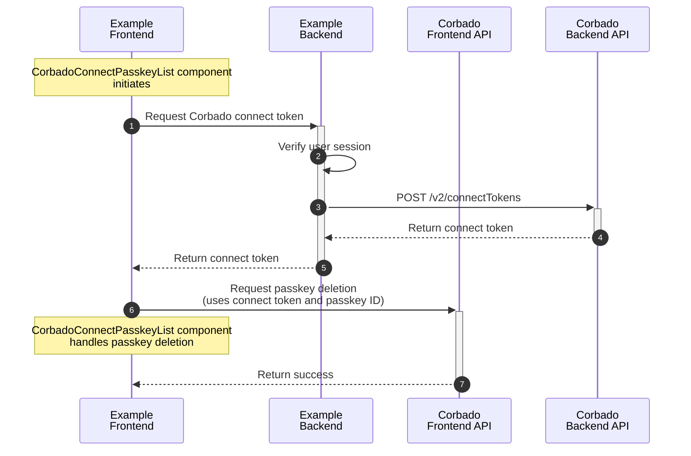

import OktaDemo from "/snippets/corbado-connect/okta-demo.mdx"

<OktaDemo />

## 0. TODOS

- Check with Athena to address "real customer questions"
- DONE Link to Demo
- Small Video (no youtube)
- No code and no mermaids (TBD if some frontend code with componentns and high level mermaid with OIDC party is okay)
- DONE define okta version (they have multiple products)

## 1. Introduction

**Corbado Connect** allows you to seamlessly integrate passkey-first authentication into your existing **Okta** system. This enables you to offer your users a secure and convenient login experience without passwords, while still leveraging the power of Okta for user management.

This guide will walk you through the process of integrating **Corbado Connect** with **Okta**, using a sample Next.js application to demonstrate the key concepts.

**Okta** offers multiple authentication solutions that have evolved over time. **Corbado Connect** supports the following:

- **Okta Identity Engine** (requires custom domain and hosted widget)
- **Okta CIC/Auth0** (Auth0 was acquired by Okta and is now part of Okta CIC)

**Okta Classic** is currently **not supported**. If you need more information about the different **Okta** solutions, read our [blog article](https://www.corbado.com/blog/okta-passkeys-analysis) or [contact us](TODO).

## 2. How it Works

The integration between **Corbado Connect** and **Okta** leverages the industry-standard **OAuth 2.0 Authorization Framework** and **OpenID Connect (OIDC)** protocol. This approach allows **Corbado Connect** to act as an external **Identity Provider (IdP)** that seamlessly integrates with your existing **Okta** infrastructure.

Instead of users authenticating directly with Okta using traditional credentials, they will authenticate with **Corbado Connect** using passkeys, and then be federated back to **Okta** through a secure OIDC flow.

This **OAuth 2.0/OIDC federation** approach ensures that your existing **Okta** policies, user management, and application integrations remain unchanged while adding the security and convenience of passkey-first authentication.

Later in this guide, we will dive deep into this concept.

## 3. Example Application

To best illustrate the integration, we will refer to a complete example application. This application is built with the following technologies:

- **Next.js**: A popular React framework for building server-rendered applications.

We will guide you through the implementation of two primary user flows: sign-up and login.

<Card title="Example Application" href="https://okta-ek30212.cloud.corbado-demo.com">
See the example application using Corbado Connect and Okta in action.
</Card>

## 4. Passkey Enrollment

In our example application, the initial user sign-up is handled through a conventional method (e.g., email and password) managed by **Okta**. Once the user has an account and is logged in, we offer them the option to add a passkey to their account for future passwordless logins. This process is often called "passkey append".

The complete flow is illustrated in detail [here](/corbado-connect/flows/user-sign-up).

### 4.1 Web UI Component Integration

To enable passkey creation we use the [CorbadoConnectAppend](/corbado-connect/web-ui-components/corbadoconnectappend) component from the `@corbado/connect-react` library. The component takes care of the entire UI and logic for creating and storing the passkey.

Here's how it's used in our example application's `post-login` page:

```tsx /application/okta/app/(auth-required)/post-login/page.tsx
"use client";

import {CorbadoConnectAppend} from "@corbado/connect-react";
import {useRouter} from "next/navigation";
import {getCorbadoConnectTokenAppend, postPasskeyAppend} from "./actions";
import {AppendStatus} from "@corbado/types";

export default function Page() {
    const router = useRouter();

    return (
        <div className="flex h-screen flex-1 items-center justify-center bg-gray-50">
            <div className="z-10 w-full max-w-sm overflow-hidden rounded-2xl border border-gray-100 shadow-xl">
                <div className="flex flex-col space-y-4 bg-gray-50 px-4 py-8 sm:px-8">
                    <CorbadoConnectAppend
                        onSkip={async () => router.push("/profile")}
                        appendTokenProvider={async () => {
                            return await getCorbadoConnectTokenAppend();
                        }}
                        onComplete={async (
                            appendStatus: AppendStatus,
                            clientState: string
                        ) => {
                            await postPasskeyAppend(appendStatus, clientState);
                            router.push("/profile");
                        }}
                    />
                </div>
            </div>
        </div>
    );
}
```

<Info>
For a detailed explanation of all available props for this component, please see the [CorbadoConnectAppend](/corbado-connect/web-ui-components/corbadoconnectappend) component documentation.
</Info>

### 4.2 Obtaining the Connect Token

When the component is initialized, it executes the function given in `appendTokenProvider` to request a [connect token](/corbado-connect/concepts/connect-token) from Corbado's Backend API (this token authorizes the creation of a passkey for a specific and authenticated user).

It uses a Next.js Server Action that first verifies the session and then calls the utility function `getCorbadoConnectToken()`:

```typescript /application/okta/app/(auth-required)/post-login/actions.ts
'use server';

import {AppendStatus} from "@corbado/types";
import {cookies} from "next/headers";
import {getCorbadoConnectToken} from "@/lib/corbado";
import {auth} from "@/auth";


export async function getCorbadoConnectTokenAppend() {
    const session = await auth();
    if (!session) {
        throw new Error('Session is required');
    }

    const displayName = session.user.email;
    const identifier = session.user.userId;

    return getCorbadoConnectToken('passkey-append', displayName, identifier);
}
```

The utility function subsequently manages the request to the Corbado Backend API:

```typescript
export const getCorbadoConnectToken = async (connectTokenType: string, displayName: string, identifier: string): Promise<string> => {
  const payload = {
    type: connectTokenType,
    data: {
      displayName: displayName,
      identifier: identifier,
    },
  };

  const body = JSON.stringify(payload);

  const url = `${process.env.CORBADO_BACKEND_API_URL}/v2/connectTokens`;
  const response = await fetch(url, {
    method: 'POST',
    headers: {
      Authorization: `Basic ${process.env.CORBADO_BACKEND_API_BASIC_AUTH}`,
      'Content-Type': 'application/json',
    },
    cache: 'no-cache',
    body: body,
  });

  const out = await response.json();

  return out.secret;
}
```

### 4.3 TODO Updating MFA Settings TODO

After a passkey is created, it's necessary to update the MFA settings in **Amazon Cognito**. This can be achieved using Corbado [actions](/corbado-connect/architecture/actions), which enable you to extensively customize **Corbado Connect** to suit your specific requirements.

The `post-append` action utilizes the `AdminGetUser` command from **Amazon Cognito** to verify if MFA is already configured. If it is not, the `AdminSetUserMFAPreference` command is executed to update the settings:

```javascript index.mjs
import { AdminGetUserCommand, AdminSetUserMFAPreferenceCommand, CognitoIdentityProviderClient } from '@aws-sdk/client-cognito-identity-provider';
import { STSClient, AssumeRoleCommand } from "@aws-sdk/client-sts";

// ID of Cognito user pool
const userPoolId = process.env.USER_POOL_ID;

// ARN of role to assume
const roleArn = process.env.ASSUME_ROLE_ARN;

let cognitoClientCache = null;
let credentialsExpiryTime = null;

const assumeRole = async () => {
    const command = new AssumeRoleCommand({
        RoleArn: roleArn,
        RoleSessionName: 'LambdaSession',
        DurationSeconds: 3600
    });

    const client = new STSClient();
    const response = await client.send(command);
    const { AccessKeyId, SecretAccessKey, SessionToken, Expiration } = response.Credentials;
    credentialsExpiryTime = new Date(Expiration).getTime();

    return new CognitoIdentityProviderClient({
        credentials: {
            accessKeyId: AccessKeyId,
            secretAccessKey: SecretAccessKey,
            sessionToken: SessionToken,
        }
    });
};

const getCognitoClient = async () => {
    const currentTime = Date.now();

    if (!cognitoClientCache || !credentialsExpiryTime || currentTime >= credentialsExpiryTime) {
        cognitoClientCache = await assumeRole();
    }

    return cognitoClientCache;
};

// Main handler function
export const handler = async (event) => {
    console.log('Received event:', event);

    try {
        const cognitoClient = await getCognitoClient();
        const username = event.username;

        // Get user and check MFA settings
        const getUserCommand = new AdminGetUserCommand({
            UserPoolId: userPoolId,
            Username: username,
        });

        const user = await cognitoClient.send(getUserCommand);
        if (user.UserMFASettingList && user.UserMFASettingList.length > 0) {
            console.log('User has MFA settings already set', user.UserMFASettingList);

            return {
                statusCode: 200,
                body: {},
            };
        }

        // Set MFA preference because not done yet (see above)
        const command = new AdminSetUserMFAPreferenceCommand({
            UserPoolId: userPoolId,
            Username: username,
            SMSMfaSettings: {
                Enabled: true,
                PreferredMfa: true,
            }
        });

        await cognitoClient.send(command);

        return {
            statusCode: 200,
            body: {}
        };
    } catch (error) {
        console.error('Caught exception:', error);

        return {
            statusCode: 500,
            body: JSON.stringify({
                message: 'Caught exception',
                error: error.message,
            }),
        };
    }
};
```

## 5. Passkey Login

Now that users can associate passkeys with their accounts, we can enable a truly passwordless login experience. This is where the **OAuth 2.0/OIDC federation**  we outlined in the "How it Works" section becomes essential.

The goal is to authenticate a user with their passkey using **Corbado Connect** and, upon success, establish an authenticated session with **Okta**.

The complete flow is illustrated in detail [here](/corbado-connect/flows/user-login).

### 5.1 Web UI Component Integration

Compared to Passkey Enrollment the login case is more complicated because we need to integrate the [CorbadoConnectLogin](/corbado-connect/web-ui-components/corbadoconnectlogin) component into the **Okta** sign-in page (hosted widget).

This can be done in the **Okta** Admin Console under **Customizations > Brands**:

```html
<!DOCTYPE html PUBLIC "-//W3C//DTD HTML 4.01//EN" "http://www.w3.org/TR/html4/strict.dtd">
<html>
<head>
    <meta http-equiv="Content-Type" content="text/html; charset=UTF-8">
    <meta name="viewport" content="width=device-width, initial-scale=1.0" />
    <meta name="robots" content="noindex,nofollow" />
    <!-- Styles generated from theme -->
    <link href="{{themedStylesUrl}}" rel="stylesheet" type="text/css">
    <!-- Favicon from theme -->
    <link rel="shortcut icon" href="{{faviconUrl}}" type="image/x-icon"/>

    <script src="https://cdn.cloud.corbado.io/connect/dist/web-js-latest.min.js"></script>
    <link rel="stylesheet" href="https://cdn.cloud.corbado.io/connect/dist/web-js-latest.min.css" />

    <title>{{pageTitle}}</title>
    {{{SignInWidgetResources}}}

    <style nonce="{{nonceValue}}">
        {{#useSiwGen3}}
        html {
            font-size: 87.5%;
        }
        {{/useSiwGen3}}

        #login-bg-image-id {
            background-image: {{bgImageUrl}}
        }
    </style>

    <style>
        .cb-connect-custom-style {
            --cb-color-outline: #dcdcdc;
            --cb-color-primary: #253544;
            --cb-color-secondary: #929aa1;
            --cb-color-tertiary: #666;
            --cb-color-on-primary: #fff;
            --cb-border-radius: 5px;
            --cb-color-surface: var(--color-gray-50);
            --cb-color-primary-container: #eef2f3;
            --cb-color-on-primary-container: #253544;
            --cb-color-secondary-container: #ecf4e7;
            --cb-color-on-secondary-container: #80b816;
            --cb-font-family-primary: var(
                    --default-font-family,
                    ui-sans-serif,
                    system-ui,
                    sans-serif,
                    "Apple Color Emoji",
                    "Segoe UI Emoji",
                    "Segoe UI Symbol",
                    "Noto Color Emoji"
            );
            --cb-font-family-secondary: var(
                    --default-font-family,
                    ui-sans-serif,
                    system-ui,
                    sans-serif,
                    "Apple Color Emoji",
                    "Segoe UI Emoji",
                    "Segoe UI Symbol",
                    "Noto Color Emoji"
            );

            --cb-color-error-container: #ffd6da;
            --cb-color-on-error-container: #cf0000;
        }

        #passkey-login-container {
            .cb-connect-login {
                max-width: 400px;
                container-type: inline-size;
            }

            .cb-login-hybrid-container {
                display: flex;
                flex-direction: column;
                align-items: center;
            }

            .cb-login-hybrid-container .cb-p,
            .cb-login-hybrid-container .cb-link-button {
                text-align: center;
            }

            .cb-login-init-signup {
                margin-top: 2rem;
            }

            .cb-login-header {
                text-align: center;
            }

            .cb-login-error-soft-icons,
            .cb-login-error-hard-icons {
                margin: 1.5rem 0;
                display: flex;
                justify-content: center;
            }

            .cb-login-error-soft-text,
            .cb-login-error-hard-text {
                margin: 1rem 0;
                text-align: center;
            }

            .cb-login-error-soft-fallback {
                margin-top: 1rem;
                text-align: center;
                color: var(--cb-color-secondary);
            }

            .cb-login-error-soft-button,
            .cb-login-error-hard-button {
                width: 100%;
                background: var(--cb-color-primary);
            }

            .cb-login-error-hard-icons > * {
                width: 80px;
            }

            .cb-login-error-hard-fallback {
                margin-top: 1rem;
                width: 100%;
            }

            .cb-login-error-hard-button-help {
                color: var(--cb-color-secondary);
            }

            .cb-switch {
                margin-top: 1rem;
            }

            .cb-login-hybrid-icons {
                margin: 1rem 0;
                padding: 2rem 0;
                display: flex;
                justify-content: center;
                color: var(--cb-color-on-primary-container);
                border-radius: var(--cb-border-radius);
            }

            .cb-login-hybrid-icons {
                gap: 2rem;
            }

            .cb-login-hybrid-icons > * {
                width: 180px;
            }

            .cb-login-hybrid-cta {
                margin: 1rem 0rem;
                display: flex;
                flex-direction: column;
                gap: 1rem;
                width: 100%;
            }

            .cb-login-loader-container {
                width: 100%;
                display: flex;
                justify-content: center;
                padding-top: 1rem;
                padding-bottom: 1rem;
            }

            .cb-login-loader {
                width: 50px;
                height: 50px;
            }

            .cb-passkey-button {
                padding: 1rem;
                background-color: white;
                color: var(--cb-color-on-primary);
                border-radius: var(--cb-border-radius);
                border: 1px solid var(--cb-color-outline);
                font-family: var(--cb-font-family-primary);
                width: 100%;
                display: flex;
                justify-items: between;
                align-items: center;
                gap: 1rem;
            }

            .cb-passkey-button-icon {
                width: 25px;
                height: 25px;
                color: black;
            }

            .cb-passkey-button-content {
                flex: 1;
                text-align: left;
            }

            .cb-passkey-button-title {
                font-weight: bold;
                font-size: 0.8rem;
                color: black;
            }

            .cb-passkey-button-subtitle {
                color: var(--cb-color-primary);
                font-size: 0.8rem;
            }

            .cb-passkey-button-arrow {
                width: 9px;
                color: black;
            }

            .cb-h2 {
                font-family: var(--cb-font-family-primary);
                font-size: 1.1rem;
                margin-bottom: 0.5rem;
            }

            .cb-h3 {
                font-family: var(--cb-font-family-primary);
                font-size: 1rem;
                margin-bottom: 0.5rem;
            }

            .cb-p {
                font-family: var(--cb-font-family-secondary);
                font-size: 1rem;
                margin-bottom: 0.5rem;
            }

            .cb-divider {
                height: 1rem;
            }

            .cb-span {
                font-family: var(--cb-font-family-secondary);
                font-size: 1rem;
            }

            .cb-bold {
                font-weight: bold;
            }

            .cb-link-button {
                cursor: pointer;
                width: 100%;
                text-decoration: underline;
            }

            .cb-connect-container {
                font-family: var(--cb-font-family-primary);
                background-color: var(--cb-color-surface);
                display: flex;
                flex-direction: column;
                box-sizing: border-box;
                text-align: left;
                width: 100%;
            }

            button.cb-primary-button {
                padding: 0.75rem 1.5rem;
                color: var(--cb-color-on-primary);
                background-color: var(--cb-color-primary);
                border-radius: var(--cb-border-radius);
                border: none;
                cursor: pointer;
                box-sizing: border-box;
                font-family: var(--cb-font-family-primary);
                text-decoration: none;
            }

            .cb-primary-button:hover,
            .cb-primary-button:focus,
            .cb-primary-button:active {
                border: none;
                opacity: 92%;
            }

            .cb-primary-button:disabled {
                opacity: 84%;
            }

            button:hover {
                cursor: pointer;
            }

            button.cb-secondary-button {
                padding: 0.75rem 1.5rem;
                color: var(--cb-color-on-secondary);
                background-color: var(--cb-color-secondary);
                border-radius: var(--cb-border-radius);
                border: none;
                cursor: pointer;
                box-sizing: border-box;
                font-family: var(--cb-font-family-primary);
            }

            .cb-secondary-button:hover,
            .cb-secondary-button:focus,
            .cb-secondary-button:active {
                border: none;
                opacity: 92%;
            }

            button.cb-outline-button {
                padding: 0.75rem 1.5rem;
                color: var(--cb-color-primary);
                background-color: transparent;
                border-radius: var(--cb-border-radius);
                border: 1px solid var(--cb-color-primary);
                cursor: pointer;
                box-sizing: border-box;
                font-family: var(--cb-font-family-primary);
            }

            .cb-input {
                flex-grow: 1;
                border-radius: var(--cb-border-radius);
                color: var(--cb-color-tertiary);
                border: 1px solid var(--cb-color-outline);
                padding: 0.75rem 0.5rem;
                justify-content: center;
                box-sizing: border-box;
                font-family: var(--cb-font-family-secondary);
            }

            .cb-input:focus {
                outline: none;
                border: 1px solid var(--cb-color-primary);
            }

            .cb-input:disabled {
                background-color: var(--cb-input-disabled-color);
            }

            .cb-input-error {
                border: 1px solid var(--cb-color-error);
            }

            .cb-input-field {
                display: flex;
                flex-direction: column;
                justify-content: center;
                margin-bottom: 0.75rem;
            }

            .cb-checkbox-input-field {
                margin-bottom: 0.75rem;
            }

            .cb-checkbox-input-field input {
                margin-right: 0.5rem;
            }

            .cb-input-label {
                font-family: var(--cb-font-family-secondary);
                margin: 0.25rem 0.5rem;
            }

            .cb-input-label-text {
            }

            .cb-notification-container {
                display: flex;
                padding: 0.5rem 1rem;
                background: var(--cb-color-secondary-container);
                color: var(--cb-color-on-secondary-container);
                border-radius: 0.7rem;
            }

            .cb-notification-icon {
                width: 20px;
                margin-right: 0.25rem;
                fill: var(--cb-color-on-secondary-container);
            }

            .cb-notification-text {
                font-size: 0.8rem;
                display: flex;
                align-items: center;
            }

            .cb-error-notification {
                width: 100%;
                box-sizing: border-box;
                background-color: var(--cb-color-error-container);
                color: var(--cb-color-on-error-container);
                border-radius: var(--cb-border-radius);
                align-items: center;
                gap: 1rem;
                margin-bottom: 1rem;
            }

            .loader {
                width: 0.75rem;
                height: 0.75rem;
                border: 2px solid #fff;
                border-radius: 50%;
                display: inline-block;
                box-sizing: content-box;
                animation: rotation 1s linear infinite;
                vertical-align: middle;
            }

            .loader-primary {
                border-top-color: var(--cb-color-primary);
                border-bottom-color: transparent;
            }

            .loader-on-primary {
                border-color: var(--cb-color-on-primary);
                border-bottom-color: transparent;
            }

            .button-loading-container {
                position: absolute;
                top: 0;
                left: 0;
                width: 100%;
                height: 100%;
                display: flex;
                justify-content: center;
                align-items: center;
                background-color: inherit;
                border-radius: inherit;
                border: inherit;
            }

            @keyframes rotation {
                0% {
                    transform: rotate(0deg);
                }

                100% {
                    transform: rotate(360deg);
                }
            }

            .cb-connect-custom-style div.cb-connect-append-cta {
                border-top: none;
            }

            .cb-connect-custom-style .cb-login-error-soft-container,
            .cb-connect-custom-style .cb-login-error-hard-container {
                align-items: normal;
                width: 100%;
            }

            .cb-connect-custom-style button.cb-login-hybrid-button {
                width: 100%;
            }

            .cb-connect-custom-style button.cb-login-error-soft-button,
            .cb-connect-custom-style button.cb-login-error-hard-button,
            .cb-connect-custom-style button.cb-login-error-hard-fallback {
                width: 100%;
            }
        }
    </style>
</head>
<body>
    <div id="login-bg-image-id" class="login-bg-image tb--background"></div>
    <div id="okta-login-container"></div>

    <!--
        "OktaUtil" defines a global OktaUtil object
        that contains methods used to complete the Okta login flow.
     -->
    {{{OktaUtil}}}

    <script type="text/javascript" nonce="{{nonceValue}}">
        // "config" object contains default widget configuration
        // with any custom overrides defined in your admin settings.
        var config = OktaUtil.getSignInWidgetConfig();

        // Render the Okta Sign-In Widget
        var oktaSignIn = new OktaSignIn(config);
        oktaSignIn.renderEl({ el: '#okta-login-container' },
            OktaUtil.completeLogin,
            function(error) {
                // Logs errors that occur when configuring the widget.
                // Remove or replace this with your own custom error handler.
                console.log(error.message, error);
            }
        );
    </script>

    <script type="text/javascript">
        const oktaFFHandshake = async (signedPasskeyData) => {
            const config = OktaUtil.getSignInWidgetConfig();
            const stateHandle = config.stateToken;
            const url = document.querySelector('.okta-idps-container').children[0].href;
            window.location.href = `/sso/idps/0oatsgxte1zfxW3gI697?login_hint=${signedPasskeyData}&fromURI=` + encodeURIComponent(location.href)
        }

        const setConventionalLoginError = (errorMessage) => {
            const cboErrorContainerId = 'cbo-error-container';
            const existingContainer = document.querySelector('#' + cboErrorContainerId);
            console.log("existingContainer", existingContainer);
            if (existingContainer) {
                existingContainer.remove();
            }

            if (errorMessage === '') {
                return;
            }

            const newDiv1 = document.createElement('div');
            newDiv1.className = 'o-form-has-errors';
            newDiv1.id = cboErrorContainerId;
            newDiv1.role = 'alert';
            const newDiv2 = document.createElement('div');
            const newDiv3 = document.createElement('div');
            newDiv3.className = 'okta-form-infobox-error infobox infobox-error'
            newDiv3.role = 'alert';
            const newText = document.createElement('p');
            newText.textContent = errorMessage;
            newDiv3.appendChild(newText);
            newDiv2.appendChild(newDiv3);
            newDiv1.appendChild(newDiv2);

            var form = document.querySelector('.o-form-fieldset-container');
            form.parentNode.insertBefore(newDiv1, form);

            const submitButton = form.parentNode.parentNode.querySelector('input[type="submit"]');
            if (submitButton) {
                submitButton.addEventListener('click', function(event) {
                    setConventionalLoginError('');
                });
            }
        }

        const fallbackToConventionalLogin = (passkeyLoginElement, conventionalLoginElement, email) => {
            passkeyLoginElement.style.display = 'none';
            const usernameInput = Array.from(conventionalLoginElement.querySelectorAll('input')).find(el => el.name.trim() === 'identifier');
            usernameInput.value = email;
            usernameInput.dispatchEvent(new Event('input', { bubbles: true }));
            conventionalLoginElement.style.display = 'block';
        }

        const getOnCompletePasskeyLoginFunction = () => {
            return async (signedPasskeyData, clientState) => {
                oktaFFHandshake(signedPasskeyData);
            };
        }

        const mountLogin = (passkeyLoginElement, conventionalLoginElement) => {
            Corbado.mountCorbadoConnectLogin(passkeyLoginElement, {
                projectId: 'pro-8464273456666930151',
                frontendApiUrlSuffix: "frontendapi.cloud.corbado.io",
                customDomain: "https://corbado.okta-ek30212.cloud.corbado-demo.com",
                onFallback: (email, errorMessage) => {
                    setConventionalLoginError(errorMessage);
                    fallbackToConventionalLogin(passkeyLoginElement, conventionalLoginElement, email);
                },
                onFallbackSilent: (email) => {
                    fallbackToConventionalLogin(passkeyLoginElement, conventionalLoginElement, email);
                },
                onComplete: getOnCompletePasskeyLoginFunction(),
                onSignupClick: () => console.log(""),
                onConditionalLoginStart: (ac) => {
                    console.log("");
                }
            });
        }

        const handlePrimaryAuth = () => {
            // Section 1: Add passkey container
            const conventionalLoginElement = document.querySelector('.auth-content-inner');
            if (!conventionalLoginElement) {
                return;
            }

            const newDiv = document.createElement('div');
            newDiv.id = 'passkey-login-container';
            const passkeyLoginElement = conventionalLoginElement.insertAdjacentElement('afterend', newDiv);
            conventionalLoginElement.style.display = 'none';

            mountLogin(passkeyLoginElement, conventionalLoginElement);

            // Section 2: Remove OIDC button
            const signInWithOIDCContainer = document.querySelector('.sign-in-with-idp');
            signInWithOIDCContainer.style.display = 'none';
        }

        const okta = new OktaSignIn(OktaUtil.getSignInWidgetConfig());
        okta.on('afterRender', c => {
            console.log('after render', c)
            const controllerName = c.controller;
            switch (controllerName) {
                case 'primary-auth':
                    return handlePrimaryAuth();
            }
        });

        okta.on('afterError', ((c, e) => {
            setConventionalLoginError('');
        }));
    </script>
</body>
</html>
```

<Info>
For a detailed explanation of all available props for this component, please see the [CorbadoConnectLogin component documentation](/corbado-connect/web-ui-components/corbadoconnectlogin).
</Info>

### 5.2 OAuth 2.0/OIDC federation

TODO

### 5.3 Identifier Translation

Since **Corbado Connect** only stores the **Amazon Cognito** username and not the user's email address, we need to translate between these identifiers during login. This translation is handled through Corbado [actions](/corbado-connect/architecture/actions), which provide extensive customization capabilities for **Corbado Connect** to meet your specific requirements.

The `pre-login` action utilizes the `AdminGetUser` command from **Amazon Cognito** to search for a user by their email address and return the corresponding **Amazon Cognito** username to **Corbado Connect**:

```javascript index.mjs
import { AdminGetUserCommand, CognitoIdentityProviderClient, ListUsersCommand } from '@aws-sdk/client-cognito-identity-provider';
import { STSClient, AssumeRoleCommand } from "@aws-sdk/client-sts";

// ID of Cognito user pool
const userPoolId = process.env.USER_POOL_ID;

// ARN of role to assume 
const roleArn = process.env.ASSUME_ROLE_ARN;

let cognitoClientCache = null;
let credentialsExpiryTime = null;

const errorUserNotFound = () => {
    console.log('Returned error with code "user_not_found"');

    return {
        statusCode: 200,
        body: {
            identifier: '',
            error: {
                return: true,
                code: 'user_not_found',
                message: 'There is no account registered to that email address.',
            },
        },
    };
};

const errorUntyped = (message) => {
    console.log(`Returned error code "untyped" and message "${message}"`);

    return {
        statusCode: 200,
        body: {
            identifier: '',
            error: {
                return: true,
                code: 'untyped',
                message
            },
        },
    };
}

const errorCustom = (code, payload) => {
    console.log(`Returned error code "${code}" and payload "${payload}"`);

    return {
        statusCode: 200,
        body: {
            identifier: '',
            error: {
                return: true,
                code,
                payload,
            },
        },
    };
}

const success = (identifier) => {
    console.log(`Returned success with identifier "${identifier}"`);

    return {
        statusCode: 200,
        body: {
            identifier,
        },
    };
}

const errorSilent = (code) => {
    console.log(`Returned error with code "${code}"`);

    return {
        statusCode: 200,
        body: {
            identifier: '',
            error: {
                return: false,
                code,
            },
        },
    };
}

const assumeRole = async () => {
    const command = new AssumeRoleCommand({
        RoleArn: roleArn,
        RoleSessionName: 'LambdaSession',
        DurationSeconds: 3600
    });

    const client = new STSClient();
    const response = await client.send(command);
    const { AccessKeyId, SecretAccessKey, SessionToken, Expiration } = response.Credentials;
    credentialsExpiryTime = new Date(Expiration).getTime();

    return new CognitoIdentityProviderClient({
        credentials: {
            accessKeyId: AccessKeyId,
            secretAccessKey: SecretAccessKey,
            sessionToken: SessionToken,
        }
    });
};

const getCognitoClient = async () => {
    const currentTime = Date.now();

    if (!cognitoClientCache || !credentialsExpiryTime || currentTime >= credentialsExpiryTime) {
        cognitoClientCache = await assumeRole();
    }

    return cognitoClientCache;
};

const handleUserNotFoundException = async (userPoolId, identifier) => {
    console.log('Falling back to search by email...');

    // users that have not confirmed their email will not be found by 
    // the AdminGetUserCommand => we need to search by email using the ListUsersCommand
    const listUsersCommand = new ListUsersCommand({
        UserPoolId: userPoolId,
        Filter: `email = "${identifier}"`,
    });

    const listUsersData = await cognitoClientCache.send(listUsersCommand);
    if (listUsersData.Users.length > 0) {
        const user = listUsersData.Users[0];
        if (user.UserStatus === 'FORCE_CHANGE_PASSWORD') {
            return errorSilent('force_change_password');
        } else {
            return errorUntyped('unhandled user status');
        }
    }

    return errorUserNotFound();
};

// Main handler function
export const handler = async (event) => {
    console.log('Received event:', event);

    try {
        const cognitoClient = await getCognitoClient();

        // The given identifier (in our Cognito demo this is an email address)
        const identifier = event.identifier;
        
        const getUserCommand = new AdminGetUserCommand({
            UserPoolId: userPoolId,
            Username: identifier,
        });

        const data = await cognitoClient.send(getUserCommand);
        
        const userStatus = data.UserStatus;
        const userEnabled = data.Enabled;

        // The Cognito username (e.g. 83942812-f091-7083-8632-7b8052ece3e5) that
        // will get returned in success case (see below). The Cognito username will 
        // be set by Cognito because we only configured "email" as sign-in identifier
        // at the Cognito user pool.
        const foreignID = data.Username;

        if (userStatus === 'CONFIRMED' && userEnabled) {
            return success(foreignID);
        } else if (userStatus === 'CONFIRMED' && !userEnabled) {
            // account has been deactivated or locked
            return errorSilent('account_disabled');
        } else if (userStatus === 'FORCE_CHANGE_PASSWORD') {
            return errorSilent('force_change_password');
        } else if (userStatus === 'RESET_REQUIRED') {
            return errorCustom('reset_required', '');
        } else {
            return errorUntyped('unhandled user status');
        }
    } catch (error) {
        console.error('Caught exception:', error);

        if (error.name === 'UserNotFoundException') {
            return await handleUserNotFoundException(userPoolId, identifier);
        }

        return errorUntyped(error.message);
    }
};
```

### 5.4 Custom Lambda functions

As introduced in the "How it Works" section, the integration between **Corbado Connect** and **Amazon Cognito** relies on three custom Lambda functions to handle the authentication flow.

These functions work together to verify passkey authentications and manage the challenge-response cycle in **Amazon Cognito**. Let's dive deeper into each function's implementation and configuration.

#### 5.4.1 Secrets

Our custom Lambda functions need to communicate securely with Corbado's Backend API. To do this, they require access to sensitive credentials, namely your **Project ID** and **API Secret**.

It is critical to never hard-code secrets directly into your Lambda function's source code. Instead, you should use a dedicated service for managing secrets. For our example application, and as a recommended best practice, we use **AWS Systems Manager (SSM) Parameter Store**.

By storing credentials as `SecureString` parameters in the SSM Parameter Store, you ensure that they are encrypted at rest. You can then grant the Lambda function's IAM role the necessary permissions to read these specific parameters at runtime. This approach provides a secure and scalable way to manage your secrets, separating them from your application code.

#### 5.4.2 Implementation

Here we will examine the code for each of the three Lambda functions required for the custom authentication flow.

<Tabs>
<Tab title="define_auth_challenge">
This is the first and last Lambda to be called in the flow. It acts as the orchestrator or state machine.

```javascript index.mjs
// This is the 1st lambda function in the Cognito custom auth flow
export const handler = async(event) => {
  console.log('Received event:', event);

  if (!event.request.session.length) {
    // The auth flow just started, send a custom challenge
    return customChallenge(event);
  }

  const lastResponse = event.request.session.slice(-1)[0];
  if (lastResponse.challengeResult === true) {
    return allow(event);
  } else if (countAttempts(event, false) === 0) {
    return customChallenge(event);
  }

  return customChallenge(event)
};

function allow(event) {
  console.log("Authentication allowed!");

  event.response.issueTokens = true;
  event.response.failAuthentication = false;

  return event;
}

function customChallenge(event) {
  event.response.issueTokens = false;
  event.response.failAuthentication = false;
  event.response.challengeName = "CUSTOM_CHALLENGE";

  return event;
}

function countAttempts(event, excludeProvideAuthParameters = true) {
  if (!excludeProvideAuthParameters) {
    return event.request.session.length;
  }

  return event.request.session.filter(
    (entry) => entry.challengeMetadata !== "PROVIDE_AUTH_PARAMETERS"
  ).length;
}
```

</Tab>
<Tab title="create_auth_challenge">
This Lambda is responsible for creating the actual challenge. In a typical custom auth flow (like sending an OTP), this function would generate a secret and send it to the user.

In our passkey flow, however, the "secret" is created and signed on the client side during the WebAuthn ceremony handled by **Corbado Connect**. Therefore, the only job of this Lambda is to pass the user's `cognitoID` securely to the next step via `privateChallengeParameters`. This ID is essential for the verification step.

```javascript index.mjs
// This is the 2nd lambda in the Cognito custom auth flow
export const handler = async(event) => {
    console.log('Received event:', event);

    event.response = {
        challengeMetadata: 'CORBADO_CHALLENGE_COGNITO_CLAIM',
        // At least one public challenge parameter is required
        publicChallengeParameters: {
            "dummy": "dummy"
        },
        privateChallengeParameters: {
            "cognitoID": event.userName,
        }
    };

    console.log(event.response);

    return event;
};
```

</Tab>
<Tab title="verify_auth_challenge_response">
This is the final and most critical Lambda in the chain. It's responsible for verifying the user's response to the challenge.

Its key responsibilities are:
1.  **Get Secret**: It securely fetches the secret from AWS Systems Manager Parameter Store.
2.  **Call Corbado Backend API**: It takes the [signedPasskeyData](/corbado-connect/concepts/signed-passkey-data) (which is the user's `challengeAnswer`) and the `cognitoID` and sends them to Corbado's `/v2/passkey/verifySignedData` endpoint.
3.  **Return Result**: Based on the response from Corbado's Backend API, it sets `event.response.answerCorrect` to `true` or `false`, telling **Amazon Cognito** whether the user's passkey authentication was successful.

```javascript index.mjs
// This is the 3rd lambda in the Cognito custom auth flow
import { SSMClient, GetParameterCommand } from '@aws-sdk/client-ssm';

// Full URL of Backend API (e.g. https://backendapi.cloud.corbado.io)
const corbadoBackendApiUrl = process.env.BAPI_URL;

// Name/path of Backend API secret in AWS Systems Manager Parameter Store
const corbadoBackendApiSecretPath = process.env.BAPI_SECRET_PATH;

// Backend API secret (base64-encoded projectID:API Secret for usage in Basic Auth header)
let corbadoBackendApiSecret = null;

// Fetch Backend API secret from AWS Systems Manager Parameter Store
const getCorbadoBackendApiSecret = async () => {
    if (corbadoBackendApiSecret) {
        return corbadoBackendApiSecret;
    }

    try {
        const ssm = new SSMClient();
        const command = new GetParameterCommand({
            Name: corbadoBackendApiSecretPath,
            WithDecryption: true
        });

        const response = await ssm.send(command);
        corbadoBackendApiSecret = response.Parameter.Value;

        return corbadoBackendApiSecret;
    } catch (error) {
        throw new Error(`Failed to fetch ${corbadoBackendApiSecretPath} from AWS Systems Manager Parameter Store: ${error.message}`);
    }
};

// Main handler function
export const handler = async (event) => {
    console.log('Received event:', event);

    // Check if all required fields are present
    if (!event.request.challengeAnswer || !event.request.privateChallengeParameters || !event.request.privateChallengeParameters.cognitoID) {
        console.log('Important event fields are missing');
        event.response.answerCorrect = false;

        return event;
    }

    const cognitoID = event.request.privateChallengeParameters.cognitoID;
    const signedPasskeyData = event.request.challengeAnswer;

    try {
        // Execute call to Backend API
        const basicAuth = await getCorbadoBackendApiSecret();
        const verifySignedDataRes = await fetch(`${corbadoBackendApiUrl}/v2/passkey/verifySignedData`, {
            method: 'POST',
            headers: {
                'Content-Type': 'application/json',
                Authorization: `Basic ${basicAuth}`,
                'Connection': 'close'
            },
            body: JSON.stringify({
                signedPasskeyData: signedPasskeyData,
                username: cognitoID
            })
        });

        // Check if call to Backend API was successful
        if (!verifySignedDataRes.ok) {
            console.log(`Call to ${corbadoBackendApiUrl}/v2/passkey/verifySignedData failed with status ${verifySignedDataRes.status} (Cognito ID: ${cognitoID})`);
            event.response.answerCorrect = false;

            return event;
        }

        // Check verification result
        const verifySignedDataResData = await verifySignedDataRes.json();
        if (verifySignedDataResData.verificationResult === "success") {
            console.log(`Verification successful (Cognito ID: ${cognitoID})`);
            event.response.answerCorrect = true;
        } else {
            console.log(`Verification failed (Cognito ID: ${cognitoID})`);
            event.response.answerCorrect = false;
        }

        return event;
    } catch (error) {
        console.error('Caught exception:', error);
        event.response.answerCorrect = false;

        return event;
    }
}
```
</Tab>
</Tabs>

<Info>
You need to configure these three Lambdas in your **Amazon Cognito** User Pool's settings under **User pool** > **Authentication** > **Extensions**.
</Info>

#### 5.4.3 Hosting

The three custom authentication Lambda functions can be deployed in two different ways, depending on your chosen setup and requirements:

*   **Corbado-Hosted**: For ease of use and quicker setup, Corbado can manage and host these Lambda functions on your behalf within our secure AWS environment. This model simplifies maintenance and operations.
*   **Self-Hosted**: For organizations that require full control over their infrastructure for security, compliance, or customization reasons, you can deploy and manage these Lambda functions directly within your own AWS account.

## 6. Passkey Management

After users have created their initial passkeys during sign-up and used them for login, they need a way to manage their existing passkeys. Passkey management encompasses three main operations:

1. Viewing existing passkeys
2. Creating additional passkeys
3. Deleting unused passkeys

All these operations follow a similar pattern: they require obtaining a [connect token](/corbado-connect/concepts/connect-token) for the [Corbado Web UI Component](/corbado-connect/web-ui-components/overview), which then handles the user interface and underlying functionality. In the following sections, we'll focus on the **passkey deletion process as an example**, since the other operations follow a similar pattern.

The complete flow is illustrated in detail [here](/corbado-connect/flows/passkey-management).

### 6.1 Implementation Overview

The passkey deletion process consists of a series of interactions between the example application (utilizing AWS Amplify), **Amazon Cognito**, and Corbado APIs. These interactions are best illustrated using a sequence diagram:



### 6.2 Web UI Component Integration

We integrate the [CorbadoConnectPasskeyList](/corbado-connect/web-ui-components/corbadoconnectpasskeylist) component from the `@corbado/connect-react` library. This component provides a complete user interface for managing passkeys, including viewing, adding, and deleting them.

Here's how it's used in our example application's profile page:

```tsx /application/cognito/app/(auth-required)/profile/PasskeySection.tsx
'use client';

import {fetchAuthSession} from "aws-amplify/auth";
import {getConnectToken} from "@/app/(auth-required)/profile/actions";
import {CorbadoConnectPasskeyList} from "@corbado/connect-react";

type Props = {
    integratePasskeys: boolean;
};

export const PasskeySection = ({integratePasskeys}: Props) => {
    if (!integratePasskeys) {
        return (
            <div className='mb-2 w-full'>
                <div>Passkeys have not been integrated into this application.</div>
                <div>To integrate with 3 clicks. Use the button on the upper right side of this page.</div>
            </div>
        )
    }

    return (
        <div className='mb-2 w-full'>
            <CorbadoConnectPasskeyList
                connectTokenProvider={async (connectTokenType: string) => {
                    const session = await fetchAuthSession();
                    const idToken = session.tokens?.idToken?.toString();

                    return await getConnectToken(connectTokenType, idToken);
                }}
            />
        </div>
    )
}
```

<Info>
For a detailed explanation of all available props for this component, please see the [CorbadoConnectPasskeyList](/corbado-connect/web-ui-components/corbadoconnectpasskeylist) component documentation.
</Info>

### 6.3 Obtaining the Connect Token

When the component needs to perform an operation (like deleting a passkey), it executes the function given in `connectTokenProvider` to request a [connect token](/corbado-connect/concepts/connect-token) from Corbado's Backend API. This token authorizes the specific operation for the authenticated user.

The frontend first gets the `idToken` for the currently logged-in user from AWS Amplify. This JWT proves the user's session with **Amazon Cognito**. The `idToken` is then sent to a Next.js Server Action:

```typescript
connectTokenProvider={async (connectTokenType: string) => {
    const session = await fetchAuthSession();
    const idToken = session.tokens?.idToken?.toString();

    return await getConnectToken(connectTokenType, idToken);
}}
```

The server action first verifies the `idToken` to ensure it's valid and extracts the user's identity, then requests the [connect token](/corbado-connect/concepts/connect-token) by calling the utility function `getCorbadoConnectToken()`:

```typescript /application/cognito/app/(auth-required)/profile/actions.tsx
'use server';

import {getCorbadoConnectToken, verifyAmplifyToken} from "@/lib/utils";

export const getConnectToken = async (connectTokenType: string, idToken?: string) => {
    if (!idToken) {
        throw new Error('idToken is required');
    }

    const {displayName, identifier} = await verifyAmplifyToken(idToken);

    return getCorbadoConnectToken(connectTokenType, displayName, identifier);
}
```

The utility function then manages the request to the Corbado Backend API, using the provided `connectTokenType` to specify which operation the token should authorize (in this case, it could be 'passkey-list', 'passkey-add', or 'passkey-delete').