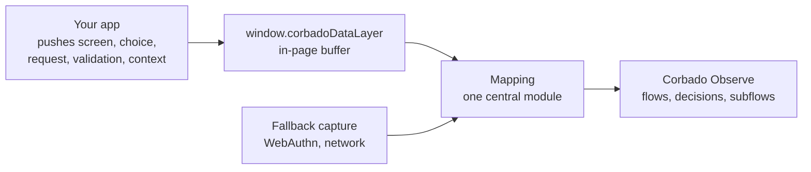

The **Observe data layer** is the recommended way to integrate **Corbado Observe** from your own source code. Your frontend pushes a handful of semantic events into a small in-page buffer, the same mechanism as an analytics data layer. One central module, the **mapping**, turns those events into Observe flows, decisions and subflows. No tracking calls are scattered through your components, the whole tracking model lives in one place, and that place can be updated without an app release.

<Info>
  The data layer is web only. On iOS and Android, use [custom events](/corbado-observe/get-started/custom-events) with the native SDKs. If you cannot change your frontend at all, use [Autocapture](/corbado-observe/get-started/autocapture).
</Info>

<Tip>
  Prefer an AI coding agent? The [Corbado Observe skill](/corbado-observe/get-started/use-with-ai-agents) implements the data layer and the mapping for you, including the replay tests.
</Tip>

## 1. Prerequisites

- An active project in the [Corbado management console](https://app.corbado.com)
- Your `Project ID` and `API Base URL` from [settings](https://app.corbado.com/observe/settings/general)

## 2. How it works



| Part | What it is | Who owns it |
| --- | --- | --- |
| **Shim** | Three lines in `<head>` that create the buffer before any app code runs | Your app |
| **Emitters** | Pushes at the moments your app already knows about: a screen rendered, a control was used, a request settled, validation failed, identity became known | Your app, in your own vocabulary |
| **Mapping** | One module that takes over the buffer, replays it, and calls the Observe SDK. It holds every Observe name, every flow boundary, every subflow step | Corbado-shaped. Served from Corbado as a script tag (recommended) or self-hosted as your own package |
| **Fallbacks** | `@corbado/autocapture` observers the mapping attaches for what your code cannot emit, above all WebAuthn ceremonies run by third-party libraries | The mapping |

The data layer speaks your app's vocabulary and the mapping speaks Observe's. That split is what lets Corbado review, test and correct the tracking model with you without touching your components.

## 3. Add the shim

Place it inline as the first script in `<head>`, before any application code. It must not sit behind a feature flag or consent gate: it only buffers in memory, and the mapping decides what is sent and when.

```html
<script>
  window.corbadoDataLayer = window.corbadoDataLayer || [];
</script>
```

<Note>
  Whether buffering in memory before consent is acceptable is your own legal assessment. If it is not, insert the shim after consent and accept that journeys before that point are not recorded. See [storage and consent](/corbado-observe/overview/constraints#7-storage-and-consent).
</Note>

## 4. Push events

Six event kinds cover an authentication journey. Names are yours; the mapping translates them.

| Event | Push when | Carries |
| --- | --- | --- |
| `screen` | A screen is presented to the user, synchronously on render, before any request the screen auto-starts | Screen name, the controls it offers in stable order, the render timestamp, the primary input element |
| `choice` | A control is used | Screen name and control name |
| `request` | From your API client: `started` when an auth call is sent, `finished` or `failed` when it settles | Request name, correlation id, projected result facts, error code and message |
| `validation` | Your own validation pass rejects a field | Screen, field, reason code |
| `context` | A fact becomes known: user reference, experiments, tags, entry point, consent | The fact |
| `ceremony` | Only if your code owns the `navigator.credentials` call and can attach the options and credential objects. Otherwise omit it: the mapping observes ceremonies itself | Kind, phase, mediation, options, credential |

```typescript
const observe = (event: Record<string, unknown>) => {
  try {
    (window.corbadoDataLayer ||= []).push(event);
  } catch {
    // telemetry never throws into the app
  }
};

// the identifier screen renders; the email field is its primary input
observe({ event: "screen", name: "identifier", options: ["email", "google", "signup-link"], ts: Date.now(), input: emailInput });

// the user clicks "Create account"
observe({ event: "choice", screen: "identifier", option: "signup-link" });

// your API client sends and settles the identifier lookup
observe({ event: "request", name: "checkIdentifier", id, phase: "started", ts: Date.now() });
observe({ event: "request", name: "checkIdentifier", id, phase: "finished", ts: Date.now(), result: { known: true } });

// identity is known once the session exists
observe({ event: "context", user: { userId: hashedUserId } });
```

Three rules keep the events useful:

- **One push per fact, at the moment it happens.** No batching, no state in the emitters. A screen is pushed per presentation, not per framework re-render.
- **Facts, never bodies.** A request's `result` names what the mapping needs, such as `{ known: true }` or `{ loggedIn: true }`. Request and response bodies, identifiers, passwords, one-time codes and credential JSON never enter the layer.
- **Emit requests from your API client.** Most apps issue every auth call from one module. Emitting there, once, is more reliable than patching `fetch`, and a request that fired before the mapping loaded is still in the buffer.

The full contract, the emission rules and the app-side ordering guarantees are in the [Corbado Observe skill](https://docs.corbado.com/skill.md).

## 5. The mapping

The mapping is a self-contained module with a fixed layout: a contract file shared with your emitters, a taxonomy file holding the three tables that translate your names into Observe's, a coordinator that derives flow starts, finishes and skips from those tables, one state class per screen, and the fallback wiring. It imports only its contract, `@corbado/observe` and `@corbado/autocapture`, never your app. Corbado provides a sample skeleton for your stack, and the agent skill writes it against your journeys.

The maintenance split follows from that layout. The emitters are your code and evolve with your screens and requests. The mapping is the one place tracking logic lives, and it can be maintained by you or together with Corbado. If you want Corbado to own the whole thing, including reconciling the tracking after your releases, without any code changes on your side, that is [Autocapture](/corbado-observe/get-started/autocapture).

Delivery is a separate choice, made before go-live, and it does not change your emitters:

| Delivery | How | Tracking corrections need |
| --- | --- | --- |
| **Corbado script tag** *(recommended)* | A tiny loader inserts an immutable, versioned mapping bundle from Corbado's CDN. Rolling back re-points the loader | Nothing on your side. A correction is live on the next page load |
| **Self-hosted** | The mapping is your own npm package, or a module in your repository, bundled and released with your app | A dependency bump or an app release |

<Note>
  Script-tag delivery is set up together with Corbado: we host the bundle, verify a new version by injecting it into your live page in a test browser and replaying recorded journeys, and only then point the loader at it. [Talk to us](mailto:support@corbado.com) when you approach go-live.
</Note>

## 6. Verify

Because the mapping's input is a plain event array, tracking logic is testable by replay. Record the data layer for a journey once, store it with the Observe events it must produce, and run it against every mapping change. The skill describes the fixture format.

Then walk the real app with `debug: true` and confirm the emitted series with the [Corbado Observe Debugger](/corbado-observe/tools/devtools-extension). See [Verify your integration](/corbado-observe/get-started/verify).

## 7. Next steps

<CardGroup cols={2}>
  <Card title="Use with AI agents" icon="robot" href="/corbado-observe/get-started/use-with-ai-agents">
    Let the skill implement the data layer and the mapping.
  </Card>
  <Card title="Model your journeys" icon="sitemap" href="/corbado-observe/tracking/modeling">
    The three tables the mapping is built from.
  </Card>
  <Card title="Tracking reference" icon="diagram-project" href="/corbado-observe/tracking/overview">
    Flows, decisions, subflows, users and tags.
  </Card>
  <Card title="Verify your integration" icon="circle-check" href="/corbado-observe/get-started/verify">
    Confirm events arrive before you ship.
  </Card>
</CardGroup>
