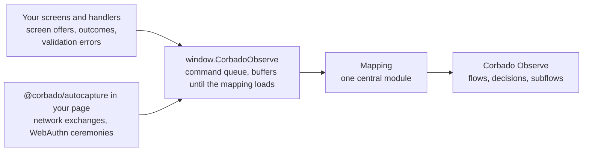

The **Observe data layer** is the recommended way to integrate **Corbado Observe** from your own source code. Your screens carry one data attribute per control, your code pushes a few events into `window.CorbadoObserve`, a small in-page command queue with the mechanics of an analytics data layer, and network calls and WebAuthn ceremonies are captured automatically in your page. One central module, the **mapping**, takes the queue over and turns everything into Observe flows, decisions and subflows. No tracking calls are scattered through your components, the whole tracking model lives in one place, and that place can be updated without an app release.

<Info>
  The data layer is web only. On iOS and Android, use [custom events](/corbado-observe/get-started/custom-events) with the native SDKs. If you do not want to change your frontend at all, [Autocapture](/corbado-observe/get-started/autocapture) is the fully managed option.
</Info>

<Tip>
  Prefer an AI coding agent? The [Corbado Observe skill](/corbado-observe/get-started/use-with-ai-agents) implements the data layer and the mapping for you, including the replay tests.
</Tip>

## 1. Prerequisites

- An active project in the [Corbado management console](https://app.corbado.com). No project yet: **Create a new project**, project type **Observe**.
- Your `Project ID` and `API Base URL` from **Observe → Settings → General**, or from `corbado switch --list` after pairing the [Observe CLI](/corbado-observe/tools/cli).
- Your authentication origins registered under **Observe → Settings → Origins**.

## 2. How it works



| Part | What it is | Who owns it |
| --- | --- | --- |
| **Stub** | A few lines inlined first in `<head>` that create `window.CorbadoObserve` and record every command until the mapping loads. The same stub Corbado's loader snippets already use | Your app, copied verbatim from below |
| **Markup and emitters** | A data attribute on every control that is a decision option, one on the primary input, and three small helpers: emit the screen offer on render, emit the outcome in the handler, emit validation errors from your validation pass | Your app, in your own screen names |
| **Capture wiring** | `captureNetwork` and `captureWebAuthn` from [`@corbado/autocapture`](https://www.npmjs.com/package/@corbado/autocapture), wired once at page start with your endpoint match and allowlist projectors, pushing into the same queue | Your app |
| **Mapping** | One module that takes the queue over, replays it and calls the Observe SDK. It holds every Observe name, every flow boundary, every subflow step, and imports nothing from your app | Built in the structure Corbado uses for its own adapters. Served from Corbado as a script tag (recommended) or self-hosted as your own package |

The mapping sees three families of events, `dom`, `network` and `webApi`, and two of them are the capture library's own objects. That is the same input an Autocapture adapter works from, which is what lets Corbado review, test and correct the tracking model with you without touching your components.

## 3. Add the stub

Inline it as the first script in `<head>`, before any application code. Do not put it behind a feature flag or a consent gate. It only records commands in memory, and nothing leaves the page before the mapping runs.

```html
<script>
  (function (document, window) {
    var loaderUrl = "";
    var commands = ["init", "setConsent", "setUser", "setExperiments", "setTags", "push", "destroy"];
    var stub, script, i;
    if (!window.CorbadoObserve) {
      stub = { q: [] };
      for (i = 0; i < commands.length; i++) {
        (function (name) {
          stub[name] = function () { stub.q.push([name, Array.prototype.slice.call(arguments, 0)]); };
        })(commands[i]);
      }
      window.CorbadoObserve = stub;
    }
    if (!loaderUrl || window.__corbadoLoaderInjected) return;
    window.__corbadoLoaderInjected = true;
    script = document.createElement("script");
    script.async = true;
    script.src = loaderUrl;
    (document.head || document.documentElement).appendChild(script);
  })(document, window);
</script>
```

The empty loader URL is the compiled-in case. With script-tag delivery Corbado issues the same stub with your loader URL rendered in.

## 4. Tag your screens and emit

Every control that offers a decision option gets `data-observe-decision-option` with the Observe option string. The primary input gets `data-observe-input`. A screen offer is then a visibility scan. There is no list of options to maintain in code:

```html
<button data-observe-decision-option="password-login-known-identifier">Log in</button>
<button data-observe-decision-option="passkey-login-known-identifier">Use a passkey</button>
<a data-observe-decision-option="recovery">Forgot password?</a>
<input type="password" data-observe-input />
```

```typescript
const observe = (event: Record<string, unknown>) => {
  try {
    window.CorbadoObserve?.push(event);
  } catch {
    // telemetry never throws into the app
  }
};

// on render, from one place per screen, after the render settled
emitScreen("password", rootElement);            // reads the visible tagged controls and input
// in the handler, before the request the choice starts
emitOutcome("password", "recovery");
// from your own validation pass, one event per pass
emitClientErrors("password", [{ field: "password", code: "valueMissing", message: "Enter your password" }]);
```

Four rules keep the offers right:

- **Emit per presentation, from one place per screen.** In a single-page app this is the screen component's mount, delayed by one microtask. In a multi-page app it is the page load. A framework re-render alone is no new presentation.
- **Re-emit with the same timestamp** when a control appears later, such as a passkey button behind a capability check. The mapping discards an unchanged set and replaces the open decision in place when the set changed. If unsure, emit.
- **Emit after the previous screen's requests settled and before the new screen starts anything**, a ceremony or a request. Screens drive the mapping's state machine.
- **Resolve outcomes explicitly in the handler**, for method choices and navigation alike, before the request they start.

Method option strings are fixed by Observe, for example `password-login-known-identifier` or `passkey-login-known-identifier`. Navigation options are names you choose, such as `back` or `recovery`. The [decisions reference](/corbado-observe/tracking/decisions) lists the strings each method resolves.

## 5. Capture network and WebAuthn in your page

Requests and ceremonies make up the majority of an integration's signals and carry its error detail. They are captured automatically. Wire the capture library once, in the first module your bundle evaluates, so that it runs before your first authentication request:

```typescript
import { captureNetwork, captureWebAuthn } from "@corbado/autocapture";

captureNetwork({
  match: (url) => url.origin === location.origin && url.pathname.startsWith("/api/auth/"),
  bodyCapture: { request: projectAuthRequest, response: projectAuthResponse },
  onRequest: (request) => observe({ type: "network", kind: "request", timestamp: request.startedAt, ...request }),
  onExchange: (exchange) => observe({ type: "network", kind: "exchange", timestamp: Date.now(), ...exchange }),
});
captureWebAuthn({
  onEvent: (event) => observe({ type: "webApi", api: "webauthn", timestamp: Date.now(), ...event }),
});
```

The projectors are your privacy boundary. Without a projector no body is read, and a projector returns only the fields the mapping needs, such as a status, a step name or an error code. Identifiers, passwords, one-time codes and raw bodies never enter the queue. WebAuthn payloads are sanitized by the capture library.

<Note>
  If your organization does not allow patching `fetch`, your API client can push `network` events itself, with the same shape. You then decide what the mapping gets to see, and only that reaches the error analytics. Do not run both.
</Note>

## 6. Lifecycle commands

| Command | Call when |
| --- | --- |
| `init({ projectId, apiBaseUrl, applicationId })` | At page start, before consent is known. Observe runs; consent decides what is transmitted |
| `setConsent(granted)` | Consent is known or changes. Identity is transmitted only while consent is granted |
| `setUser({ userId, identifier })` | Identity becomes known, before the final request settles |
| `setExperiments(map)` | Your A/B assignments resolve or change |
| `setTags(map)` | A tag becomes known after `init`; the latest value per key rides on the next flow event |
| `destroy()` | The surface is torn down for good |

```typescript
window.CorbadoObserve?.init({ projectId: "<ProjectID>", apiBaseUrl: "<APIBaseURL>", applicationId: "web" });
window.CorbadoObserve?.setConsent(consentGranted);
// later, once the session exists
window.CorbadoObserve?.setUser({ userId: hashedUserId });
```

Whether recording into the in-page queue before consent is acceptable is your own legal assessment. The queue holds no identity until consent, and your projectors keep identifiers out of network events. See [storage and consent](/corbado-observe/overview/constraints#7-storage-and-consent).

The full contract, the emission rules and the mapping's tables are in the [Corbado Observe skill](https://docs.corbado.com/skill.md).

## 7. The mapping

The mapping is a self-contained module with a fixed layout: a contract file shared with your emitters, a taxonomy file holding the tables that translate your screen names and endpoints into Observe's flows, decisions and steps, a coordinator that derives flow starts, finishes and skips from those tables, and one state class per screen. It imports only its contract and `@corbado/observe`. It does not import your app and does not touch browser APIs. Corbado provides a sample skeleton for your stack, and the agent skill writes it against your journeys.

The maintenance split follows from that layout. The markup, the emitters and the capture wiring are your code and evolve with your screens. The mapping is the single place where tracking logic lives, and it can be maintained by you or together with Corbado. If you want Corbado to own the whole thing, including reconciling the tracking after your releases, without any code changes on your side, that is [Autocapture](/corbado-observe/get-started/autocapture).

Delivery is a separate choice, made before go-live, and it does not change your app code:

| Delivery | How | Tracking corrections need |
| --- | --- | --- |
| **Corbado script tag** *(recommended)* | The stub is issued with your loader URL. The loader inserts an immutable, versioned mapping bundle from Corbado's CDN. Rolling back re-points the loader | Nothing on your side. A correction is live on the next page load |
| **Self-hosted** | The mapping is your own npm package or a module in your repository, bundled and released with your app, or the same bundle on your own CDN behind your own loader | A dependency bump or an app release, or re-pointing your loader |

**Start locally, switch later.** A new integration starts compiled in, because no Corbado-hosted bundle exists for your app yet, and the switch does not touch your markup, emitters or capture wiring:

<Steps>
  <Step title="Compiled in">
    Install `@corbado/observe` and `@corbado/autocapture`, inline the stub above, import the capture wiring and the mapping module first thing in your app entry, and call `CorbadoObserve.init()` right after.
  </Step>
  <Step title="Script tag">
    The same mapping module is built as a self-contained bundle and hosted behind a loader. Remove the import and the `@corbado/observe` dependency, and use the stub Corbado issues with your loader URL. Everything else stays as it is.
  </Step>
</Steps>

<Note>
  Script-tag delivery is set up together with Corbado: we host the bundle, verify a new version by injecting it into your live page in a test browser and replaying recorded journeys, and only then point the loader at it. [Talk to us](mailto:support@corbado.com) when you approach go-live.
</Note>

## 8. Verify

Because the mapping's input is the stub's queue, a plain array that now carries screens, outcomes, exchanges and ceremonies alike, tracking logic is testable by replay. Dump `window.CorbadoObserve.q` for a journey once, store it with the Observe events it must produce, and run it against every mapping change. The skill describes the fixture format.

Then walk the real app with `debug: true`, confirm the emitted series with the [Corbado Observe Debugger](/corbado-observe/tools/devtools-extension) and check the result against the backend: with the [Observe CLI](/corbado-observe/tools/cli) through `events-feed`, `classify` and `classification-errors`, or in the console under **Observe → Debugging → Integration** with the **Process** button. See [Verify your integration](/corbado-observe/get-started/verify).

## 9. Next steps

<CardGroup cols={2}>
  <Card title="Use with AI agents" icon="robot" href="/corbado-observe/get-started/use-with-ai-agents">
    Let the skill implement the data layer and the mapping.
  </Card>
  <Card title="Model your journeys" icon="sitemap" href="/corbado-observe/tracking/modeling">
    The tables the mapping is built from.
  </Card>
  <Card title="Observe CLI" icon="terminal" href="/corbado-observe/tools/cli">
    Pair your project and verify classification from the terminal.
  </Card>
  <Card title="Verify your integration" icon="circle-check" href="/corbado-observe/get-started/verify">
    Confirm events arrive before you ship.
  </Card>
</CardGroup>
