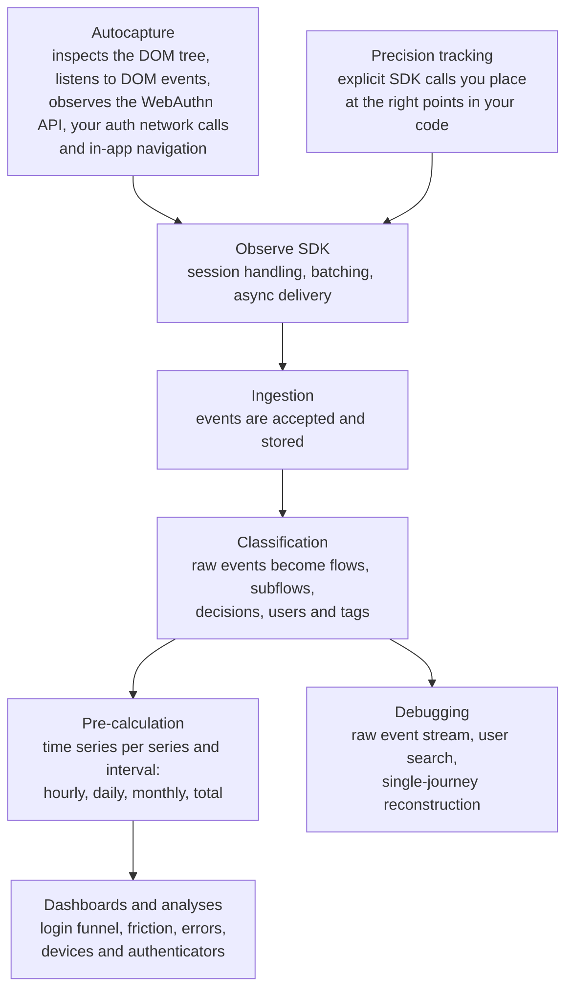

**Corbado Observe** is an observability tool for the client side of authentication. This page explains what it does, what it deliberately does not do, and how it differs from the tools you already run.

## 1. The blind spot Observe closes

With passwords, authentication happened on your backend: you compared a hash and returned success or failure. Your backend logs told the whole story.

With passkeys, authentication moves to the frontend. Whether a login succeeds now depends on the operating system, the browser, the credential manager, whether Face ID appears, whether a system dialog is dismissed, and whether a device ships a WebAuthn bug. None of that reaches your backend. A user who never gets past the passkey dialog produces **no backend event at all** — they simply disappear.

That gap is what **Corbado Observe** measures.

## 2. How data flows through Observe

Everything starts in the browser and ends as a query you can answer in the console. The two [integration paths](/corbado-observe/overview/integration-paths) differ only at the very front — from the SDK onwards, they run through exactly the same pipeline.

<Steps>
  <Step title="Capture in the browser">
    The SDK observes the authentication journey — WebAuthn ceremonies, the steps of your login and sign-up flows, the methods users choose, and the errors they hit. With [Autocapture](/corbado-observe/get-started/autocapture) this happens by observing what your frontend already does; with [precision tracking](/corbado-observe/get-started/precision-tracking) you emit the events yourself.
  </Step>
  <Step title="Send">
    Events are batched and sent asynchronously to the Corbado backend. Delivery never blocks your UI and never sits in the authentication path.
  </Step>
  <Step title="Classify">
    Corbado maps the raw events onto a structured [data model](/corbado-observe/tracking/overview): individual events are classified into **flows** (login, sign-up, recovery), **subflows** (passkey login, password enrollment, email OTP), **decisions**, **users** and **tags**. This is closer to process mining than to a flat event log, which is what makes it possible to reconstruct a complete journey including loops, retries and method switches.
  </Step>
  <Step title="Pre-calculate">
    A pre-calculation stage rolls the classified data into time series, bucketed hourly, daily, monthly and total. This is what keeps dashboards fast on large projects: an analysis reads a prepared series rather than scanning raw events. Cadence is managed automatically and can be tuned per project under **Observe → Settings → Pre-calculation** in the console.
  </Step>
  <Step title="Analyze and debug">
    The [Corbado management console](https://app.corbado.com) reads the pre-calculated series for login funnels, friction and error analysis and device breakdowns — and reads the classified events directly for user search and single-journey reconstruction.
  </Step>
</Steps>

## 3. What Observe is not

This is usually the fastest way to understand where Observe fits:

| Observe does **not** | What that means for you |
| --- | --- |
| Act as an identity provider | Your existing authentication stack stays exactly as it is. |
| Sit in the authentication path | Observe never grants, denies or delays a login. It only watches. |
| Require a backend integration | There is nothing to install on your servers and no API for Observe to call into. |
| Modify your authentication logic | Instrumentation is pure telemetry. It cannot change behavior. |
| Depend on a specific IdP or stack | Observe is agnostic: commercial IdP, open-source library, custom implementation or on-chain — it makes no difference. |

<Note>
  Because Observe is client-side only and never in the authentication path, an SDK failure costs you telemetry — never a login.
</Note>

## 4. Observe vs. Corbado Connect

Corbado has two products, and they solve different problems:

| | **Corbado Observe** | **Corbado Connect** |
| --- | --- | --- |
| Purpose | Measure and debug the authentication you already have | Add passkeys to an existing IdP |
| You already have passkeys | Yes — Observe tells you how well they work | No — Connect builds the passkey layer |
| Touches authentication | No | Yes |
| Backend integration | None | Yes |

If you have built your own passkey implementation and want to know how it performs in production, you want **Observe**. See [Corbado Connect](/corbado-connect/overview/welcome) if you are still adding passkeys.

## 5. How Observe differs from the tools you already run

Product analytics and application monitoring tools are good at what they were built for. Observe covers a layer they do not model:

| Tool category | What it gives you | What it misses |
| --- | --- | --- |
| Product analytics (Amplitude, Mixpanel, PostHog, Google Analytics) | Page views, clicks, funnels you define | No model of a WebAuthn ceremony, no authenticator or credential-manager detail, no root cause for a failed login |
| Error and APM tooling (Sentry, Datadog, Splunk) | Exceptions, traces, backend performance | Passkey failures often throw no exception at all — a silent cancellation is a normal `NotAllowedError` or nothing. Reconstructing a login journey out of error events is manual work. |
| Your own backend logs | Successful and failed authentication attempts | Everything that happens before the request reaches you, which is where most passkey friction lives |

Observe complements these rather than replacing them. It is deliberately narrow: the client side of authentication, modeled properly.

## 6. Next steps

<CardGroup cols={2}>
  <Card title="Integration paths" icon="route" href="/corbado-observe/overview/integration-paths">
    Autocapture vs. precision tracking — how data gets into Observe.
  </Card>
  <Card title="Compatibility & constraints" icon="list-check" href="/corbado-observe/overview/constraints">
    What Observe supports, what it requires and where the limits are.
  </Card>
</CardGroup>
