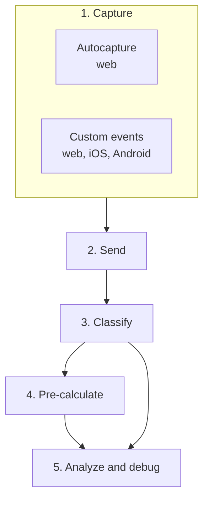

**Corbado Observe** is an observability tool for the client side of authentication. This page explains how data flows through it, what it deliberately does not do and how it differs from the tools you already run.

## 1. The blind spot Observe closes

With passwords, authentication happened on your backend: you compared a hash and returned success or failure. Your backend logs told the whole story.

With passkeys, authentication moves to the client. Whether a login succeeds now depends on the operating system, the browser, the credential manager, whether Face ID appears and whether a device ships a WebAuthn bug. None of that reaches your backend. A user who never gets past the passkey dialog produces **no backend event at all**. They simply disappear.

That gap is what **Corbado Observe** measures.

## 2. How data flows through Observe

The two [integration paths](/corbado-observe/overview/integration-paths) differ only in step 1. From step 2 onwards they run through the same pipeline.

<Steps>
  <Step title="Capture">
    [Autocapture](/corbado-observe/get-started/autocapture) observes what your web frontend already does. [Custom events](/corbado-observe/get-started/custom-events) are events you emit yourself, from the web, iOS or Android SDK.
  </Step>
  <Step title="Send">
    Events are batched and sent asynchronously to Corbado. Delivery never blocks your UI and never sits in the authentication path.
  </Step>
  <Step title="Classify">
    Raw events are mapped onto the [data model](/corbado-observe/tracking/overview): **flows** (login, sign-up, recovery), **subflows** (passkey login, password enrollment, email OTP), **decisions**, **users** and **tags**. This is closer to process mining than to a flat event log, which is what makes it possible to reconstruct a journey including loops, retries and method switches.
  </Step>
  <Step title="Pre-calculate">
    Classified data is rolled into time series bucketed hourly, daily, monthly and total. Dashboards read a prepared series instead of scanning raw events, which is what keeps them fast on large projects. Cadence is automatic and can be tuned under **Observe → Settings → Pre-calculation**.
  </Step>
  <Step title="Analyze and debug">
    The [management console](https://app.corbado.com) reads pre-calculated series for funnels, friction and error analysis and device breakdowns. It reads classified events directly for user search and single-journey reconstruction.
  </Step>
</Steps>

## 3. What Observe is not

| Observe does **not** | What that means for you |
| --- | --- |
| Act as an identity provider | Your authentication stack stays exactly as it is. |
| Sit in the authentication path | Observe never grants, denies or delays a login. It only watches. |
| Require a backend integration | Nothing to install on your servers, no API for Observe to call into. |
| Modify your authentication logic | Instrumentation is pure telemetry. It cannot change behavior. |
| Depend on a specific IdP or stack | Commercial IdP, open-source library, custom implementation or on-chain: it makes no difference. |

<Note>
  Because Observe is never in the authentication path, an SDK failure costs you telemetry, never a login.
</Note>

## 4. Observe vs. Corbado Connect

| | **Corbado Observe** | **Corbado Connect** |
| --- | --- | --- |
| Purpose | Measure and debug the authentication you already have | Add passkeys to an existing IdP |
| Passkeys | You already have them | Connect builds the passkey layer |
| Touches authentication | No | Yes |
| Backend integration | None | Yes |

See [Corbado Connect](/corbado-connect/overview/welcome) if you are still adding passkeys.

## 5. How Observe differs from your existing tooling

| Tool category | What it gives you | What it misses |
| --- | --- | --- |
| Product analytics (Amplitude, Mixpanel, PostHog, Google Analytics) | Page views, clicks, funnels you define | No model of a WebAuthn ceremony, no authenticator or credential-manager detail, no root cause for a failed login |
| Error and APM tooling (Sentry, Datadog, Splunk) | Exceptions, traces, backend performance | Passkey failures often throw no exception at all. A silent cancellation is a normal `NotAllowedError` or nothing, and reconstructing a journey from error events is manual work. |
| Your own backend logs | Successful and failed authentication attempts | Everything before the request reaches you, which is where most passkey friction lives |

Observe complements these rather than replacing them. It is deliberately narrow: the client side of authentication, modeled properly.

## 6. Next steps

<CardGroup cols={2}>
  <Card title="Integration paths" icon="route" href="/corbado-observe/overview/integration-paths">
    Autocapture vs. custom events.
  </Card>
  <Card title="Compatibility & constraints" icon="list-check" href="/corbado-observe/overview/constraints">
    Platforms, requirements and limits.
  </Card>
</CardGroup>
